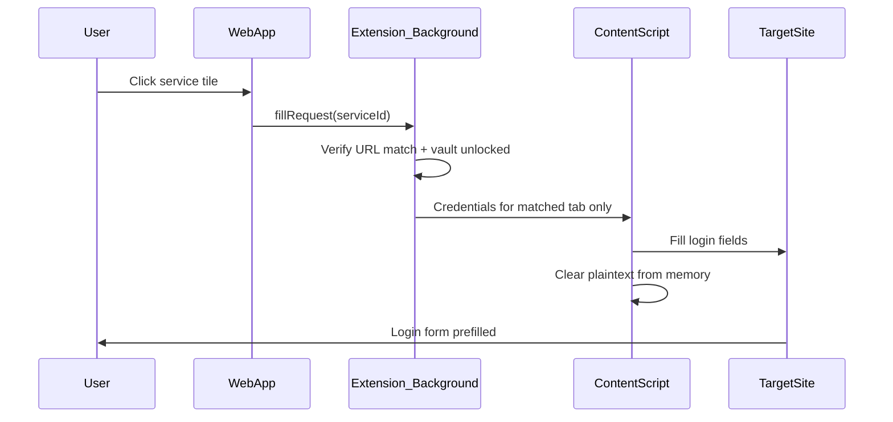

# Phase 2 — Auto-fill Architecture (Short)

## Zero Knowledge (Hard Requirement)

All Phase 2 design decisions must satisfy zero knowledge:

- Credentials are **encrypted before storage** — encryption happens client-side only
- **Plaintext credentials are never stored** — not in IndexedDB, extension storage, logs, or analytics
- A **future backend must never be able to decrypt user secrets** — server stores ciphertext only (if sync is added later); keys derived from user-held master password or device secret never leave the client

## 1. Web App Role

The existing React app ([`src/Dashboard.tsx`](src/Dashboard.tsx), [`src/Tile.tsx`](src/Tile.tsx)) is the **control panel**:

- User selects services and manages saved logins (add / edit / delete)
- User unlocks the vault with a master password; derived key exists **only in memory** while unlocked
- Clicking a tile signals the extension to open the site and autofill (Phase 2c+)

The web app never injects into third-party pages.

## 2. Browser Extension Role

The extension is required for real autofill (Phase 2c+):

- **Content script** — receives credentials **only for the active matched site**; fills login fields; discards plaintext immediately after fill
- **Background service worker** — coordinates messaging, tab open, URL matching, unlock state; **does not hold decrypted credentials or the vault key by default**
- **Bridge** — talks to the web app via `chrome.runtime` messaging with origin checks

Without the extension, the web app can only open URLs in a new tab.

## 3. Where Credentials Are Stored

**Phase 2a (web app MVP):**

- **Primary vault: IndexedDB** — encrypted blob(s) only (ciphertext + salt + KDF params + metadata)
- **Do not use `chrome.storage.local` as the primary vault in Phase 2a** — extension storage may be introduced later for extension-side coordination, not as the source of truth for the vault MVP

**Later phases:**

- Extension may read encrypted vault data shared from the web app (export/import or messaging) — still ciphertext in transit/at rest
- Sync (if added) uploads ciphertext only; zero-knowledge preserved

Each credential links to a `serviceId` plus URL/domain match rules.

## 4. How Autofill Works

**Decrypt behavior (mandatory):**

- Vault key exists **only in memory** while unlocked; cleared on lock/timeout
- **Minimize plaintext lifetime** — decrypt at the last moment, only for the matched site
- **Content scripts receive credentials only for the active matched site** — never broadcast secrets to all tabs
- Background worker coordinates; it does not assume long-lived decrypted credential caches

**Site matching:** strict domain + path rules per service; confirm on mismatch before fill.

## 5. Security Risks

| Risk | Mitigation |
|------|------------|
| Plaintext persistence | Encrypt before write; zero-knowledge architecture |
| XSS on vault web app | CSP, no inline scripts, sanitize UI |
| Extension messaging hijack | Origin checks, signed messages, least privilege |
| Phishing sites stealing fills | Strict URL match; user confirmation on domain mismatch |
| Master password brute force | Argon2id + rate limiting |
| Memory exposure | Key/credentials cleared on lock; minimal lifetime in content script |
| Backend compromise (future) | Zero knowledge — server never has decryption keys |
| Malicious extension updates | Store review, minimal permissions |

## 6. Security Audit Gate (Mandatory Before Public Launch)

No public release until all audits pass:

- Penetration testing
- Secure code review
- Encryption and key management review
- Browser extension security review
- Privacy review

## 7. Step-by-Step Phases

**Phase 2a — Encrypted credential CRUD (web app only)**  
Split into small steps. **Step 1 (current):** unlock UI only.

### Phase 2a Step 1 — Vault unlock screen (no crypto)

**Scope:** UI + React state only. No encryption, IndexedDB, CRUD, extension, or autofill.

**Flow:** Manage Services → המשך → Unlock screen → Dashboard

**UI (Hebrew, RTL):**
- Title: `פתיחת הכספת`
- Field label: `סיסמה ראשית`
- Button: `פתח כספת`

**State:** `isUnlocked` in [`src/App.tsx`](src/App.tsx) — lost on page refresh.

**Files to add/change:**
- New [`src/UnlockScreen.tsx`](src/UnlockScreen.tsx)
- Gate dashboard in `App.tsx` when `screen === 'dashboard' && !isUnlocked`
- Styles in [`src/App.css`](src/App.css)

**Step 2+ (later):** Argon2id, IndexedDB, credential CRUD.

Master password unlock, Argon2id key derivation, encrypt-then-store in **IndexedDB**, per-service credential forms. Tiles still open URLs only. No extension vault.

**Phase 2b — Extension shell**  
Manifest V3 extension, messaging bridge, unlock-state coordination with web app. No autofill yet.

**Phase 2c — Autofill proof of concept (one Israeli site)**  
Content script + strict URL match for **one** known login page (e.g. one bank). Validate decrypt-on-demand, fill, and immediate plaintext cleanup.

**Phase 2d — Limited autofill (selected Israeli services)**  
Expand to a curated set of Israeli services (banks, health, shopping) with per-site field mappings. Lock timeout and fill-confirmation UX.

**Before public launch — Security Audit Gate**  
Complete all audits in Section 6. No production release without sign-off.

## Recommendation

Build the **zero-knowledge IndexedDB vault** first (2a), then a **minimal extension shell** (2b), then **one-site autofill POC** (2c) before scaling to selected services (2d). Design the `Service` + `Credential` model and messaging contract early so web app and extension stay aligned.
