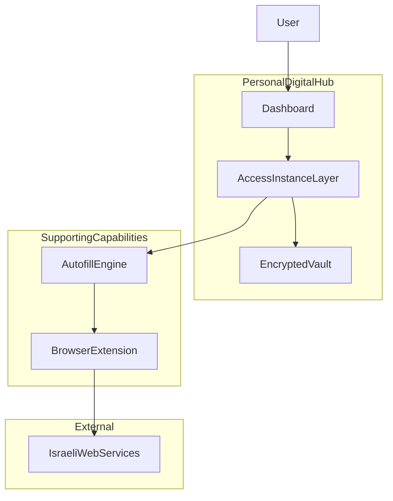
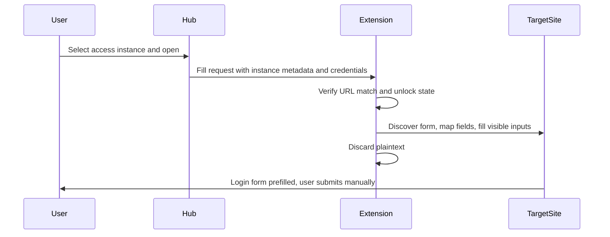

# High-Level Architecture

**Single source of truth** for product vision and system architecture.

| | |
|---|---|
| **Version** | 0.2 |
| **Status** | Living Architecture Document |
| **Last updated** | 2026-06-25 |

This document describes *what* the product is and *how* it is shaped at a system level. It does not prescribe implementation details, file layouts, or step-by-step build plans.

---

## Product Vision

The product is a **Personal Digital Hub for Israeli users** — one trusted place to reach the services, accounts, and workflows that matter in daily life: banking, health, government, shopping, professional tools, and more.

**Secure credential storage and autofill are supporting capabilities**, not the whole product. They enable fast, trusted access. The hub’s core value is **organization and reach** — helping users get to the right place, with the right account, with minimal friction.

### Multiple Access Models (Future Validation)

The system must support **multiple ways of accessing the same service** — for example, different family members, personal vs work accounts, or professional client workflows. One service definition may represent many real-world uses:

| Service | Example uses |
|---------|----------------|
| Bank Hapoalim | Dad, Mom |
| Gmail | Personal, Work |
| Tax Authority | Client A |
| Net HaMishpat | Client Cohen |

The **exact UX model is intentionally undecided.** The architecture must support **multiple possible presentation models** until validated with real users.

Examples of models under consideration (not commitments):

- **Multiple tiles** — separate tiles pointing to the same service template under different labels
- **Selection before open** — one tile per service, with a chooser step before open or autofill
- **Professional workflows** — client-oriented access patterns (e.g. tax, legal)
- **Family workflows** — household-oriented access patterns (e.g. shared banking)

No presentation model or domain term is final until validated through real-world usage.

---

## Architectural Principles

1. **Hub-first** — The web application is the control panel: catalog, credentials, unlock/lock. It does not inject into third-party pages.

2. **User ownership** — The Personal Digital Hub belongs to the user. Its purpose is to organize the user's digital world, not replace existing online services. The hub becomes the trusted entry point to the user's digital life while external services remain the systems of record.

3. **Zero-knowledge by design** — Secrets are encrypted on the client before persistence. No backend or sync layer should ever hold decryption keys.

4. **Multi-instance-aware, not service-only** — Routing, storage, and autofill must resolve through a specific user-defined access instance (however it is presented in UX), not merely a service name.

5. **Presentation-agnostic data model** — The same underlying model powers multiple tiles or a single-tile chooser without schema changes.

6. **Progressive enhancement** — The hub works without a browser extension (open URL). Autofill is an enhancement when the extension is installed.

7. **Generic before bespoke** — Autofill defaults to a generic discovery-and-fill engine. Site-specific adapters are isolated fallbacks for sites that break generic rules.

8. **User control** — No auto-submit. The user always completes login. Sensitive actions require explicit intent.

9. **Israeli-first** — RTL, Hebrew UX, and a local service catalog as defaults.

10. **Minimize secret lifetime** — Decrypt late, use briefly, clear on lock. Credentials reach the extension only for the matched active request.

11. **Architecture follows validated user behavior** — Core UX decisions that affect the domain model should be validated with real users before becoming permanent architecture. Architecture should remain flexible where user behavior has not yet been validated.

---

## High-Level System Architecture



### Component roles

| Component | Responsibility |
|-----------|----------------|
| **Dashboard** | Presents catalog entries and user access instances; tile layout, user-defined labels, credential entry, vault unlock |
| **Access instance layer** | Binds a service template + user-defined label to credentials and open/autofill behavior (provisional layer name) |
| **Encrypted vault** | Stores ciphertext only; key derived from master password while unlocked |
| **Autofill engine** | Discovers visible login forms, maps fields, fills and verifies — generic path first |
| **Browser extension** | Opens tabs, bridges hub to page, performs DOM fill; not the primary vault |
| **Israeli web services** | External login pages, popups, and flows outside product control |

### Autofill flow (conceptual)



**Autofill engine layering:**

- **Generic engine** — Detect visible forms, map `loginFields` to page inputs, fill without calling site-internal JavaScript.
- **Site adapters** — Fallback for popups, delayed forms, duplicate hidden fields, or other DOM patterns generic detection cannot handle reliably.

---

## Service Catalog

The Personal Digital Hub is built around a **curated catalog of digital services**.

The catalog is responsible for:

- Providing trusted service definitions
- Maintaining service metadata
- Defining login field schemas
- Defining known login URLs when available
- Supporting user-created custom services

The catalog is **independent from user credentials**.

A **service template** represents a service in the catalog. User data is attached through user-owned **access instances** *(provisional term)*.

---

## Data Model Direction

Today’s model associates credentials with a single service identifier. The direction is a **three-layer model**:

```mermaid
erDiagram
  ServiceTemplate ||--o{ AccessInstance : has
  AccessInstance ||--|| CredentialSet : stores
  ServiceTemplate {
    string templateId
    string name
    string url
    string loginUrl
    loginFieldSchema loginFields
  }
  AccessInstance {
    string instanceId
    string templateId
    string displayLabel
    string instanceKind
  }
  CredentialSet {
    fieldValues keyed by loginField id
  }
```

*Entity names in this diagram are provisional candidates under evaluation — not finalized domain terminology.*

### Concepts

**Service template** — A catalog entry: shared definition for a site or institution (display name, homepage URL, optional login URL, login field schema). One template may have many access instances. See Service Catalog.

**Access instance** *(provisional term)* — A user-facing entry tied to a template: e.g. “Bank Hapoalim — Dad”, “Gmail — Work”. Owns the credential set and dashboard placement (dedicated tile or chooser entry). Final naming remains open.

**Credential set** — Field values matching the template’s login field schema. Encrypted inside the vault, keyed by access instance.

### Directional rules

- Do not duplicate service definitions per family member, client, or role.
- Dashboard selection should eventually reference **instance identifiers** (or equivalent), not only template identifiers.
- Autofill requests carry template metadata, instance identity, and credentials so behavior is decoupled from UI presentation.
- User-added custom sites are templates with one or more access instances, same as catalog entries.

Candidate terminology for the access-instance concept remains under evaluation — see Open Architectural Questions.

---

## Security Principles

1. **Encrypt before store** — All credential material is encrypted client-side prior to any persistence.

2. **Never persist plaintext secrets** — Not in local storage, extension storage, logs, analytics, or error reports.

3. **Keys stay on the client** — Master-password-derived keys exist in memory only while the vault is unlocked. A future sync backend stores ciphertext only.

4. **Least exposure at fill time** — Decrypt only when needed; pass credentials to the extension only for the active matched request; clear promptly after fill.

5. **Strict site matching** — Autofill applies only when the open URL matches the template’s declared domain and login path rules. Mismatch requires user confirmation or refusal.

6. **No invocation of site internals** — Do not call page JavaScript functions (e.g. `login()`). Do not fill hidden fields. Do not auto-submit forms.

7. **Extension least privilege** — Minimal permissions, origin-checked messaging between hub and extension.

8. **Defense in depth** — CSP and XSS hardening on the hub; rate limiting on unlock; cautious handling of memory lifetime in extension contexts.

9. **Audit before public launch** — Penetration testing, secure code review, cryptography review, extension security review, and privacy review are mandatory gates before any public release.

---

## Non-Goals

The product is not intended to:

- Replace the websites it connects to
- Circumvent authentication mechanisms
- Automatically bypass MFA
- Automatically submit login forms
- Store plaintext credentials
- Depend on site-internal JavaScript APIs

---

## Development Phases

Phases describe capability maturity, not implementation tasks.

| Phase | Focus | Outcome |
|-------|--------|---------|
| **1 — Hub MVP** | Service dashboard, Israeli catalog, tile navigation | Users reach services from a unified hub |
| **2a — Vault** | Master-password unlock, encrypted local storage, per-service credentials | Users save and manage secrets securely |
| **2b — Extension shell** | Messaging bridge between hub and browser extension | Foundation for autofill without filling yet |
| **2c — Autofill POC** | Generic engine on controlled demos; first real Israeli site | Prove discover → map → fill → verify |
| **2d — Limited autofill** | Curated set of Israeli services; adapter fallbacks where needed | Repeatable autofill for common sites |
| **3 — Advanced user models** | Validate and implement the most appropriate user model based on real-world usage | User model driven by validated behavior, not assumptions |
| **4 — Scale and polish** | Broader catalog, family/professional workflows, sync exploration (zero-knowledge) | Production-ready hub |
| **Launch gate** | Security audit sign-off | Public release only after all reviews pass |

**Phase 3 — Advanced user models** (detail): Validate and implement the most appropriate user model based on real-world usage. Possible models include multiple tiles, selection-before-open, professional workflows, and family workflows. Implementation must be driven by validated user behavior rather than assumptions.

Each phase builds on the previous. Autofill and advanced user models assume a working vault and extension bridge.

---

## Open Architectural Questions

Unresolved decisions. The architecture must keep options open until validated.

### Multiple tiles vs selection-before-open

Duplicate tiles improve scanability and one-click access. A chooser step before open reduces clutter when many access instances share one service. Which model fits Israeli users in personal, family, and professional scenarios?

### Family usage patterns

Shared household device vs individual vaults; whether parents manage children’s access entries; grouping entries under a household namespace; visibility rules between family members.

### Professional client-based workflows

Tax, legal, and accounting use cases (Client A, Client Cohen). Labeling conventions, separation between client entries, and whether professional workflows need stronger isolation, export, or compliance constraints.

### Access-instance naming

How to name the concept of a user-facing access entry in Hebrew UX and in stable APIs — terms such as context, profile, workspace, and identity remain candidates under evaluation, not established vocabulary.

### Supported services strategy

Curated Israeli catalog vs user-added-only vs hybrid. Who maintains login URLs and login field schemas. How custom sites enter the catalog.

### Generic autofill vs site adapters

Default generic engine for breadth; adapters for popups, iframes, delayed forms, and duplicate hidden fields. Criteria for when a site earns an adapter vs improving generic heuristics.

---

## Design Philosophy

The product should always remain **extremely simple for the default user**.

A citizen with one account per service should never experience unnecessary complexity.

Advanced capabilities for professionals, families, and power users should be available **without** making the default experience more complicated.

The architecture should therefore **separate capability from presentation**, allowing the product to grow without redesigning its foundations.

---

## Document History

**Version 0.2** (2026-06-25)

Major changes:

- Product vision shifted from Password Vault to Personal Digital Hub
- Generic Autofill architecture introduced
- Advanced user models intentionally left open

Implementation plans live elsewhere and are not governed by this document.
