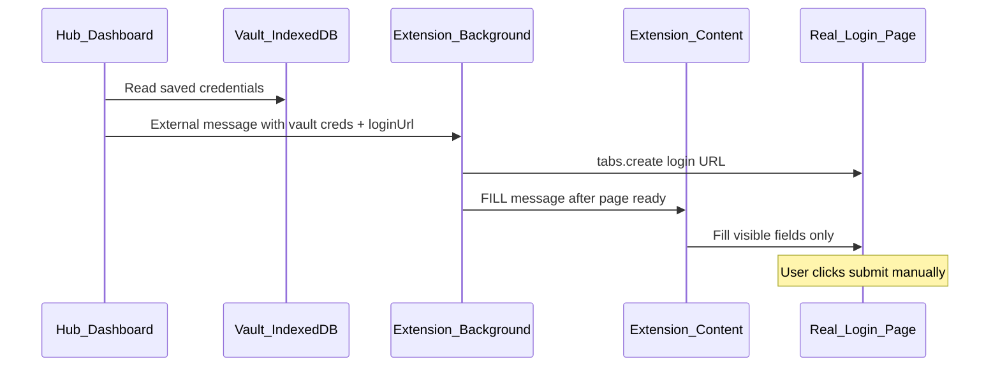

# Phase 2 — First Real Integration

Implementation planning document.

**Authoritative sources:**

- [FIRST_USER_JOURNEY.md](../FIRST_USER_JOURNEY.md)
- [HIGH_LEVEL_ARCHITECTURE.md](../HIGH_LEVEL_ARCHITECTURE.md)
- [DECISIONS.md](../DECISIONS.md)
- [phases/PHASE_1_FIRST_USER_JOURNEY.md](./PHASE_1_FIRST_USER_JOURNEY.md)

**Baseline:** Phase 1 validated Hub → Vault → Extension → Autofill on the local **תרגול התחברות** practice path. Phase 2 extends that chain to **real websites** — technical validation only, not beta launch or user testing.

This document is an **implementation specification**, not a product or architecture document.

**Naming note:** This **implementation Phase 2** follows Phase 1 (journey + demo path). It aligns with architecture **Phase 2c–2d** in [HIGH_LEVEL_ARCHITECTURE.md](../HIGH_LEVEL_ARCHITECTURE.md) (autofill POC → limited real-site autofill).

---

## Goal

Prove that the existing Hub → Vault → Extension → Autofill flow works on **real websites**, not only demo pages.

Success is measured by **two** reliable real-site integrations (2-field and 3-field) and testable acceptance criteria below — not by catalog breadth, beta readiness, or user-testing milestones.

---

## Scope

Phase 2 delivers **exactly two** designated real-site integrations:

| Integration | Field count | Designated service |
|-------------|-------------|-------------------|
| **A — 2-field** | 2 visible text/password fields | **First Generic 2-field Site (TBD)** |
| **B — 3-field** | 3 visible fields | **כללית (Clalit)** |

For each integration:

1. Analyze the target login page **before** implementation.
2. Define pre-implementation gates that must pass.
3. Implement only after gates pass.

Integration A site selection happens **after** candidate validation against the generic-engine criteria below — not before.

### What Phase 2 is

- Technical validation that vault credentials flow from hub tile → extension → visible fields on real login pages.
- Proof that the generic autofill engine (Integration A) and generic-or-adapter path (Integration B) work outside localhost.

### What Phase 2 is not

- Beta launch, user testing, or production rollout.
- Broad catalog autofill or bank integrations (unless explicitly selected in a later phase).
- Changes to parent architecture, product, or decision documents.

---

## Site selection rules

Apply to all candidate sites (Integration A pool and Integration B alternates):

| Rule | Requirement |
|------|-------------|
| Banking as first integration | Do **not** choose banking unless no better option exists |
| Page stability | Prefer stable, simple login pages |
| Geography | Prefer Israeli services |
| CAPTCHA | Avoid sites where CAPTCHA appears before fields are visible |
| iframe | Avoid sites where login fields are hidden inside cross-origin iframes |
| Site JavaScript | Do **not** call internal site `login()` or equivalent submit handlers |
| Generic first | Per ADR-003, attempt generic autofill before creating a site adapter |
| Human submit | User always performs final login action (ADR-004) |

---

## Integration A — First Generic 2-field Site (TBD)

### Purpose

Prove the **generic autofill engine** on a real Israeli login page with two visible fields — without a site-specific adapter.

### Designation

A real catalog service is chosen **only after** it passes all selection criteria below. The site identity is **TBD** until gate validation completes.

### Selection criteria (all must be true before designation)

- Two visible login fields on the login page.
- **No popup login** — fields present in the main document on load (or after a single same-page navigation, not a modal overlay).
- **No cross-origin iframe** containing the login fields.
- **No CAPTCHA** before field entry.
- **Stable dedicated login URL** (recorded as catalog `loginUrl`).
- **Expected to work with the generic autofill engine** ([`extension/generic/`](../../extension/generic/)) before considering a site adapter (ADR-003).

### Site analysis (complete at gate time for chosen site)

| Criterion | Assessment (TBD until site selected) |
|-----------|--------------------------------------|
| Login URL | **TBD** — confirm stable dedicated login URL |
| Visible fields | 2 — e.g. username/email + password |
| Credential mapping | **TBD** — hub `loginFields` IDs → detected inputs via generic field mapper |
| Visible on page load | **Required** — yes, in main document |
| iframe | **Required** — no cross-origin login iframe |
| popup | **Required** — no popup/modal login |
| CAPTCHA / MFA | **Required** — no CAPTCHA before field entry; MFA after manual submit acceptable |
| Generic autofill | **Required to pass** — generic trial must succeed before coding |
| Adapter required | **No** (by selection rule) — adapter only if generic trial unexpectedly fails after designation; re-evaluate site choice first |
| Implementation risk | **TBD** — assess after site selection |

### Candidate pool (not designated until gates pass)

Israeli shopping/catalog services with likely simple login pages — e.g. **KSP**, **Shufersal**, **Amazon IL**, **Rami Levy**. Login URL and DOM must be verified for each candidate; **none is pre-selected**.

**Banks** — excluded by selection rules unless no alternative exists.

### Alternates rejected (until re-evaluated)

| Candidate | Reason |
|-----------|--------|
| Banks (Hapoalim, Leumi, etc.) | Excluded as first generic integration; prefer non-banking candidates |

---

## Secondary validation candidate — HTZone (adapter-based)

HTZone is **not** Integration A. It is documented as a **secondary validation candidate** because:

- It already has a dedicated adapter ([`extension/htzone-adapter.js`](../../extension/htzone-adapter.js)) and represents an **adapter-based** integration, not a generic-engine proof.
- It validates the adapter path separately from generic autofill on a real Israeli site.
- It is already in the catalog with `loginUrl` and field schema ([`src/mockServices.ts`](../../src/mockServices.ts)); extension manifest grants `htzone.co.il` host permissions.

### HTZone analysis (secondary validation only)

| Criterion | HTZone assessment |
|-----------|-------------------|
| Login URL | `https://www.htzone.co.il/login` (catalog `loginUrl`) |
| Visible fields | 2 — email, password |
| Credential mapping | `email` → `input[name="email"]`, `password` → `input[name="password"]` (adapter selectors) |
| Visible on page load | **No** — popup overlay; adapter calls `prepareLoginPopup()` |
| iframe | No cross-origin login iframe identified in current adapter |
| popup | **Yes** — `.htz_up_popup.popup_login_form` |
| CAPTCHA / MFA | Not expected before field fill; MFA may follow manual submit (out of scope) |
| Generic autofill | **Unlikely to succeed** — hidden popup breaks generic visible-form detection |
| Adapter required | **Yes** (ADR-003 exception); adapter already exists |
| Implementation risk | **Medium** — DOM/class changes break adapter; partial POC exists |

**Optional secondary QA (after Integration A generic proof):** HTZone adapter fills **vault** email/password on **3 consecutive** manual QA runs via dashboard tile (not dev mock button).

---

## Integration B — Clalit (3-field)

### Purpose

Prove autofill on a real Israeli **3-field** login form — canonical health-fund pattern (teudat zehut + user code + password).

### Why Clalit is designated

- Already in catalog with explicit 3-field schema: `idNumber`, `userCode`, `password` ([`src/mockServices.ts`](../../src/mockServices.ts)).
- Non-banking Israeli service.
- Proves generic engine **or** scoped adapter on a different DOM pattern than HTZone popup.

### Site analysis (verify before coding)

| Criterion | Clalit assessment (pre-analysis; verify at gate) |
|-----------|--------------------------------------------------|
| Login URL | **TBD at gate** — confirm stable dedicated login URL (not homepage redirect only); candidate: Clalit online services login entry linked from `https://www.clalit.co.il` |
| Visible fields | 3 — ID number, user code, password |
| Credential mapping | `idNumber`, `userCode`, `password` → hub `loginFields` (match catalog IDs) |
| Visible on page load | **Verify** — prefer dedicated login page with fields in main document |
| iframe | **Verify** — reject if login fields are cross-origin iframe |
| popup | **Verify** — prefer full-page login over modal |
| CAPTCHA / MFA | **Verify** — if CAPTCHA blocks fields before fill, site is disqualified; MFA after submit is acceptable |
| Generic autofill | **Try first** per ADR-003; Hebrew labels may work via [`extension/generic/field-mapper.js`](../../extension/generic/field-mapper.js) |
| Adapter required | **TBD after generic trial** — likely if dynamic DOM, hidden fields, or multi-step gate |
| Implementation risk | **High** — health-sector security, URL drift, possible CAPTCHA; no existing adapter |

### Alternates considered

| Candidate | Notes |
|-----------|-------|
| Maccabi / Leumit / Meuhedet | Same 3-field pattern and similar risk; Clalit preferred because field schema already defined in catalog |
| Banks | Excluded; often multi-step, strong anti-automation |

---

## Pre-implementation gates

All items below must be true **before coding begins** for each designated integration.

### Shared gates (both integrations)

- [ ] Phase 1 practice/demo flow still passes regression (Phase 1 AC-15).
- [ ] `VITE_POC_EXTENSION_ID` configured; Hub → extension external messaging confirmed.
- [ ] Stable `loginUrl` recorded in catalog (or documented update to `loginUrl`).
- [ ] Manual DOM inspection completed (Chrome DevTools) and recorded in team notes.
- [ ] Login fields are **same-origin**, **visible**, and **fillable** without calling site-internal `login()` or submit handlers.
- [ ] No CAPTCHA blocking fields before autofill test.
- [ ] Hub `Service.loginFields` IDs match vault credential keys sent to extension.
- [ ] Extension [`manifest.json`](../../extension/manifest.json) `host_permissions` and (if needed) `content_scripts.matches` include target origin.
- [ ] Generic autofill trial documented (pass/fail + reason).
- [ ] Adapter decision recorded (required / not required) per ADR-003.
- [ ] Fill uses **vault credentials only** — no mock credentials on tile path.
- [ ] Manual submit only (ADR-004); no password values in console logs.

### Generic 2-field site gate (Integration A)

- [ ] Candidate passes all Integration A selection criteria (visible fields, no popup, no cross-origin iframe, no pre-entry CAPTCHA, stable login URL).
- [ ] Generic autofill trial on live login page **succeeds** before implementation begins.
- [ ] Site designated in catalog with confirmed `loginUrl` and `loginFields`.
- [ ] Tile path fills **vault** credentials on **3 consecutive** manual QA runs.

### Clalit gate (Integration B)

- [ ] Live login URL confirmed and added to catalog as `loginUrl`.
- [ ] Generic engine trial result documented; if fail, adapter scope written before implementation.

---

## Affected components

Existing components expected to change when Phase 2 is **implemented** (future work — not part of this planning deliverable). **No replacements.**

| Component | Expected changes |
|-----------|------------------|
| [`src/mockServices.ts`](../../src/mockServices.ts) | Generic 2-field site designation (`loginUrl`, `loginFields`); Clalit `loginUrl` confirmation |
| [`src/pocAutofill.ts`](../../src/pocAutofill.ts) / [`src/Dashboard.tsx`](../../src/Dashboard.tsx) | Tile open + vault creds for designated real sites (pattern from practice/HTZone) |
| [`extension/manifest.json`](../../extension/manifest.json) | Host permissions + content script matches for designated origins |
| [`extension/background.js`](../../extension/background.js) | Real-site open/fill handler (extend beyond localhost + HTZone) |
| [`extension/content.js`](../../extension/content.js) | Route FILL on designated real-site origins |
| [`extension/generic/*`](../../extension/generic/) | Bugfixes only if generic trial fails for fixable reasons |
| New adapter (if needed) | e.g. `clalit-adapter.js` — isolated, only if generic fails gates for Clalit |

Components **not** expected to change in Phase 2:

- Vault crypto layer ([`src/vault/`](../../src/vault/))
- Practice/demo flow ([`public/demo-login.html`](../../public/demo-login.html), `hub-practice-login`)
- Banking services (catalog entries only; no autofill wiring unless explicitly scoped in a later phase)
- HTZone adapter behavior unless reliability fixes required for optional secondary validation
- Parent docs: `HIGH_LEVEL_ARCHITECTURE.md`, `PRODUCT_PRINCIPLES.md`, `DECISIONS.md`, `FIRST_USER_JOURNEY.md`

---

## Out of scope

The following are **intentionally excluded** from Phase 2:

| Excluded | Rationale |
|----------|-----------|
| Broad site catalog support | Phase limited to two designated integrations |
| Bank integrations | Unless explicitly selected in a later phase; not Integration A |
| Cloud sync | ADR-002 — future phase |
| Mobile / PWA / desktop clients | ADR-007 — web-first |
| AI-assisted autofill or discovery | Not required for technical validation |
| Beta launch | Phase 2 is engineering validation only |
| Security audit / production launch gate | Architecture launch gate; not Phase 2 |
| New user model / multi-profile / client workflows | Phase 3+ architecture |
| Auto-submit or MFA bypass | ADR-004; architecture non-goals |
| Autofill for non-designated catalog services | Reliability before breadth (ADR-003) |
| Changes to parent architecture, product, or decision documents | Phase implements against them; does not rewrite them |
| User testing or habit-formation mechanics | Not technical validation scope |

---

## Risks

### Implementation risks

| Risk | Mitigation |
|------|------------|
| No catalog candidate passes Integration A generic criteria | Expand candidate pool analysis; do not lower criteria; do not default to banking |
| Generic engine insufficient for Clalit | Document trial; scoped adapter only if gates require; do not expand generic prematurely for one site |
| Clalit login URL or DOM changes | Gate checklist; fail fast; swap to Maccabi alternate only after full re-analysis |
| HTZone popup DOM changes (secondary path) | Adapter isolation; visual QA; version note in adapter file |
| Scope creep to full catalog | Hold acceptance to **two** designated integrations only |
| Phase 2 confused with beta launch | Document and communicate: technical validation only |

### Technical risks

| Risk | Mitigation |
|------|------------|
| Real-site fill depends on extension + env config | Same prerequisites as Phase 1; hub-language message if extension missing |
| Generic trial passes in DevTools but fails in extension timing | Retry/ready gates; document QA on tile path, not manual console fill only |
| Mock credentials leak into tile path | Vault-only fill enforced in acceptance criteria and gates |

---

## Technical decision principle

Whenever multiple technically valid implementation options exist, preference should be given to the solution that:

1. **Attempts generic autofill first** (ADR-003).
2. **Preserves human control** — fill only; user submits manually (ADR-004).
3. **Isolates site adapters** — one file per site; no changes to generic engine unless the fix benefits all sites.

Reliability on the designated path takes precedence over adding integrations.

---

## Acceptance criteria

Phase 2 is **complete** when all of the following are true. Each criterion is **testable**.

### Integration A — Generic 2-field site

- [ ] **AC-2F-1:** User saves 2-field credentials for the designated generic 2-field site in hub; tile opens `loginUrl`; extension fills both fields from vault via generic engine; user submits manually; no auto-submit.
- [ ] **AC-2F-2:** Generic 2-field site tile path succeeds **3 consecutive times** in manual QA (reliability bar from journey doc).

### Integration B — Clalit (3-field)

- [ ] **AC-3F-1:** User saves 3-field credentials for Clalit; tile opens confirmed login URL; extension fills all 3 fields from vault; user submits manually.
- [ ] **AC-3F-2:** Clalit tile path succeeds **3 consecutive times** in manual QA.

### Regression

- [ ] **AC-REG-1:** Practice **תרגול התחברות** flow unchanged (vault creds, no mock on tile path).
- [ ] **AC-REG-2:** Dev demo POC buttons unchanged in dev mode.

### Security and architecture preservation

- [ ] **AC-SEC-1:** No password logging in console; ADR-002 and ADR-004 preserved.
- [ ] **AC-SEC-2:** No auto-submit; no site-internal `login()` calls; no hidden-field fill.

---

## Suggested implementation order

1. **Integration A — selection:** Validate candidates against generic criteria; run generic trial; designate site in catalog.
2. **Integration A — implementation:** Tile + extension path using generic engine only.
3. **Integration B — gates:** Complete Clalit pre-coding gates + generic trial.
4. **Integration B — implementation:** Generic path or scoped adapter per gate outcome.
5. **Regression:** Practice demo + dev POC controls.
6. **Optional secondary:** HTZone adapter vault tile validation.
7. **Evidence:** Document QA results (3× success per designated integration).

---

## Document status

| | |
|---|---|
| **Phase** | 2 — First Real Integration |
| **Status** | Approved for Development |
| **Depends on** | Phase 1 complete; `DECISIONS.md` (ADR-002–004); `HIGH_LEVEL_ARCHITECTURE.md` v0.2 (phases 2c–2d) |
| **Does not modify** | Source code; parent architecture/product/decision documents |

---

*Implementation plans live here; product philosophy and architecture direction remain in the `docs/` parent documents.*
