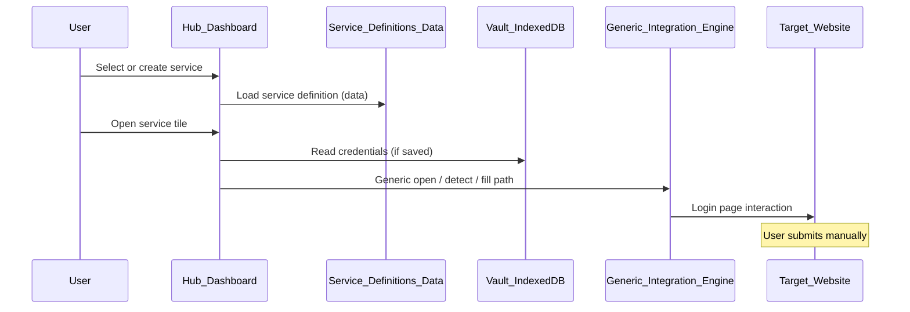

# Phase 3 — Extensible Service Platform

Implementation planning document.

**Authoritative sources:**

- [FIRST_USER_JOURNEY.md](../FIRST_USER_JOURNEY.md)
- [HIGH_LEVEL_ARCHITECTURE.md](../HIGH_LEVEL_ARCHITECTURE.md)
- [DECISIONS.md](../DECISIONS.md)
- [GENERIC_SITE_INTEGRATION_MODEL.md](../GENERIC_SITE_INTEGRATION_MODEL.md)
- [phases/PHASE_1_FIRST_USER_JOURNEY.md](./PHASE_1_FIRST_USER_JOURNEY.md)
- [phases/PHASE_2_FIRST_REAL_INTEGRATION.md](./PHASE_2_FIRST_REAL_INTEGRATION.md)

**Baseline:** Phase 1 validated the first-user journey and practice autofill path. Phase 2 validated generic and adapter-based autofill on real Israeli sites (Shufersal, Clalit, HTZone secondary). The catalog today lives in application source (`mockServices.ts`); services are not yet user-extensible or persistently managed as data.

This document is an **architecture and implementation plan** for Phase 3. It defines **what** the extensible platform must become — not APIs, storage schemas, or production code.

**Naming note:** This **implementation Phase 3** follows Phases 1–2 (journey + real integration). It aligns with architecture evolution toward catalog-as-data and user-defined services described in [HIGH_LEVEL_ARCHITECTURE.md](../HIGH_LEVEL_ARCHITECTURE.md) and [GENERIC_SITE_INTEGRATION_MODEL.md](../GENERIC_SITE_INTEGRATION_MODEL.md).

---

## Goal

Transform the Personal Digital Hub from a platform with **predefined integrations** into a platform capable of supporting **arbitrary websites** through a **generic service model**.

The objective of Phase 3 is **not** to add more one-off integrations.

The objective is to make **adding integrations scalable** — so new sites enter the hub as **configuration**, not as application code changes, whenever the generic engine can support them.

Success is measured by platform extensibility and preservation of generic-first principles — not by catalog size alone.

---

## Success criteria

By the end of Phase 3, the following must be true:

| Criterion | Meaning |
|-----------|---------|
| **Services as data** | Service definitions are represented as structured configuration, not hard-coded TypeScript entries |
| **Catalog decoupled from source** | The built-in catalog is no longer authored only in `mockServices.ts`; predefined services load from persistent catalog data |
| **User-created services** | Users can define their own services and receive the same hub experience as catalog services |
| **Generic engine remains default** | Open, detect, map, and fill still flow through the generic integration path first (ADR-003, ADR-008) |
| **Adapters remain exceptional** | Site-specific adapters are registered and invoked only when generic integration is insufficient |

---

## Scope

### What Phase 3 is

- Architectural and product foundation for an **extensible service platform**
- Canonical **service definition model** (configuration over code)
- **Login entry discovery** from a primary URL or homepage — users need not know the exact login URL
- **User custom services** as first-class citizens
- **Catalog persistence** with import/export and future remote-catalog compatibility
- **Presentation layer** for icons and tiles (independent of integration capability)
- **Adapter framework** that extends — not replaces — the generic engine

### What Phase 3 is not

- Beta launch, user testing at scale, or production rollout gate
- Broad autofill reliability program for every site in a national catalog
- Rewrite of parent architecture, product, or decision documents

### Included

| Area | Phase 3 deliverable (architectural) |
|------|-------------------------------------|
| Service definition model | Canonical Service entity, validation, lifecycle |
| Login entry discovery | Find likely login entry from primary URL; persist discovered `loginUrl` |
| User-created services | Minimum: display name + primary URL; generic path by default |
| Catalog persistence | Predefined services as data; import / export / update |
| Icon strategy | Favicon resolution, cache, fallbacks, user-supplied icons |
| Adapter registration model | Registration, selection rules, isolation from generic engine |

### Not included

| Excluded | Rationale |
|----------|-----------|
| Mobile / PWA / desktop clients | ADR-007 — web-first; future phase |
| Cloud sync | ADR-002 — future phase |
| AI-assisted autofill or discovery | Out of scope for extensibility foundation |
| Enterprise administration | Org-managed catalogs may be **designed for**; not implemented |
| Sharing credentials | Security and product scope; future phase |
| Browser support expansion | Extension platform assumptions unchanged |
| Auto-submit or MFA bypass | ADR-004 — non-goal |

---

## Iteration 3.1 — Service Definition Model

### Purpose

Define the **canonical Service entity** that all catalog entries, user-created services, and future imported definitions conform to. After Phase 3, a service is **configuration**, not a code change.

### Required fields (conceptual)

| Field | Role |
|-------|------|
| **id** | Stable unique identifier within the user’s hub (catalog id or generated id for custom services) |
| **displayName** | Human-readable name shown on tile and in credential UI |
| **url** | Primary site URL (homepage or canonical entry point) |

### Optional fields (conceptual)

| Field | Role |
|-------|------|
| **loginUrl** | Dedicated login page when different from `url` |
| **loginFields** | Ordered field schema: id, label, type (text / password) — vault credential keys |
| **category** | UX grouping (e.g. banking, health, shopping, custom) |
| **icon** | Reference to presentation-layer icon (URL, asset id, or user upload handle) |
| **source** | Provenance: built-in catalog, user-created, imported, future org catalog |
| **adapterId** | Reference to registered adapter **only** when generic path is insufficient |
| **locale / metadata** | Extensibility hooks without breaking existing clients |

### Validation rules

- **id** — unique per hub instance; stable across catalog updates for same logical service
- **displayName** — non-empty; reasonable length for RTL UI
- **url** / **loginUrl** — valid HTTPS (or allowed scheme policy); same-origin rules respected by extension policy
- **loginFields** — when present: unique field ids; at least one password-type field for credential services; labels suitable for generic field mapper
- **adapterId** — must reference a **registered** adapter; forbidden as default for new services without generic evaluation record
- **No credentials in service definition** — credentials remain in vault only (ADR-002)

### Service lifecycle

| State | Description |
|-------|-------------|
| **Defined** | Service record exists (catalog or user-created) |
| **Visible** | Shown on dashboard per user selection / access instance |
| **Configured** | User has saved credentials (optional for open-only flows) |
| **Generic-evaluated** | Documented result of generic detect/fill trial (pass/fail, date, reason) — required before adapter designation |
| **Adapter-bound** | Exceptional: `adapterId` set after generic failure documented |
| **Archived / removed** | User or catalog update hides or deletes definition; vault credentials handled per product policy |

### Future compatibility requirements

- Service records must be **versionable** (schema version field or implicit migration path) so built-in catalog, imports, and future remote catalogs can evolve without hub code changes
- Unknown optional fields should be **ignorable** by older clients (forward-compatible parsing)
- Field schema must support **2-field, 3-field, and N-field** patterns without entity redesign
- **source** and provenance fields must allow future organization-managed catalogs without changing integration flow
- Service definition must **not** embed integration logic — only metadata and references (e.g. `adapterId`)

### Acceptance criteria — Iteration 3.1

- [ ] **AC-3.1-1:** Canonical Service entity documented with required, optional, and validation rules above
- [ ] **AC-3.1-2:** Lifecycle states defined; generic-evaluated gate documented before adapter binding
- [ ] **AC-3.1-3:** Compatibility requirements written; no credential fields in service definition
- [ ] **AC-3.1-4:** Mapping from current catalog concepts (Phase 2 services) to canonical model documented

---

## Iteration 3.2 — Login Entry Discovery

### Purpose

Allow the platform to start from a user-provided **primary URL** or homepage and **discover the most likely login entry point**.

This is required for user-created services and future catalog flexibility. The user should **not** be required to know the exact login URL.

### Discovery capabilities

Discovery should support:

- Dedicated login pages
- Login links from homepages
- Visible login buttons
- Modal or popup login entry points
- Redirects to authentication subdomains
- Common login paths such as `/login`, `/signin`, `/account/login` as **fallback candidates**

### Rules

- Prefer **visible user-facing** login links or buttons before guessing paths
- **Never** call internal site JavaScript functions directly
- **Never** submit forms automatically
- **Never** bypass CAPTCHA, MFA, or security gates
- If discovery fails, the Hub should still open the **original primary URL** and explain that autofill may not be available
- A discovered `loginUrl` should be **stored back into the service definition** after user confirmation or successful validation

### Relationship to service model

- **Primary URL** (`url`) — what the user provides at service creation; homepage or canonical site entry
- **Login URL** (`loginUrl`) — optional until discovery or catalog metadata supplies it; becomes the autofill open target when known
- Catalog entries with explicit `loginUrl` (e.g. Phase 2 Shufersal, Clalit) may skip discovery when `loginUrl` is already defined

### Login URL lifecycle

The user provides a **primary URL** only once, when creating a new service.

The platform is responsible for discovering the most appropriate login entry point.

If a stable login entry is successfully discovered, the resulting `loginUrl` becomes part of the service definition.

Subsequent launches of the service should use the stored `loginUrl` directly.

Login discovery is **not** part of the normal login flow.

Discovery should only be performed when one of the following is true:

- The service does not yet have a stored `loginUrl`
- The stored `loginUrl` is no longer valid
- The user explicitly requests a new discovery
- The service definition is being recreated or repaired

If a stored `loginUrl` becomes invalid, the platform should automatically fall back to the **primary URL** and attempt discovery again.

This behavior keeps the normal user experience fast while allowing the platform to recover from website changes.

### Acceptance criteria — Iteration 3.2

- [ ] **AC-3.2-1:** Given a homepage primary URL, the system can identify a likely login entry point when a visible login link exists
- [ ] **AC-3.2-2:** The system can follow redirects to a stable login URL
- [ ] **AC-3.2-3:** The system can recognize when login is exposed through a visible popup/modal trigger
- [ ] **AC-3.2-4:** If no login entry is found, the original primary URL still opens normally
- [ ] **AC-3.2-5:** Discovery never submits credentials or invokes internal site functions
- [ ] **AC-3.2-6:** Successful discovery can persist the discovered `loginUrl` as service metadata
- [ ] **AC-3.2-7:** After successful discovery, the `loginUrl` becomes part of the persisted service definition
- [ ] **AC-3.2-8:** Normal service launches use the stored `loginUrl` without repeating discovery
- [ ] **AC-3.2-9:** If the stored `loginUrl` is no longer valid, the platform falls back to the primary URL and performs discovery again
- [ ] **AC-3.2-10:** The user is never required to re-enter the primary URL when rediscovery is needed

---

## Iteration 3.3 — User Custom Services

### Purpose

Allow users to **create their own services** without waiting for a built-in catalog entry. Custom services are **first-class citizens** — same tile, credential, open, and generic integration behavior as catalog services.

### Initial minimum (Phase 3)

| User provides | System behavior |
|---------------|-----------------|
| **Display name** | Tile label and credential modal title |
| **Primary URL** | Homepage or site entry point; starting point for login entry discovery (Iteration 3.2) |

Users are not required to supply `loginUrl` at creation time. Discovery runs when `loginUrl` is absent; an explicit `loginUrl` override remains a future expansion.

### Generic integration behavior

On tile open (when credentials exist and extension path applies):

1. Resolve open target: use stored `loginUrl` when present; otherwise run **login entry discovery** from primary URL (Iteration 3.2)
2. Open resolved login page (or primary URL when discovery does not find an entry)
3. Run **generic form detection** and **field mapping**
4. If field schema unknown, infer from detection or prompt user to confirm field labels (future refinement — architecture must allow it)
5. Fill from vault; **user submits manually** (ADR-004)

No adapter is assumed for user-created services at creation time.

### Future expansion (documented, not required for Phase 3 completion)

- Custom icon upload or selection
- Category assignment
- Explicit `loginUrl` override (without relying on discovery)
- Login field customization (add/rename fields, reorder)
- Generic evaluation status visible to user (“works with autofill” / “needs attention”)

### Acceptance criteria — Iteration 3.3

- [ ] **AC-3.3-1:** User can create a service with display name + primary URL only
- [ ] **AC-3.3-2:** Custom service appears on dashboard alongside catalog services
- [ ] **AC-3.3-3:** Custom service uses generic open/detect/fill path — no site-specific code per user site
- [ ] **AC-3.3-4:** Custom service credentials stored in vault keyed by service id (same as catalog)
- [ ] **AC-3.3-5:** Removing custom service does not break catalog or Phase 1–2 regression paths

---

## Iteration 3.4 — Catalog Persistence

### Purpose

Move **predefined services** from hard-coded application source into **persistent catalog storage**. The hub loads catalog entries as data at runtime (or build-time bundle of data files — architecture choice deferred to implementation; **persistence as data** is the requirement).

### Architectural capabilities

| Capability | Intent |
|------------|--------|
| **Import** | Load catalog definitions from external package (file, bundle, future remote feed) without code deploy |
| **Export** | Serialize current catalog (+ optionally user custom services) for backup or sharing |
| **Update** | Replace or merge catalog entries by id/version; built-in catalog updates ship as data updates |
| **Future remote catalogs** | Architecture allows trusted third-party or org catalogs; generic-first evaluation unchanged |

### Separation of concerns

| Layer | Responsibility |
|-------|----------------|
| **Catalog data** | Service definitions (names, URLs, fields, categories, icon refs) |
| **Hub application** | Renders tiles, merges user selections, loads vault credentials |
| **Integration engine** | Generic (default) or adapter (exception) — driven by service metadata, not catalog authorship |

Built-in Israeli catalog (Shufersal, Clalit, HTZone, banks, etc.) migrates from `mockServices.ts` to **catalog data** without changing integration philosophy.

### Acceptance criteria — Iteration 3.4

- [ ] **AC-3.4-1:** Built-in catalog loads from persistent data layer — not from TypeScript service array as sole source
- [ ] **AC-3.4-2:** Import and export of catalog definitions demonstrated (format spec is implementation detail)
- [ ] **AC-3.4-3:** Catalog update changes service metadata without application logic change for that service
- [ ] **AC-3.4-4:** Phase 2 validated services (Shufersal, Clalit) retain same logical definitions after migration
- [ ] **AC-3.4-5:** Architecture note documents path to future remote/org catalogs without amending this plan

---

## Iteration 3.5 — Service Presentation Layer

### Purpose

Define how services are **visually represented** on the dashboard. Presentation is **independent from integration capability** — a missing icon or favicon must not imply a site is unsupported.

### Topics

| Topic | Architectural intent |
|-------|------------------------|
| **Favicon resolution** | Derive icon from service URL origin when no explicit icon configured |
| **Local icon cache** | Avoid repeated network fetches; respect privacy and offline hub use |
| **Fallback icons** | Letter, category glyph, or neutral placeholder when favicon fails |
| **SVG support** | Allow vector icons for catalog and user uploads where policy permits |
| **User-supplied icons** | Custom services may attach icon reference; optional in 3.3 minimum |
| **Placeholder strategy** | Consistent RTL-safe fallback when all resolution paths fail |

### Principles

- Presentation failures must **never** block tile open or generic integration
- Icon pipeline is **read-only** with respect to credentials and autofill
- Catalog-provided icons and user icons use the **same presentation pipeline**

### Acceptance criteria — Iteration 3.5

- [ ] **AC-3.5-1:** Each service tile displays an icon or deterministic fallback
- [ ] **AC-3.5-2:** Favicon resolution and cache behavior documented; failed fetch does not break tile
- [ ] **AC-3.5-3:** User-supplied icon path supported in architecture (implementation may follow 3.3 minimum)
- [ ] **AC-3.5-4:** Presentation layer has no dependency on adapter vs generic integration type

---

## Iteration 3.6 — Adapter Framework

### Purpose

Define architecture for **exceptional integrations** — sites where generic detection or fill cannot provide a reliable experience after evaluation (see [GENERIC_SITE_INTEGRATION_MODEL.md](../GENERIC_SITE_INTEGRATION_MODEL.md)).

HTZone is the current reference: catalog metadata is shared; fill uses isolated adapter logic.

### Adapter registration

- Adapters are **registered** with a stable id (e.g. `htzone`), display metadata for diagnostics, and origin / URL match rules
- Registration is **declarative** — adapter module associates itself with registry at load time (implementation detail deferred)
- New adapters require **generic evaluation record** before registration is allowed in catalog data

### Adapter lifecycle

| Stage | Requirement |
|-------|-------------|
| **Evaluate generic** | Documented fail reason (popup, iframe, timing, etc.) |
| **Implement isolated adapter** | Single-site scope; no generic engine rule forks for one site |
| **Register** | Appears in adapter registry; referenced by `adapterId` on service definition |
| **Maintain** | DOM drift handled in adapter file only; generic engine unchanged unless fix benefits all sites |

### Selection rules

When user opens a service tile:

1. If service has **no** `adapterId` → **generic path only**
2. If service has **adapterId** → invoke registered adapter **after** generic path fails **or** when service definition marks adapter as required (architecture must prefer try-generic-first per ADR-003 unless generic trial permanently failed for that site)
3. Custom user services → **generic only** unless user/admin explicitly binds adapter (exceptional; not default)

### Isolation

- Adapters must not modify generic detector, mapper, or fill executor for site-specific behavior
- Adapter code lives in **dedicated modules** (current pattern: per-site adapter file)
- Extension host permissions remain driven by **origin policy**, not hard-coded hub tiles

### Compatibility with generic engine

The adapter framework **extends** the generic engine:

- Generic engine remains default for all service types
- Adapters are a **fallback layer**, not a parallel integration stack
- Improvements to generic detection reduce adapter surface area over time

### Acceptance criteria — Iteration 3.6

- [ ] **AC-3.6-1:** Adapter registry model documented (registration, id, selection)
- [ ] **AC-3.6-2:** Existing HTZone adapter fits registry model without behavior regression
- [ ] **AC-3.6-3:** New catalog entry cannot specify `adapterId` without generic evaluation gate
- [ ] **AC-3.6-4:** Generic path attempted before adapter for services where policy allows try-generic-first
- [ ] **AC-3.6-5:** No new adapters required for Phase 3 completion — framework only

---

## Architectural principles

Phase 3 must preserve and operationalize [GENERIC_SITE_INTEGRATION_MODEL.md](../GENERIC_SITE_INTEGRATION_MODEL.md):

| Principle | Phase 3 obligation |
|-----------|-------------------|
| **Generic first** | Service platform routes all new services through generic integration by default |
| **Configuration over code** | Catalog and custom services are data; hub code does not grow per site |
| **Catalog is convenience** | Built-in catalog is predefined UX — not a whitelist |
| **Custom services are first-class** | Same entity model, vault, tile, and integration flow as catalog |
| **Adapters are exceptions** | Registry + `adapterId` only after documented generic insufficiency |
| **Manual login submission** | ADR-004 unchanged; fill never submits forms |

Whenever design choices conflict, prefer the option that **improves generic coverage** or **reduces per-site code**.

---

## Expected deliverables

| Deliverable | Iteration |
|-------------|-----------|
| Canonical Service entity specification | 3.1 |
| Validation rules and lifecycle documentation | 3.1 |
| Login entry discovery architecture | 3.2 |
| User custom service workflow (architecture) | 3.3 |
| Persistent catalog architecture (import/export/update) | 3.4 |
| Presentation / icon architecture | 3.5 |
| Adapter registration and selection architecture | 3.6 |
| Phase 3 acceptance criteria sign-off | All |

Implementation artifacts (storage format, UI screens, module layout) are **out of scope for this document**.

---

## Affected components (conceptual)

Components expected to evolve during Phase 3 implementation. **No replacements** of vault crypto or generic engine core philosophy.

| Component | Expected architectural change |
|-----------|------------------------------|
| **Service catalog layer** | From embedded TypeScript list to loaded data + user records |
| **Dashboard** | Renders any Service entity; custom + catalog unified |
| **Vault credential binding** | Keyed by service id; unchanged zero-knowledge model |
| **Login entry discovery** | Resolves `loginUrl` from primary URL when absent; persists after confirmation |
| **Hub open/fill orchestration** | Driven by service metadata (primary url, loginUrl, loginFields, adapterId) |
| **Generic integration engine** | Unchanged as default; may gain heuristic improvements benefiting all services |
| **Extension** | Origin allowlist policy may evolve from static list toward metadata-driven rules (architecture TBD in implementation) |
| **Adapter modules** | Registered via framework; HTZone remains reference implementation |

Components **not** expected to change in Phase 3:

- Phase 1 practice flow (regression preserved)
- Phase 2 Shufersal / Clalit generic validated paths (behavior preserved post-catalog migration)
- ADR-002 zero-knowledge vault
- Parent docs: `HIGH_LEVEL_ARCHITECTURE.md`, `PRODUCT_PRINCIPLES.md`, `DECISIONS.md`, `GENERIC_SITE_INTEGRATION_MODEL.md`

---

## Risks

### Platform risks

| Risk | Mitigation |
|------|------------|
| Catalog migration breaks Phase 2 services | Migration mapping + regression AC; Shufersal/Clalit definitions parity check |
| User custom services imply “unsupported = bad UX” | Presentation fallbacks; generic trial messaging; catalog not whitelist |
| Scope creep to full national catalog autofill | Phase 3 success = extensibility, not breadth |
| Adapter registry becomes default path | AC-3.6-3 generic evaluation gate; ADR-008 |
| Login discovery false positives or security bypass attempts | Rules enforce visible links first; no JS invocation; no auto-submit; ADR-004 |
| Discovery failure blocks user access | AC-3.2-4 — primary URL still opens; autofill may be unavailable |
| Service schema churn | Version field + forward-compatible optional fields |

### Technical risks

| Risk | Mitigation |
|------|------------|
| Dynamic origin policy for extension | Architecture allows metadata-driven rules; Phase 3 documents constraint; implementation validates safely |
| Icon cache privacy | Cache only public favicons; no credential leakage |
| Import of malicious catalog data | Validation rules; trusted source policy for imports (implementation phase) |

---

## Technical decision principle

When multiple valid options exist, prefer the solution that:

1. **Treats services as data** (configuration over code)
2. **Attempts generic integration first** (ADR-003, ADR-008)
3. **Keeps custom and catalog services on the same model**
4. **Isolates adapters** without forking generic engine for one site
5. **Preserves human submit** (ADR-004)

Extensibility takes precedence over optimizing any single catalog entry.

---

## Out of scope (Phase 3 document boundary)

The following are **intentionally excluded** from this plan and from Phase 3 architecture deliverables:

| Excluded | Notes |
|----------|-------|
| API specifications | Implementation phase |
| Database or storage schemas | Implementation phase |
| Production code in this planning deliverable | This file is plan-only |
| Concrete UI mockups | Product iteration |
| Remote catalog protocol | Architecture allows; protocol is later |
| Enterprise admin console | Future |
| Auto-submit, MFA automation | ADR-004 |
| Changes to parent architecture documents | Phase implements against them |

---

## Suggested implementation order

1. **3.1 — Service definition model:** Canonical entity, validation, lifecycle, migration mapping from current catalog
2. **3.2 — Login entry discovery:** Resolve `loginUrl` from primary URL; persistence after confirmation
3. **3.4 — Catalog persistence:** Load built-in catalog as data (enables 3.3 and 3.5 to consume unified model)
4. **3.5 — Presentation layer:** Icon pipeline on unified Service entity
5. **3.3 — User custom services:** Create flow with primary URL only; dashboard merge; discovery on open
6. **3.6 — Adapter framework:** Registry formalization; HTZone registration
7. **Regression:** Phase 1 practice, Phase 2 Shufersal/Clalit generic paths, HTZone adapter path
8. **Evidence:** Sign off all AC-3.x criteria

Order may adjust if persistence (3.4) must precede model finalization — model (3.1) remains the specification authority. Login entry discovery (3.2) must precede user custom services (3.3).

---

## Acceptance criteria (Phase complete)

Phase 3 is **complete** when all iteration acceptance criteria (AC-3.1 through AC-3.6) are satisfied and:

- [ ] **AC-3-P-1:** Services are represented as data end-to-end (catalog + custom)
- [ ] **AC-3-P-2:** Built-in catalog no longer depends solely on `mockServices.ts` as authoring source
- [ ] **AC-3-P-3:** User can create a custom service with display name + primary URL only; generic integration attempt follows login entry discovery when `loginUrl` is absent
- [ ] **AC-3-P-4:** Login entry discovery operates without requiring exact login URL upfront; failed discovery still opens primary URL
- [ ] **AC-3-P-5:** Generic engine remains default; adapters registered only via framework
- [ ] **AC-3-P-6:** All architectural decisions trace to [GENERIC_SITE_INTEGRATION_MODEL.md](../GENERIC_SITE_INTEGRATION_MODEL.md)
- [ ] **AC-3-P-7:** Phase 1 and Phase 2 regression criteria still pass

---

## Document status

| | |
|---|---|
| **Phase** | 3 — Extensible Service Platform |
| **Status** | Planning |
| **Depends on** | Phase 1 complete; Phase 2 complete; [HIGH_LEVEL_ARCHITECTURE.md](../HIGH_LEVEL_ARCHITECTURE.md); [DECISIONS.md](../DECISIONS.md); [GENERIC_SITE_INTEGRATION_MODEL.md](../GENERIC_SITE_INTEGRATION_MODEL.md) |
| **Does not modify** | Source code; parent architecture/product/decision documents (except this new phase plan) |

---

*Phase plans live here; integration philosophy remains in [GENERIC_SITE_INTEGRATION_MODEL.md](../GENERIC_SITE_INTEGRATION_MODEL.md); product and platform direction remain in parent `docs/` documents.*
