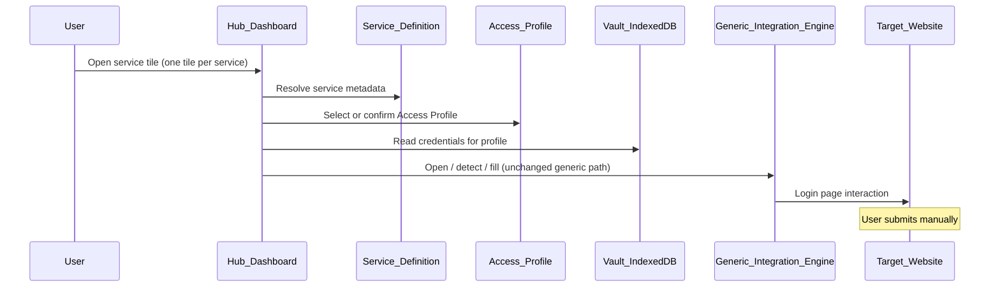
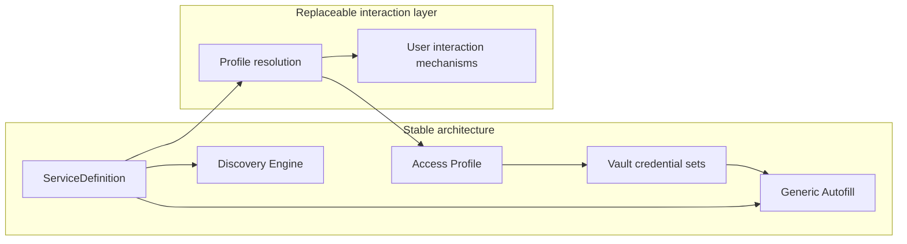

# Phase 4 — Identity and Profile Management

Implementation planning document.

**Authoritative sources:**

- [FIRST_USER_JOURNEY.md](../FIRST_USER_JOURNEY.md)
- [HIGH_LEVEL_ARCHITECTURE.md](../HIGH_LEVEL_ARCHITECTURE.md)
- [DECISIONS.md](../DECISIONS.md)
- [GENERIC_SITE_INTEGRATION_MODEL.md](../GENERIC_SITE_INTEGRATION_MODEL.md)
- [PRODUCT_PRINCIPLES.md](../PRODUCT_PRINCIPLES.md)
- [phases/PHASE_1_FIRST_USER_JOURNEY.md](./PHASE_1_FIRST_USER_JOURNEY.md)
- [phases/PHASE_2_FIRST_REAL_INTEGRATION.md](./PHASE_2_FIRST_REAL_INTEGRATION.md)
- [phases/PHASE_3_EXTENSIBLE_SERVICE_PLATFORM.md](./PHASE_3_EXTENSIBLE_SERVICE_PLATFORM.md)

**Baseline:** Phase 3 established services as data — catalog and custom services share a canonical **Service** entity, login entry discovery, generic-first integration, and vault credentials keyed by **service id**. The dashboard shows **one tile per selected service**. Today each service supports at most one implicit credential set. [HIGH_LEVEL_ARCHITECTURE.md](../HIGH_LEVEL_ARCHITECTURE.md) describes a future **three-layer model** (service template → access instance → credential set); Phase 4 formalizes that direction using **Access Profiles** as first-class entities.

This document is an **architecture and implementation plan** for Phase 4. It defines **what** identity and profile management must become — not APIs, storage schemas, or production code.

**Naming note:** This **implementation Phase 4** follows Phases 1–3. It operationalizes the multi-access direction in [HIGH_LEVEL_ARCHITECTURE.md](../HIGH_LEVEL_ARCHITECTURE.md) and respects **ADR-006** (validate UX before locking presentation details). **Access Profile** is the Phase 4 canonical term for a user-owned identity context bound to a service (replacing provisional “access instance” language in parent architecture where this plan applies).

---

## Goal

Introduce **Access Profiles** so a single **Service** on the dashboard can represent **multiple real-world identities** — personal and work accounts, family members, professional client contexts — without duplicating service definitions or breaking the generic autofill architecture.



The objective of Phase 4 is **not** to add new site integrations or change how login forms are detected and filled.

The objective is to **separate identity from service** — so credentials, labels, and autofill context resolve through an **Access Profile**, while the dashboard remains **one tile per service** and a dedicated **management surface** handles profile and credential administration.

Success is measured by a clear three-entity model, backward-compatible vault migration, unchanged generic-first autofill behavior, and a clean **execution vs management** split — not by family-sharing, cloud sync, or enterprise administration.

---

## Success criteria

By the end of Phase 4, the following must be true:

| Criterion | Meaning |
|-----------|---------|
| **Access Profiles are first-class** | Profiles exist as explicit entities with stable identity, not implicit “the credentials for this service” |
| **One tile per service** | Dashboard layout remains one tile per selected service; multiple identities are handled inside the service experience |
| **Three-layer separation** | **Service**, **Access Profile**, and **Credentials** are distinct concepts with distinct responsibilities |
| **Multiple profiles per service** | A user can define more than one Access Profile for the same service, each with its own credential set |
| **Vault compatibility** | Existing vault data (credentials keyed by service id) loads without loss; legacy binding maps to a default profile |
| **Generic autofill unchanged** | Open, detect, map, and fill still flow through the generic integration engine; only credential **selection** changes |
| **Hub-first preserved** | ADR-001, ADR-002, ADR-004 unchanged — hub orchestrates; extension fills; user submits manually |
| **Execution vs management separated** | Dashboard for daily execution; dedicated management surface for profiles and credentials |

---

## Scope

**The product intentionally separates execution from management.** The dashboard is for daily use — open, resolve profile, launch login, autofill. Credential and Access Profile administration belongs to a dedicated management experience (see [Management Surface](#management-surface)).

### What Phase 4 is

- Architectural foundation for **identity and profile management** on top of the Phase 3 service platform
- Canonical **Access Profile** entity — user-owned context bound to exactly one service
- **Credential binding** refactored from service id → profile id (with migration from today’s model)
- **Dashboard as execution surface** — one tile per service; open and autofill only; no profile or credential management on dashboard
- **Management surface** — create, rename, delete profiles; edit credentials; set default profile
- **Profile resolution** — determine which Access Profile to use before open (when multiple exist)
- **Compatibility layer** for existing encrypted vault payloads
- Documentation of profile lifecycle, defaults, and deletion policy

### What Phase 4 is not

- Beta launch, user testing at scale, or production rollout gate
- Cloud sync, multi-device identity, or shared household vaults
- Enterprise administration or org-managed profiles
- Changes to the generic autofill engine, discovery engine, or adapter framework
- Duplicate dashboard tiles per profile (explicit non-goal for Phase 4)
- Credential sharing between users or devices

### Included

| Area | Phase 4 deliverable (architectural) |
|------|-------------------------------------|
| Access Profile entity | Canonical profile model, validation, lifecycle |
| Service / Profile / Credentials separation | Three-layer data model and responsibility boundaries |
| Vault migration strategy | Map legacy service-keyed credentials to default profiles without re-encryption philosophy change |
| Execution surface (dashboard) | One tile per service; open, profile resolution, launch login, autofill — no management |
| Management surface | Full Access Profile and credential administration (location TBD) |
| Profile resolution | Resolve profile id before open when multiple profiles exist |
| Default profile | Every service with legacy credentials gains exactly one implicit default profile on migration |

### Not included

| Excluded | Rationale |
|----------|-----------|
| Cloud sync of profiles | ADR-002 — future phase |
| Multi-user / family vault namespaces | Product and security scope; architecture may allow later |
| Professional client workflow UI (full) | Phase 4 establishes profiles; rich client-management UX is later |
| Profile avatars, colors, or deep personalization | Optional future presentation layer |
| Auto-submit, MFA automation | ADR-004 — non-goal |
| Changes to ServiceDefinition schema beyond profile references | Service remains site metadata only |
| New site adapters or catalog entries | Phase 2–3 responsibility |

---

## Architectural principles

Phase 4 must preserve [GENERIC_SITE_INTEGRATION_MODEL.md](../GENERIC_SITE_INTEGRATION_MODEL.md) and [DECISIONS.md](../DECISIONS.md):

**The product intentionally separates execution from management.**

| Principle | Phase 4 obligation |
|-----------|-------------------|
| **Service is site metadata** | Service holds URLs, field schema, category, icon — never credentials or profile-specific labels |
| **Profile is user identity context** | Profile holds user-facing label (e.g. “עבודה”, “אמא”), optional kind/metadata, binding to one service |
| **Credentials belong to profiles** | Encrypted field values keyed by profile id; never embedded in service or profile display metadata |
| **Dashboard is an execution surface** | Daily-use dashboard: open service, resolve profile, launch login, initiate autofill — not profile or credential management |
| **Management is a separate surface** | Profile CRUD, credential editing, and default selection belong to dedicated management UX |
| **One tile per service** | Dashboard scanability preserved; multiple identities resolved at execution time, not via duplicate tiles |
| **Generic autofill unchanged** | Engine receives service metadata + credential set; profile affects **which** values, not **how** fill works |
| **Zero-knowledge preserved** | ADR-002 — migration re-keys or wraps references; no plaintext export; master password model unchanged |
| **Validate UX, stabilize architecture** | ADR-006 — profile selection and management presentation may evolve; entity model and vault binding should not |
| **Profile model independent of interaction** | Access Profile entities and vault binding are stable; **how** a profile is chosen is a replaceable interaction layer |
| **Configuration over duplication** | Do not clone Service records per family member or account — add profiles instead |
| **Manual login submission** | ADR-004 unchanged |

Whenever design choices conflict, prefer the option that **keeps one service definition**, **adds profiles**, and **keeps management off the dashboard**.

---

## Dashboard is an Execution Surface

The Digital Hub **dashboard** is intended for **daily use and execution only**.

Its responsibilities are limited to:

- Opening a service
- Resolving the appropriate Access Profile
- Launching the login flow
- Initiating autofill

The dashboard **must not** become a credential or profile management interface. Users should not need to administer profiles or edit stored secrets from the tile grid to complete a routine login.

Profile resolution on open (default profile, chooser, or future mechanism) is part of **execution** — not management — because it happens in the flow of reaching a service, not in a configuration context.

---

## Management Surface

Credential and Access Profile **management** belongs to the dedicated **management experience**.

This includes:

- Creating Access Profiles
- Renaming Access Profiles
- Deleting Access Profiles
- Marking the default Access Profile
- Editing credential values
- Adding or removing credential fields when applicable

The management experience may be accessed from:

- Manage Services
- Credentials
- A future unified management page

The exact UI location is **intentionally unspecified** (ADR-006).

Future product versions may consolidate service management and credential management into a **unified management experience** without changing the underlying Access Profile architecture, vault binding model, or execution surface responsibilities.

---

## Data model

Phase 4 formalizes the three-layer model described in [HIGH_LEVEL_ARCHITECTURE.md](../HIGH_LEVEL_ARCHITECTURE.md). Entity names below are **canonical for Phase 4 planning**.

### Layer 1 — Service

**Role:** Site or institution template — shared integration metadata for all profiles on that service.

| Concept | Description |
|---------|-------------|
| **Identity** | Stable service id (catalog or custom) |
| **Contains** | displayName, url, loginUrl, loginFields, category, icon, source, adapterId (when applicable) |
| **Does not contain** | Credentials, profile labels, user-specific account names |
| **Dashboard** | Exactly one tile per selected service |
| **Relationship** | One service → zero or many Access Profiles |

Service entity aligns with Phase 3 **ServiceDefinition**. Phase 4 does not redesign it.

### Layer 2 — Access Profile

**Role:** User-owned identity context for a specific service — the unit the user recognizes when choosing “which account”.

| Concept | Description |
|---------|-------------|
| **Identity** | Stable profile id, unique within the vault |
| **Binding** | Exactly one parent service id |
| **Contains** | User-facing profile label (e.g. “פרטי”, “עבודה”, “לקוח כהן”), optional profile kind or tags for future UX, sort order, default flag |
| **Does not contain** | Site URLs, login field schema, or secret field values |
| **Lifecycle** | Created, renamed, set as default, archived/deleted |
| **Relationship** | One profile → exactly one credential set |

**Default profile:** Every service that has credentials after migration must have exactly one profile marked default (or equivalent implicit rule) so single-account users need not choose every time.

### Layer 3 — Credentials

**Role:** Encrypted field values matching the parent service’s **loginFields** schema.

| Concept | Description |
|---------|-------------|
| **Identity** | Keyed by profile id inside encrypted vault payload |
| **Contains** | Field id → value map (same shape as today’s Credential) |
| **Does not contain** | Service metadata or profile display label |
| **Relationship** | One credential set → exactly one Access Profile |

### Conceptual relationships

```mermaid
erDiagram
  Service ||--o{ AccessProfile : has
  AccessProfile ||--o| CredentialSet : stores
  Service {
    string serviceId
    string displayName
    string url
    string loginUrl
    loginFieldSchema loginFields
  }
  AccessProfile {
    string profileId
    string serviceId
    string profileLabel
    boolean isDefault
  }
  CredentialSet {
    fieldValues keyed by loginField id
  }
```

### Validation rules (conceptual)

- **Profile serviceId** — must reference an existing selected or defined service
- **profileLabel** — non-empty; suitable for RTL UI; unique per service (recommended, not globally)
- **isDefault** — at most one default profile per service
- **Credentials** — field ids must match parent service **loginFields**; at least one password-type field when service requires login
- **No credentials in Service or Access Profile records**
- **Deleting a profile** — credential set removed or archived per product policy; service tile remains if service still selected

### Compatibility with existing vault data

Today’s vault stores credentials keyed by **service id**. Phase 4 migration (conceptual):

| Legacy state | Phase 4 state |
|--------------|---------------|
| Credential exists for service id `S` | One **default Access Profile** for `S` + credential set keyed by new profile id |
| No credential for service `S` | No profile required until user saves credentials (or optional empty default — product choice documented at implementation) |
| Custom services in vault | Same rule — default profile per service with credentials |
| selectedIds / service selection | Unchanged — still service ids |

Migration must be **lossless**, **idempotent**, and **transparent** to users who only ever had one account per service.

---

## Future extensibility

The **Access Profile model** must remain **independent from the user interaction model**.

Phase 4 introduces profiles as stable entities and a first **profile resolution** experience (default profile, chooser on open, etc.). That experience is **one implementation** of profile resolution — not part of the profile entity definition.

### Separation of concerns

| Layer | Stable (Phase 4+) | Replaceable (product evolution) |
|-------|---------------------|----------------------------------|
| **ServiceDefinition** | Site metadata, field schema, login URLs | Presentation, catalog source |
| **Access Profile entity** | profileId, serviceId, profileLabel, default flag, lifecycle | — |
| **Vault credential binding** | Credentials keyed by profile id; encrypted credential sets | Sync transport (future) |
| **Profile resolution** | Input: service + context → output: profileId | UX, rules, automation, policy |
| **User interaction** | — | Chooser UI, remembered choice, silent selection |

Profile resolution is the **bridge** between “user opened a service” and “load credentials for profile X”. The Hub orchestration layer owns resolution on the **execution surface**; the vault stores profiles and credentials; the **management surface** owns profile and credential administration.



### Future profile resolution mechanisms

Future product versions may resolve profiles using **any** of the following (or combinations), without amending the Access Profile entity or vault binding model:

| Mechanism | Description |
|-----------|-------------|
| **Remembered profile** | Last-used or frequently-used profile per service |
| **Background rules** | Time-of-day, calendar, device context, or user-defined rules |
| **Contextual automation** | Infer profile from open context (e.g. active client matter, location) |
| **AI assistance** | Suggest or select profile from natural-language intent — advisory or automatic per policy |
| **Enterprise policy** | Org-mandated profile or credential scope for managed deployments |
| **Other mechanisms** | Not enumerated exhaustively; resolution remains pluggable |

Each mechanism implements the same architectural contract: given a **service** and **resolution context**, produce a **profile id** (or explicit user override). Credentials are then loaded from the vault for that profile.

### Components that must not change for new resolution mechanisms

The following remain **stable** when profile resolution evolves:

| Component | Why stable |
|-----------|------------|
| **ServiceDefinition** | Describes the site, not who is logging in |
| **Vault model** | Profiles and credential sets; encryption and keying by profile id |
| **Generic Autofill** | Receives service field schema + credential values; no profile-selection logic |
| **Discovery Engine** | Operates on service primary URL; identity-agnostic |

Adding remembered profiles, rules, AI, or enterprise policy changes **only** the profile resolution / interaction layer — not service metadata, vault shape, form detection, field mapping, fill execution, or login entry discovery.

### Architectural rules for future phases

- New resolution mechanisms **must not** embed credentials in Service or Access Profile metadata
- New resolution mechanisms **must not** fork generic autofill or discovery per profile type
- New resolution mechanisms **may** store **non-secret** preferences (e.g. last profile id per service) outside credential payloads, subject to privacy review
- Enterprise or AI features **must** fail open to explicit user choice when resolution is uncertain

---

## Development iterations

### Iteration 4.1 — Access Profile Entity Model

#### Purpose

Define the **canonical Access Profile entity** and its relationship to Service. After Phase 4, “which account” is never inferred solely from service id.

#### Required concepts

| Concept | Role |
|---------|------|
| **profileId** | Stable unique identifier within vault |
| **serviceId** | Parent service reference |
| **profileLabel** | Human-readable name shown in profile selection UI |
| **isDefault** | Whether this profile is used when user does not explicitly choose |

#### Optional concepts (documented, may defer implementation)

| Concept | Role |
|---------|------|
| **profileKind** | Coarse category: personal, work, family, client — for future filtering |
| **sortOrder** | User-defined ordering in profile list |
| **createdAt / updatedAt** | Audit and UX hints |

#### Acceptance criteria — Iteration 4.1

- [ ] **AC-4.1-1:** Access Profile entity documented with required fields, validation, and service binding
- [ ] **AC-4.1-2:** Three-layer separation (Service / Access Profile / Credentials) documented with responsibility boundaries
- [ ] **AC-4.1-3:** Default profile rules documented (one default per service when multiple profiles exist)
- [ ] **AC-4.1-4:** Mapping from current single-credential-per-service model documented
- [ ] **AC-4.1-5:** Access Profile entity documented as independent from profile resolution / user interaction model

---

### Iteration 4.2 — Vault Compatibility and Migration

#### Purpose

Introduce profile-keyed credential storage **without breaking** existing encrypted vaults or ADR-002 guarantees.

#### Architectural capabilities

| Capability | Intent |
|------------|--------|
| **Read legacy format** | Unlock loads credentials keyed by service id |
| **Migrate on unlock** | First unlock after upgrade creates default profiles and rebinds credentials |
| **Write new format** | New saves target profile id |
| **Rollback safety** | Migration documented so failed partial state is recoverable |

#### Rules

- Master password and encryption model unchanged
- No plaintext credential export as part of migration
- Custom services and catalog services follow the same profile rules
- Removing a service from dashboard selection does not automatically delete profiles (policy documented)

#### Acceptance criteria — Iteration 4.2

- [ ] **AC-4.2-1:** Legacy vault with service-keyed credentials loads and maps to default profiles without data loss
- [ ] **AC-4.2-2:** New credential saves persist under profile id
- [ ] **AC-4.2-3:** User with one account per service requires no new mandatory setup after migration
- [ ] **AC-4.2-4:** Zero-knowledge properties preserved (ADR-002)

---

### Iteration 4.3 — Profile Management

#### Goal

Introduce complete **Access Profile management** without changing the dashboard execution experience.

#### Purpose

Deliver the **management surface** capabilities for profiles and credentials. Users administer identities and secrets here — not from the dashboard tile grid.

Management responsibilities include:

| Capability | Intent |
|------------|--------|
| **Create profile** | Add a new Access Profile for a service |
| **Rename profile** | Update profile display label |
| **Delete profile** | Remove profile and associated credential set per policy |
| **Set default** | Mark exactly one default profile per service when multiple exist |
| **Edit credentials** | Create, update, or remove credential field values for a profile |
| **Field schema edits** | Add or remove credential fields when applicable (subject to service loginFields) |

#### Explicit non-goals

- Profile or credential management UI on the dashboard execution surface
- Duplicate dashboard tiles per profile
- Profile resolution UX (Iteration 4.4)

#### Acceptance criteria — Iteration 4.3

- [ ] **AC-4.3-1:** User can create a second Access Profile for an existing service from the management surface
- [ ] **AC-4.3-2:** User can rename a profile without changing ServiceDefinition
- [ ] **AC-4.3-3:** User can delete a profile; credentials for that profile are removed
- [ ] **AC-4.3-4:** User can mark one profile as default per service
- [ ] **AC-4.3-5:** User can edit credential values for a specific profile from the management surface
- [ ] **AC-4.3-6:** Dashboard execution surface unchanged — no profile CRUD or credential editing on dashboard tiles

---

### Iteration 4.4 — Profile Resolution

#### Goal

When multiple Access Profiles exist for a service, **resolve which profile to use** before opening the service and initiating autofill.

#### Purpose

Define the **execution-time** profile resolution step on the dashboard (or equivalent execution surface). Resolution produces a **profile id** consumed by open/fill orchestration. The **UI mechanism is intentionally unspecified** — chooser dialog, inline picker, remembered profile, or future automation are implementation choices (see [Future extensibility](#future-extensibility)).

#### Resolution rules (architectural)

| Condition | Behavior |
|-----------|----------|
| **Single profile for service** | Use that profile (or explicit default); no mandatory user step |
| **Multiple profiles, default set** | Use default unless user overrides at execution time |
| **Multiple profiles, no default** | Resolution must obtain explicit or rule-based choice before open |
| **After resolution** | Load credentials for resolved profile id; generic autofill path unchanged |

#### Orchestration (downstream of resolution)

Once profile id is resolved:

| Step | Responsibility |
|------|----------------|
| Load service | ServiceDefinition metadata (url, loginUrl, loginFields, adapterId) |
| Load credentials | Decrypt credential set for resolved profile id |
| Open / discover | Unchanged from Phase 3 |
| Fill | Generic engine (or adapter) receives same field schema and credential map shape as today |

#### Explicit non-goals

- Specifying resolution UI layout or interaction design
- Profile or credential management (Iteration 4.3)
- Changes to generic autofill engine or extension fill semantics

#### Acceptance criteria — Iteration 4.4

- [ ] **AC-4.4-1:** Single-profile users experience no extra mandatory resolution step
- [ ] **AC-4.4-2:** Multi-profile users resolve to the intended profile before open/autofill
- [ ] **AC-4.4-3:** Tile open with resolved profile fills identically to pre-Phase-4 behavior for single-account users
- [ ] **AC-4.4-4:** Generic autofill engine and adapter selection rules unchanged (ADR-003, ADR-008)
- [ ] **AC-4.4-5:** No auto-submit; user submits manually (ADR-004)

---

### Iteration 4.5 — Profile Lifecycle Policy

#### Purpose

Document edge cases and policies for profile lifecycle that span management and vault state — complementing Iteration 4.3 implementation.

#### Lifecycle states

| State | Description |
|-------|-------------|
| **Active** | Profile available for selection and autofill |
| **Default** | Profile used when no explicit selection (at most one per service) |
| **Deleted** | Profile and credential set removed per policy; service tile unaffected |

#### Rules

- Deleting the last profile for a service leaves service tile in place; credentials empty until user creates a new profile
- Deleting the default profile requires promoting another profile or accepting implicit selection rules
- Service deletion (custom) or deselection handles orphaned profiles per documented policy

#### Acceptance criteria — Iteration 4.5

- [ ] **AC-4.5-1:** Deleting the last profile for a service leaves service tile in place; credentials empty until user creates a new profile via management surface
- [ ] **AC-4.5-2:** Deleting the default profile requires promoting another profile or documented fallback selection rules
- [ ] **AC-4.5-3:** Service deselection or custom service removal handles orphaned profiles per documented policy
- [ ] **AC-4.5-4:** Lifecycle policies documented; management and execution surfaces remain separated

---

## Expected deliverables

| Deliverable | Iteration |
|-------------|-----------|
| Access Profile entity specification | 4.1 |
| Three-layer data model documentation | 4.1 |
| Profile resolution vs interaction separation | 4.1, Future extensibility |
| Vault migration and compatibility architecture | 4.2 |
| Profile management surface architecture | 4.3 |
| Profile resolution architecture (execution surface) | 4.4 |
| Profile lifecycle policy documentation | 4.5 |
| Phase 4 acceptance criteria sign-off | All |

Implementation artifacts (storage format, UI screens, module layout) are **out of scope for this document**.

---

## Affected components (conceptual)

Components expected to evolve during Phase 4 implementation. **No replacements** of vault crypto philosophy or generic engine core.

| Component | Expected architectural change |
|-----------|------------------------------|
| **Vault payload** | Credentials keyed by profile id; profiles stored alongside or within encrypted state; migration from service id keys |
| **Management surface** | Profile CRUD, credential editing, default profile selection |
| **Dashboard (execution surface)** | One tile per service; open, profile resolution, launch login, autofill — no management |
| **Open/fill orchestration** | Consumes resolved profile id; passes credentials to extension as today |
| **Service catalog / ServiceDefinition** | Minimal or no change — remains site metadata |
| **Generic integration engine** | Unchanged |
| **Login entry discovery** | Unchanged — operates on service primary URL |
| **Extension** | May receive profile id for logging; fill behavior unchanged |

Components **not** expected to change in Phase 4:

- Phase 3 service platform, catalog persistence, custom service creation
- Discovery execution abstraction and engine
- ADR-002 zero-knowledge encryption approach
- Parent docs: `HIGH_LEVEL_ARCHITECTURE.md`, `PRODUCT_PRINCIPLES.md`, `DECISIONS.md`, `GENERIC_SITE_INTEGRATION_MODEL.md` (except alignment notes)

---

## Risks

### Product risks

| Risk | Mitigation |
|------|------------|
| Profile selection adds friction for single-account users | Default profile; no mandatory chooser when only one profile exists |
| Users expect duplicate tiles (ADR-006) | Document one-tile model; validate chooser UX before expanding |
| Terminology confusion (profile vs service vs account) | Consistent Hebrew UX copy; profileLabel distinct from service displayName |
| Dashboard accumulates management features | Execution vs management principle; AC-4.3-6 |

### Technical risks

| Risk | Mitigation |
|------|------------|
| Vault migration data loss | Lossless migration AC; idempotent upgrade; regression on real vault fixtures |
| Orphan credentials after partial migration | Migration completes atomically per unlock session |
| Extension or fill path uses wrong profile | Explicit profile id in orchestration; regression tests for multi-profile services |
| Breaking Phase 2–3 regression | Default profile preserves single-account behavior exactly |

### Platform risks

| Risk | Mitigation |
|------|------------|
| Duplicating services instead of profiles | Architectural review; AC-4.1 separation; code review gate |
| Credentials embedded in profile metadata | Validation rules forbid secrets in profile entity |

---

## Dependencies

| Dependency | Relationship |
|------------|--------------|
| **Phase 3 complete** | Canonical Service entity, custom services, catalog as data, discovery, dashboard merge |
| **Phase 2 regression baseline** | Shufersal, Clalit generic fill; HTZone adapter — must pass with default profile |
| **Phase 1 regression baseline** | Practice path unchanged |
| **[HIGH_LEVEL_ARCHITECTURE.md](../HIGH_LEVEL_ARCHITECTURE.md)** | Three-layer model direction; Phase 4 names and formalizes Access Profile |
| **[DECISIONS.md](../DECISIONS.md)** | ADR-001 hub-first, ADR-002 zero-knowledge, ADR-004 human submit, ADR-006 UX validation |
| **[GENERIC_SITE_INTEGRATION_MODEL.md](../GENERIC_SITE_INTEGRATION_MODEL.md)** | Generic autofill remains default; profiles change credential source only |

Phase 4 does **not** depend on cloud sync, enterprise catalog, or non-intrusive discovery executors (Phase 3.6 execution layer).

---

## Technical decision principle

When multiple valid options exist, prefer the solution that:

1. **Keeps one Service definition per site** (no duplication per identity)
2. **Keys credentials to Access Profile**, not service id, in the steady state
3. **Preserves one dashboard tile per service**
4. **Migrates legacy data losslessly** to default profiles
5. **Leaves generic autofill and discovery unchanged**
6. **Preserves zero-knowledge and manual submit** (ADR-002, ADR-004)
7. **Keeps profile and credential management off the dashboard execution surface**

Identity management takes precedence over dashboard visual experimentation.

---

## Out of scope (Phase 4 document boundary)

The following are **intentionally excluded** from this plan and from Phase 4 architecture deliverables:

| Excluded | Notes |
|----------|-------|
| API specifications | Implementation phase |
| Database or storage schemas | Implementation phase |
| Production code in this planning deliverable | This file is plan-only |
| Concrete UI mockups | Product iteration; ADR-006 |
| Cloud sync of profiles | Future phase |
| Shared vaults / family accounts | Future phase |
| Enterprise admin or org profiles | Future phase |
| Duplicate tiles per profile | Explicit Phase 4 non-goal |
| Generic engine or adapter redesign | Phase 2–3 scope |
| Auto-submit, MFA automation | ADR-004 |
| Changes to parent architecture documents | Phase implements against them |

---

## Suggested implementation order

1. **4.1 — Access Profile entity model:** Canonical entity, validation, three-layer documentation
2. **4.2 — Vault compatibility and migration:** Legacy read, migrate-on-unlock, profile-keyed write
3. **4.3 — Profile management:** Management surface for profiles and credentials; dashboard unchanged
4. **4.4 — Profile resolution:** Execution-time profile selection before open; UI unspecified
5. **4.5 — Profile lifecycle policy:** Edge cases, orphans, default promotion rules
6. **Regression:** Phase 1 practice, Phase 2 Shufersal/Clalit/HTZone, Phase 3 custom services — all with default profile
7. **Evidence:** Sign off all AC-4.x criteria

Iteration 4.2 should follow 4.1 so migration targets a stable entity model. Iteration 4.4 depends on 4.2 and 4.3 so resolution has profiles to choose among and management to create them.

---

## Acceptance criteria (Phase complete)

Phase 4 is **complete** when all iteration acceptance criteria (AC-4.1 through AC-4.5) are satisfied and:

- [ ] **AC-4-P-1:** Access Profiles are first-class entities with stable ids and service binding
- [ ] **AC-4-P-2:** Service, Access Profile, and Credentials are separated end-to-end
- [ ] **AC-4-P-3:** User can store multiple credential profiles for one service
- [ ] **AC-4-P-4:** Dashboard shows one tile per service; profiles do not multiply tiles; dashboard remains execution-only
- [ ] **AC-4-P-5:** Existing vault data migrates to default profiles without credential loss
- [ ] **AC-4-P-6:** Generic autofill architecture and behavior unchanged for single-profile users
- [ ] **AC-4-P-7:** Phase 1, Phase 2, and Phase 3 regression criteria still pass
- [ ] **AC-4-P-8:** All architectural decisions trace to parent architecture and ADRs
- [ ] **AC-4-P-9:** Access Profile and vault model documented as stable under future profile resolution mechanisms (remembered profile, rules, automation, AI, enterprise policy)
- [ ] **AC-4-P-10:** Execution (dashboard) and management (profiles, credentials) responsibilities are architecturally separated

---

## Document status

| | |
|---|---|
| **Phase** | 4 — Identity and Profile Management |
| **Status** | Planning |
| **Depends on** | Phase 3 complete (or materially complete); [HIGH_LEVEL_ARCHITECTURE.md](../HIGH_LEVEL_ARCHITECTURE.md); [DECISIONS.md](../DECISIONS.md); [GENERIC_SITE_INTEGRATION_MODEL.md](../GENERIC_SITE_INTEGRATION_MODEL.md) |
| **Does not modify** | Source code; parent architecture/product/decision documents (except this new phase plan) |

---

*Phase plans live here; integration philosophy remains in [GENERIC_SITE_INTEGRATION_MODEL.md](../GENERIC_SITE_INTEGRATION_MODEL.md); product and platform direction remain in parent `docs/` documents.*
