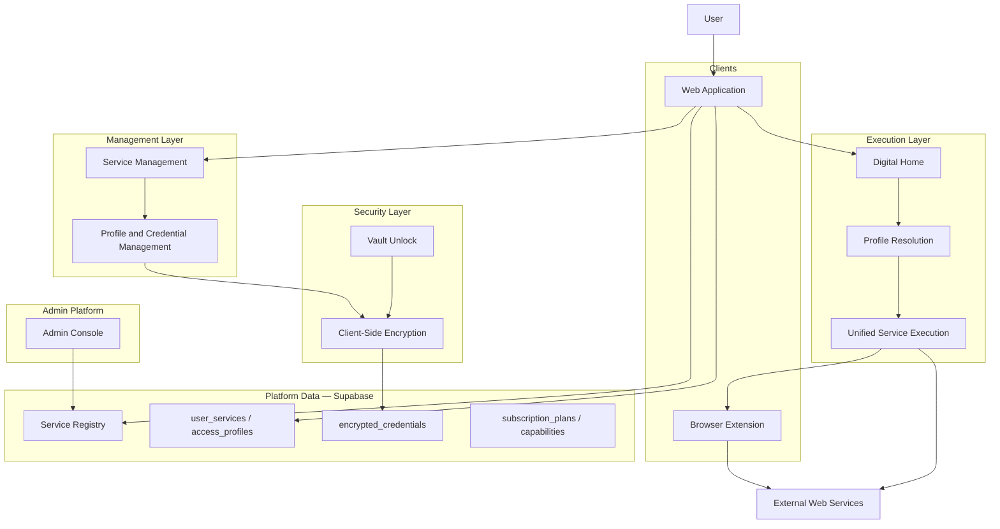
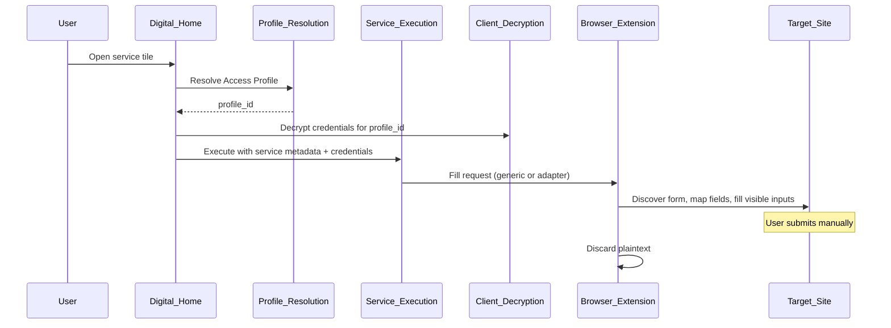
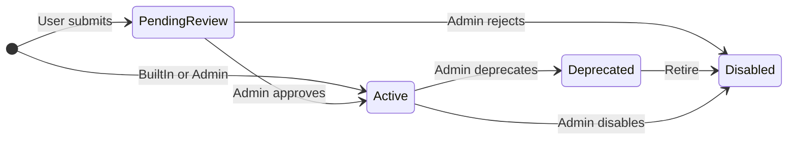
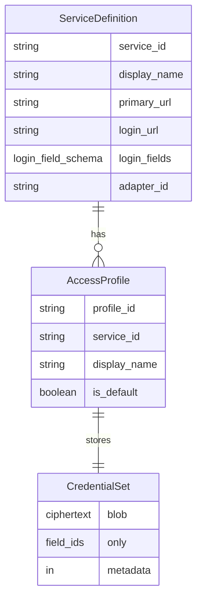
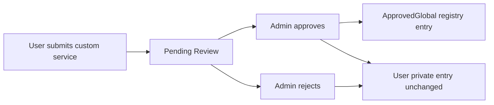
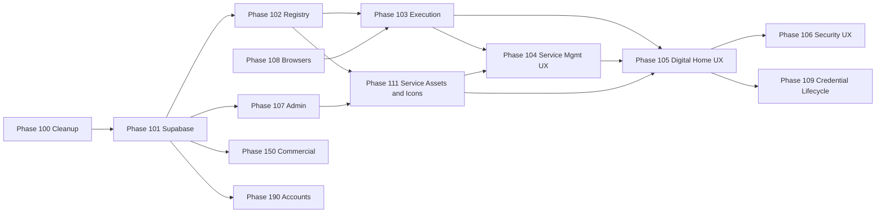

# High-Level Architecture

**Single source of truth** for product vision and production system architecture.

| | |
|---|---|
| **Version** | 1.5 |
| **Status** | Production Ready |
| **Last updated** | 2026-07-06 |

This document describes *what* the product is and *how* it is shaped at a system level. It does not prescribe implementation details, file layouts, or step-by-step build plans.

**Roadmap authority:** Prototype Phases **1–4** are **completed history** (see §3). All active development, planning, and agent work must treat **Phase 100+** as the active roadmap (see §18). Do not extend or reopen prototype phase numbers for new work.

---

## 1. Product Vision

The product is a **Personal Digital Hub for Israeli users** — one trusted place to reach the services, accounts, and workflows that matter in daily life: banking, health, government, shopping, professional tools, and more.

**Secure credential storage and autofill are supporting capabilities**, not the whole product. They enable fast, trusted access. The hub’s core value is **organization and reach** — helping users get to the right place, with the right account, with minimal friction.

### What users experience

| Surface (Hebrew) | Role |
|------------------|------|
| **הבית הדיגיטלי** (Digital Home) | Daily execution — open services, resolve identity, launch login, autofill when available |
| **ניהול שירותים** (Service Management) | Configure which services appear, manage Access Profiles and credentials |

The vault is a **security component** inside the hub, not the product identity (ADR-001).

### Multiple identities per service

A single service in the catalog (e.g. a bank, email provider, tax portal) may represent many real-world uses: personal vs work, family members, professional clients. The production architecture supports this through **Access Profiles** bound to one service — not through duplicating service definitions.

The prototype validated **one tile per service** with **profile selection at execution time** when multiple profiles exist. Production retains this model unless future user research proves otherwise (ADR-006).

### Design philosophy

The product must remain **extremely simple for the default user** — one account per service, no unnecessary steps. Advanced capabilities (multiple profiles, professional workflows, subscriptions) must be **additive**, not intrusive (see [PRODUCT_PRINCIPLES.md](./PRODUCT_PRINCIPLES.md)).

---

## 2. Production Architecture Principles

These principles govern production design. They inherit and refine prototype ADRs ([DECISIONS.md](./DECISIONS.md)).

| # | Principle | Summary |
|---|-----------|---------|
| P1 | **Hub-first** | The web application is the control panel: Digital Home, Service Management, vault unlock. It does not inject into third-party pages. |
| P2 | **User ownership** | The hub organizes access; external sites remain systems of record. |
| P3 | **Zero-knowledge by design** | Secrets are encrypted on the client before persistence. No server holds decryption keys (ADR-002). |
| P4 | **Profile-aware execution** | Open and autofill resolve through a specific **Access Profile**, not merely a service identifier. |
| P5 | **Execution vs management separation** | Digital Home is execution-only. Profiles and credentials are administered in Service Management. |
| P6 | **Unified service execution** | Catalog, custom, and admin-managed services share one execution pipeline differentiated only by metadata. |
| P7 | **Generic before bespoke** | Autofill defaults to the generic discovery-and-fill engine. Adapters are isolated fallbacks (ADR-003, ADR-008). |
| P8 | **User control** | No auto-submit. The user always completes login. Sensitive actions require explicit intent (ADR-004). |
| P9 | **Progressive enhancement** | The hub works without a browser extension (open URL). Autofill is an enhancement when the extension is installed. |
| P10 | **Web-first platform** | The browser application is the primary experience. Extensions and future clients are supporting interfaces (ADR-007). |
| P11 | **Israeli-first** | RTL, Hebrew UX, and a local service catalog as defaults. |
| P12 | **Minimize secret lifetime** | Decrypt late, use briefly, clear on lock. Credentials reach the extension only for the active matched request. |
| P13 | **Capability as data** | Subscription limits and feature gates are data-driven, not hardcoded (production subscription model). |
| P14 | **Validated behavior before permanence** | Presentation may evolve; the three-layer data model (service → profile → credentials) is production canon. |

---

## 3. Prototype History and Lessons Learned

### Status of prototype phases

**Phases 1–4 are completed prototype work.** They validated architecture direction in a local, client-only implementation. They are **not** the active roadmap. Production development **starts at Phase 100**.

| Prototype phase | Focus | Outcome |
|-----------------|--------|---------|
| **Phase 1 — First User Journey** | Hub MVP, first-run flow, one reliable “magic moment” | Users reach services from a unified hub; journey-aligned copy and flow |
| **Phase 2 — First Real Integration** | Vault, extension bridge, generic autofill on real Israeli sites | Encrypted local vault; Shufersal and Clalit via generic engine; HTZone via adapter |
| **Phase 3 — Extensible Service Platform** | Services as data, custom services, login URL discovery | Canonical ServiceDefinition; user-added sites; discovery execution abstraction |
| **Phase 4 — Identity and Profile Management** | Access Profiles, vault migration, management surface, profile resolution | Three-layer model; profile-keyed credentials; execution vs management split; unified tile execution |

Detailed prototype plans remain in `docs/phases/` for historical reference only.

### Lessons carried into production

| Lesson | Production implication |
|--------|------------------------|
| **First failed autofill destroys credibility** | Production must prioritize reliability over catalog breadth; generic path must be proven per integration class. |
| **Generic engine scales; adapters are expensive** | Adapter registry exists; new sites default to generic integration. |
| **Services must be data, not code** | Production **service registry** in Supabase replaces built-in TypeScript catalogs. |
| **One tile per service works** | Digital Home keeps one tile per service; profile chooser attaches to tile open. |
| **Credentials belong to profiles, not services** | `encrypted_credentials` keyed by `access_profile_id`. |
| **Discovery is expensive and fragile** | Login URL discovery runs only when `loginUrl` is missing or invalid; results are cached in the registry. |
| **POC/demo surfaces confuse users** | Phase 100 removes demo controls and POC wording from user-facing UI. |
| **Local IndexedDB is not production persistence** | Phase 101 introduces Supabase with zero-knowledge ciphertext storage. |
| **Account login ≠ vault unlock** | Phase 190 separates account session from vault decryption (see §9, Phase 190). |

### Prototype limitations (explicit)

The prototype intentionally **does not** provide:

- Multi-user accounts, registration, or cloud sync
- Admin platform for catalog curation
- Subscription or billing
- Production-grade browser extension distribution (Chrome Web Store / Edge Add-ons)
- Stale-credential lifecycle or login-failure feedback loops
- Edge browser validation
- Security audit or penetration-test sign-off

These gaps are addressed in Phase 100+.

---

## 4. Production Target Architecture



### Component responsibilities

| Component | Responsibility |
|-----------|----------------|
| **Web application** | Primary UX: Digital Home, Service Management, vault unlock, account session (Phase 190+) |
| **Digital Home** | Category-grouped tiles; one tile per service; execution-only |
| **Profile resolution** | Choose Access Profile before open (auto when one profile; chooser when many) |
| **Unified service execution** | Open URL, load profile credentials, invoke generic autofill or adapter fallback |
| **Service Management** | Select services, search/discover catalog, manage profiles and credentials |
| **Client-side encryption** | Derive keys from vault secret; encrypt before any persistence |
| **Browser extension** | Open tabs, bridge hub to page, DOM fill; not the primary vault |
| **Service registry** | Authoritative catalog metadata: URLs, categories, icons, login field schemas |
| **Admin platform** | Curate registry, approve user-submitted services, refresh login URLs, integration review |
| **Supabase** | Auth (Phase 190+), relational metadata, ciphertext storage — never plaintext secrets |

### Autofill flow (production)



---

## 5. Database and Supabase Architecture

Supabase provides **relational metadata and ciphertext storage**. It does **not** participate in decryption.

### Core tables (production target)

| Table | Purpose |
|-------|---------|
| **users** | Account identity (Phase 190+); no vault secrets |
| **service_registry** | Canonical catalog entries: names, URLs, categories, icons, login field schemas |
| **categories** | Grouping for Digital Home and Service Management |
| **user_services** | User’s selected services (catalog or custom reference) |
| **access_profiles** | User-owned identity contexts bound to one `user_service` / service |
| **encrypted_credentials** | Ciphertext credential sets keyed by `access_profile_id` |
| **subscription_plans** | Plan definitions and capability flags (Phase 150+) |

### Data rules

| Rule | Requirement |
|------|-------------|
| **No plaintext credentials** | `encrypted_credentials` stores ciphertext and non-sensitive metadata only (e.g. schema version, field ids present — never values). |
| **No master password on server** | Vault unlock secret never persisted server-side. |
| **Registry is not user-specific** | `service_registry` is shared catalog data; user selections live in `user_services`. |
| **Custom services** | User-added services reference registry rows or user-scoped registry extensions per admin approval policy (Phase 107). |
| **Row-level security** | User tables (`user_services`, `access_profiles`, `encrypted_credentials`) are scoped to authenticated user; registry is readable per policy. |
| **Audit-friendly metadata** | Timestamps, integration status, and login URL freshness tracked on registry rows for admin operations. |

### Client vs server boundary

| Lives on client | Lives in Supabase |
|-----------------|-------------------|
| Master password / vault unlock secret | User account credentials (Phase 190) |
| Decryption keys (in memory while unlocked) | Encrypted credential blobs |
| Ephemeral fill payloads to extension | Service registry metadata |
| Profile resolution UI state | Access profile display metadata |

---

## 6. Service Registry

The **service registry** is the authoritative source of service definitions for production. Every service — whether built-in, user-created, or admin-curated — exists as a registry entry with a defined **lifecycle**, **origin**, and **metadata ownership** model.

### Registry entry responsibilities

| Field class | Purpose |
|-------------|---------|
| **Identity** | Stable service id, display name, source (built-in, admin-curated, user-submitted) |
| **Navigation** | `primaryUrl` (homepage), `loginUrl` (login entry when known) |
| **Presentation** | Category, icon, RTL display name |
| **Integration** | `loginFields` schema (field ids, labels, types), optional `adapterId` |
| **Operational** | Login URL freshness, discovery status, integration health |

### Registry rules

1. **Independent from credentials** — Registry entries never contain user secrets.
2. **Catalog and custom parity** — Custom services become registry entries (user-scoped or admin-approved global).
3. **Login URL cache** — `loginUrl` is persisted after discovery; rediscovery only when missing or invalid (Phase 102).
4. **Generic-first integration** — Registry supplies metadata to the generic engine; `adapterId` marks adapter fallback only.
5. **Admin curation** — Built-in and approved services are maintained through the admin platform (Phase 107).

### Service lifecycle and origin

Every registry entry progresses through a defined lifecycle. **Origin** (how the entry was created) and **status** (whether it is usable in the platform) are distinct dimensions.



#### sourceType

Describes **who created** the registry entry and under what authority.

| sourceType | Meaning |
|------------|---------|
| **BuiltIn** | Shipped with the product; maintained by the platform team via admin tools |
| **User** | Created by an end user for personal use; private by default |
| **Admin** | Authored or edited directly by an administrator in the admin platform |
| **ApprovedGlobal** | Originated as a user submission but promoted into the shared global catalog after admin review |

`sourceType` is immutable audit context once established; promotion creates a **new global entry** rather than rewriting origin history (see Custom services).

#### serviceStatus

Describes **whether and how** the entry may be used across the platform.

| serviceStatus | Meaning |
|---------------|---------|
| **Active** | Available for selection, execution, and (if global) discovery by all eligible users |
| **Pending Review** | User-submitted; visible only to the submitting user until approved or rejected |
| **Deprecated** | Still resolvable for existing user selections but hidden from new discovery; scheduled for retirement |
| **Disabled** | Not selectable or executable; retained for audit and migration only |

Execution and discovery layers must respect `serviceStatus`: disabled entries never open; deprecated entries warn in management surfaces but may still execute for users who already selected them until migrated.

#### Metadata ownership

| Entry class | Who owns metadata | Who may edit |
|-------------|-------------------|--------------|
| **BuiltIn / Admin / ApprovedGlobal** | Platform (admin-curated) | Administrators only |
| **User (private)** | Submitting user | Submitting user for personal fields; integration fields may be admin-overridden on promotion |
| **User selection (`user_services`)** | User | User controls home placement and profile bindings — not registry canonical URLs |

User-owned metadata (display preferences, sort order on Digital Home) lives in **user-scoped tables**, not in the global registry row. The registry holds **canonical service truth**; users hold **personalization and selection**.

#### Future extensibility

The registry schema is designed to accept additional metadata without breaking execution:

- New optional presentation fields (badges, regional availability, capability requirements)
- New integration hints (MFA expected, multi-step login class)
- New `sourceType` or `serviceStatus` values via versioned enums — clients ignore unknown values safely
- Extension fields bucket for experiments not yet promoted to first-class columns

Execution reads only the fields it understands; unknown metadata must not block open or autofill.

### Service metadata versioning

Registry metadata is **versioned** independently of user credentials and independently of application releases.

| Concept | Role |
|---------|------|
| **metadataVersion** | Monotonic version identifier for the registry row’s integration and navigation metadata |
| **lastVerified** | Timestamp when login URL, field schema, or integration health was last confirmed accurate |
| **discoveryMethod** | How `loginUrl` was obtained (manual admin, automated discovery, user-provided, inherited from promotion) |
| **integrationHealth** | Operational signal: healthy, degraded, unknown, failing — derived from discovery outcomes, fill success rates, and admin review |

#### Why metadata versioning is required

1. **Stale URLs are inevitable** — Sites change login paths; without version and verification timestamps, the platform cannot prioritize refresh work or warn users safely.
2. **Safe rollout** — Admins can publish metadata updates while clients capable of older schema versions continue to function until upgraded.
3. **Conflict detection** — Multi-device and admin-user concurrent edits resolve against `metadataVersion` (see §10 Synchronization Architecture).
4. **Audit and support** — Support and admin teams can trace when a service integration changed and by what method.
5. **Execution correctness** — Unified service execution selects URLs and field schemas from the **latest verified metadata** the client is authorized to read, not from stale caches.

Metadata version increments on any material change to `primaryUrl`, `loginUrl`, `loginFields`, `adapterId`, or `integrationHealth` classification. Cosmetic icon changes may bump a separate presentation revision without invalidating integration contracts.

### Custom services

Custom services follow an explicit **ownership and promotion** model.

| Rule | Requirement |
|------|-------------|
| **Private by default** | User-created services (`sourceType: User`) remain **private to that user** until admin promotion |
| **User execution** | Private user services participate fully in unified execution, profile resolution, and autofill for the owning user |
| **Global promotion** | Administrators may promote a user submission to `ApprovedGlobal`, making it discoverable in the shared catalog |
| **Non-destructive promotion** | Promotion **does not modify** the user’s original private definition or their `user_services` binding — it creates or links to a **new global registry entry** |
| **Continuity** | The user’s existing profiles and credentials remain attached to their original service reference; migration to the global id is optional and user-consented |

Pending submissions use `serviceStatus: Pending Review` until approved or rejected.

### Categories

Categories organize Digital Home and Service Management (banking, health, shopping, government, etc.). Category definitions are data-driven (`categories` table), not hardcoded in the client.

#### Many-to-many readiness

The architecture supports **many-to-many** relationships between services and categories:

- A service may belong to **multiple categories** (e.g. a health insurer also tagged under government services).
- The data model uses a junction association, not a single foreign key, as the canonical truth.

**Current UI constraint:** Early production surfaces may expose **one primary category** per service for simplicity. This is a **presentation choice**, not a data-model limit. Digital Home grouping and Service Management filters must not assume exclusivity in the underlying architecture.

Admin category assignment and future multi-category browse must work without schema migration.

### Icon architecture

Service icons are first-class presentation metadata in the registry. **Phase 111** defines the full icon lifecycle: discovery, normalization, Supabase Storage, caching, admin override, versioning, and consistent rendering across Digital Home and Service Management.

| Concept | Role |
|---------|------|
| **iconUrl** | Resolved URL or asset reference for the tile and service card — points to managed storage, not third-party hotlinks during normal app use |
| **iconSource** | Provenance: built-in asset, admin upload, favicon derivation, user-provided, approved promotion |
| **Fallback icons** | Deterministic fallback when `iconUrl` is missing or fails to load — typically initials or category default glyph; must never block execution |
| **Administrator-managed icons** | Admins may override icons for BuiltIn, Admin, and ApprovedGlobal entries; overrides version with presentation metadata (Phase 111) |

Architecture rules (Phase 111):

- Do not store image binary data directly in `service_registry` rows — store files in object storage (Supabase Storage); registry holds metadata/reference only.
- Execution must never depend on icon availability.
- Icon updates must not require changing credentials or access profiles.

Icons are **presentation only** — they do not affect integration, autofill, or security paths. Execution must succeed with fallback icons when assets are unavailable.

Icon metadata follows the same ownership rules as other registry fields: user-private icons belong to user-scoped entries; global icons are admin-curated. User-created services may receive automatically discovered icons; admin-approved global services may receive curated icons.

---

## 7. Unified Service Execution Flow

**One execution pipeline** serves catalog services, custom services, and admin-managed services. Differentiation is **metadata only** — not separate code paths per brand.

### Execution steps

| Step | Actor | Action |
|------|-------|--------|
| 1 | User | Clicks service tile on Digital Home |
| 2 | Profile resolution | Resolve Access Profile (auto if one; chooser if many; default preselected) |
| 3 | Credential load | Decrypt credential set for resolved `profile_id` |
| 4 | URL selection | Open `loginUrl` if present and valid; otherwise `primaryUrl` |
| 5 | Autofill decision | If `loginFields` and complete credentials exist → generic autofill; else open only |
| 6 | Adapter fallback | If `adapterId` is set and generic path is insufficient for this service class → adapter |
| 7 | User | Completes login manually (no auto-submit) |

### Autofill path priority

```
1. Generic integration engine (default)
2. Site adapter (only when registry marks adapterId and generic is insufficient)
3. Open URL only (no loginFields or incomplete credentials — user-friendly message)
```

### Messages

When autofill is unavailable, the user sees **non-technical Hebrew messaging** — not engine errors or POC terminology.

### Prototype validation

The prototype proved this flow for Shufersal, Clalit, Practice, HTZone (adapter), and custom services. Production generalizes it behind registry metadata and Supabase-backed definitions.

---

## 8. Access Profiles and Credential Model

Production adopts the **three-layer model** validated in prototype Phase 4.



### Layer responsibilities

| Layer | Contains | Must not contain |
|-------|----------|------------------|
| **Service definition** | Site metadata from registry | Credentials, profile labels |
| **Access Profile** | User-owned identity context for one service | Credentials, site URLs, login field schema |
| **Credential set** | Encrypted field values matching service `loginFields` | Service metadata, profile display label |

### Rules

- **One credential set per profile** — keyed by `access_profile_id` in storage.
- **Exactly one default profile per service** when multiple profiles exist.
- **No duplicate service definitions** for family members, clients, or roles.
- **Profile resolution at execution** — Digital Home never administers profiles.
- **Management in Service Management** — create, rename, delete profiles; edit credentials; set default.

### Terminology

**Access Profile** is production canon (replacing provisional “access instance” language from early architecture drafts).

---

## 9. Security and Zero-Knowledge Rules

| # | Rule |
|---|------|
| S1 | **Encrypt before store** — All credential material encrypted client-side before Supabase persistence. |
| S2 | **Never persist plaintext secrets** — Not in database, local storage, extension storage, logs, analytics, or error reports. |
| S3 | **Keys stay on the client** — Vault unlock-derived keys exist in memory only while unlocked. |
| S4 | **Least exposure at fill time** — Decrypt only when needed; pass credentials to extension only for the active request; clear promptly. |
| S5 | **Strict site matching** — Autofill applies only when open URL matches declared domain and login path rules. |
| S6 | **No site-internal invocation** — Do not call page JavaScript login functions; do not fill hidden fields; do not auto-submit. |
| S7 | **Extension least privilege** — Minimal permissions; origin-checked messaging between hub and extension. |
| S8 | **Account session ≠ vault unlock** — Signing into the product does not automatically decrypt the vault (Phase 190). |
| S9 | **Defense in depth** — CSP/XSS hardening, unlock rate limiting, cautious memory lifetime in extension contexts. |
| S10 | **Audit before public launch** — Penetration test, crypto review, extension security review, privacy review as release gates. |

### Non-goals

The product does not: replace external websites; circumvent authentication; bypass MFA automatically; auto-submit login forms; store plaintext credentials; depend on site-internal JavaScript APIs.

---

## 10. Synchronization Architecture

Production must support **multiple authorized devices** per user while preserving zero-knowledge guarantees. Synchronization is architectural — not merely a transport detail.

### Principles

| Principle | Meaning |
|-----------|---------|
| **Ciphertext only** | Only encrypted credential blobs and non-sensitive metadata sync across devices; vault unlock secret never leaves the client voluntarily |
| **Authorized devices** | A device is trusted only after explicit user authorization tied to account session (Phase 190+) |
| **Offline operation** | Digital Home and vault unlock must function offline against locally cached ciphertext and registry snapshots |
| **Eventual consistency** | The platform tolerates temporary divergence between devices; convergence is guaranteed within bounded sync windows |
| **User-visible conflicts** | Credential and profile conflicts surface to the user — silent last-write-wins on secrets is forbidden |

### Synchronization scope

| Data class | Sync strategy |
|------------|---------------|
| **encrypted_credentials** | Sync ciphertext blobs keyed by `access_profile_id`; client decrypts after unlock |
| **access_profiles** | Sync display metadata and defaults |
| **user_services** | Sync selection and home placement |
| **service_registry (global)** | Pull-based refresh; admin publishes versioned metadata |
| **service_registry (user-private)** | Sync only for owning user |
| **Vault lock state** | Never synced — each device maintains independent lock |

### Conflict resolution

| Conflict type | Resolution model |
|---------------|------------------|
| **Profile metadata** (rename, default flag) | Last-write-wins on non-secret fields with `updatedAt` and user notification if concurrent edit detected |
| **Credential ciphertext** | Per-profile version vector; concurrent edits require user to choose which version to keep or re-enter credentials |
| **Registry metadata** | Server-authoritative for global entries; clients refresh on `metadataVersion` mismatch |
| **User service selection** | Union with tombstones for removals; duplicates prevented by stable ids |

### Offline behavior

When offline:

- Digital Home renders from cached registry and user selections
- Execution opens URLs; autofill requires extension and cached credentials after vault unlock
- Changes queue locally and sync on reconnect
- UI indicates offline/sync-pending state without blocking read-only execution where safe

Synchronization architecture aligns with ADR-002: the sync layer is untrusted with respect to plaintext.

---

## 11. Non-Functional Requirements

Production quality is defined by the following non-functional requirements. They apply to all phases unless explicitly deferred.

### Performance

- Digital Home initial render must feel instantaneous on modern hardware and typical Israeli mobile networks
- Vault unlock feedback appears within perceptually immediate bounds; heavy crypto runs off the critical UI path where possible
- Service tile open initiates navigation without blocking on network round-trips beyond profile resolution and credential decrypt
- Registry search and discovery remain responsive at catalog scale growth through indexed queries and client caching

### Scalability

- Registry, user tables, and ciphertext storage scale horizontally via Supabase/Postgres capacity planning
- Client caches bounded registry snapshots; full catalog is not loaded into memory at once
- Autofill and discovery workloads are extension- and client-side — they do not centralize DOM execution
- Capability and subscription evaluation remain O(1) per request via cached plan data

### Availability

- Hub web application targets high availability for read paths (Digital Home, registry browse)
- Sync and write paths degrade gracefully during partial outages — offline mode remains usable
- Extension autofill failure never prevents URL open (progressive enhancement)
- Admin operations may use maintenance windows; user execution paths fail open to cached metadata where safe

### Security

- All requirements in §9 apply as baseline NFRs
- RLS, MFA, rate limiting, and audit logging are mandatory for production — not optional enhancements
- Third-party dependencies reviewed for supply-chain risk before public launch

### Accessibility

- WCAG-oriented contrast, focus order, and screen-reader labels on core flows (unlock, tile grid, profile chooser, credential editor)
- Keyboard-operable alternatives for pointer-only interactions
- Motion and animation respect reduced-motion preferences

### Localization

- **Hebrew primary** — default copy, RTL layout, Israeli date/number conventions
- **RTL architecture** — layout mirroring is structural, not a stylesheet afterthought; LTR exceptions only for URLs and technical values
- **English secondary** — supported for admin and future expansion without breaking RTL-first defaults
- String externalization required for all user-visible text

### Observability

- Client and server emit structured, non-sensitive telemetry: sync health, discovery outcomes, fill success/failure classes (never credential values)
- Admin dashboard for integration health aggregates `integrationHealth` and discovery metrics
- Error budgets defined for core journeys: unlock, tile open, autofill attempt

### Logging

- **Never log plaintext secrets**, master passwords, vault keys, or decrypted field values
- Security events (failed unlock, MFA challenge, device authorization) are auditable
- Log retention and access controls comply with privacy policy

### Backup and recovery

- Supabase backup strategy for relational data and ciphertext with documented RPO/RTO targets
- Client-side export path for user vault backup (encrypted bundle) planned for disaster recovery
- Registry version history enables rollback of bad admin metadata publishes

### Maintainability

- Unified execution, profile resolution, and browser abstraction minimize per-site branching
- Registry-driven integration reduces code deploys for new catalog entries
- Phase boundaries (100+) map to independently testable capabilities
- Architecture documents remain the single source of truth; phase plans reference, not duplicate

---

## 12. Product Governance

Product governance defines **who owns** platform definitions and how changes propagate.

### Ownership matrix

| Domain | Owner | Change authority |
|--------|-------|------------------|
| **Service Registry (global)** | Platform / product operations | Admin platform; change-managed releases |
| **Service Registry (user-private)** | End user | User via Service Management; subject to capability limits |
| **Categories** | Platform / product operations | Admin platform; localization review for Hebrew labels |
| **Adapters** | Engineering + product | New adapters require engineering implementation **and** admin registry binding; generic engine improvements preferred |
| **Integration metadata** | Platform operations | Admins edit `loginUrl`, `loginFields`, `integrationHealth`; discovery system proposes |
| **Approval workflow** | Platform operations | User submissions queue as `Pending Review`; admins approve to `ApprovedGlobal` or reject to `Disabled` |

### Approval workflow (architectural)



Governance ensures **users keep their private definition** while the platform gains a curated global entry when approved. Adapters and integration metadata changes for global services require admin visibility — not silent auto-update without `metadataVersion` bump and `lastVerified` update.

### Escalation

- Degraded `integrationHealth` on BuiltIn services triggers admin review queue
- Security incidents override normal governance — ability to `Disable` registry entries platform-wide

---

## 13. Browser Compatibility

### Supported browsers (production target)

| Browser | Support level |
|---------|---------------|
| **Google Chrome** | **Primary** — full support; extension distributed via Chrome Web Store |
| **Microsoft Edge** | **Supported peer** — full support; extension distributed via Edge Add-ons (Chromium-based) |

### Future browser evaluation

The following browsers are **not** production commitments in Phase 108 but are evaluated for future support through the same abstraction layer:

| Browser | Evaluation notes |
|---------|------------------|
| **Mozilla Firefox** | Requires WebExtensions packaging and API parity assessment; distinct store and manifest considerations |
| **Brave** | Chromium-derived; likely low incremental cost if Chrome path is stable — policy and store review still required |
| **Apple Safari** | WebExtensions on macOS/iOS with platform constraints; lowest priority for Israeli desktop-first launch |

No future browser may bypass the **Browser Integration Abstraction** — browser-specific code lives only in adapter implementations.

### Browser Integration Abstraction (required model)

Production **requires** a **Browser Integration Abstraction** — a stable internal contract between the hub execution layer and browser-specific extension hosts.

| Layer | Responsibility |
|-------|----------------|
| **Execution layer** | Calls abstraction: open URL, request fill, probe extension availability |
| **Abstraction interface** | Uniform messages, capability flags, error taxonomy |
| **Browser host** | Chrome, Edge, or future: maps abstraction to `chrome.*` / `browser.*` APIs |

Production introduces this abstraction so execution logic does not depend on Chrome-specific APIs directly.

| Concern | Abstraction |
|---------|-------------|
| Extension messaging | Uniform message envelope for fill requests |
| Tab open | Browser-neutral open-with-fill orchestration |
| Extension detection | Capability probe with graceful degradation to open-URL-only |
| Packaging | Separate store artifacts from shared extension core (Phase 108) |
| Future browsers | New host adapter implements same interface — execution layer unchanged |

### Degradation

Without a supported extension: Digital Home opens the service URL; user enters credentials manually. No broken or technical error states.

---

## 14. UX Architecture Principles

### Cross-cutting UX concepts

These concepts apply to all user surfaces. They describe **interaction architecture**, not visual design.

| Concept | Meaning |
|---------|---------|
| **Progressive disclosure** | Show only what the current step requires — profile chooser appears only when multiple profiles exist; advanced management hidden from Digital Home |
| **Execution vs management** | Daily use (open, fill) is separated from configuration (profiles, credentials, service selection) — different surfaces, different mental models |
| **Consistency** | Same service card metaphors, category language, and action verbs across discovery, selection, and home; catalog and custom services look like one system |
| **Minimal cognitive load** | One tile per service; default path is one profile and one click; Hebrew copy is short and non-technical |
| **Responsive layouts** | Digital Home and Service Management function across desktop and mobile widths; tile grid and card browse reflow without losing category grouping or RTL correctness |

### Digital Home — **הבית הדיגיטלי**

| Principle | Detail |
|-----------|--------|
| **Daily starting point** | Where users begin their digital day (Product Principle 1). |
| **One tile per service** | Multiple identities handled via profile resolution, not duplicate tiles. |
| **Category grouping** | Services grouped by category for scanability. |
| **Execution only** | No profile CRUD or credential editing on tiles. |
| **Profile chooser on tile** | When multiple profiles exist, chooser appears at open time (attached to tile interaction). |
| **Useful services area** | Surface for pinned, frequent, or recommended services (Phase 105). |
| **Notifications foundation** | Area reserved for future hub notifications (Phase 105); not a full notification product in early production phases. |

### Service Management — **ניהול שירותים**

| Principle | Detail |
|-----------|--------|
| **Configuration surface** | Select services, manage profiles, edit credentials. |
| **Selected services section** | Clear view of what appears on Digital Home. |
| **Discovery and search** | Find catalog services; add to user collection. |
| **One custom-service entry point** | Single “add my site” action — not per-category duplicates. |
| **Category filtering** | Browse and filter registry by category. |
| **Modern service cards** | Card-based selection UX (Phase 104). |

### Execution vs management

| Digital Home | Service Management |
|--------------|-------------------|
| Open services | Add/remove services from home |
| Resolve profile | Create/rename/delete profiles |
| Launch autofill | Edit credentials |
| Read-only credential indicator on tile | Set default profile |

This separation is **architectural** — not merely a layout preference (validated in prototype Phase 4).

### Trust and simplicity

- Default user: one profile per service, no chooser, minimal steps.
- Security state (locked/unlocked) must be visible and reassuring (Product Principles 4, 7).
- Advanced capabilities never complicate the default path (Product Principle 5).

---

## 15. Admin Architecture

The **admin platform** is a separate operational surface (not part of the end-user Digital Home).

### Responsibilities

| Function | Detail |
|----------|--------|
| **Category management** | Create, reorder, and localize categories |
| **Service registry CRUD** | Maintain built-in and curated services |
| **User-submitted service approval** | Review user-added services for promotion to global registry |
| **Login URL refresh** | Trigger rediscovery or manual correction when URLs go stale |
| **Icon management** | Upload, override, or refresh service icons; discovery and asset lifecycle per Phase 111 |
| **Integration status review** | Monitor generic vs adapter health per service |

### Admin vs user boundary

Admins curate **registry metadata** and **integration health**. Admins never access user credential plaintext. User vault data remains zero-knowledge.

---

## 16. Subscription and Capability Model

Production commercialization (Phase 150+) uses a **data-driven capability engine**.

### Concepts

| Concept | Role |
|---------|------|
| **subscription_plans** | Plan tiers (e.g. free, premium) defined as data |
| **Capabilities** | Feature flags and limits per plan (profile count, custom services, sync, etc.) |
| **Capability engine** | Evaluates user plan at runtime; UI and API gates read capabilities — not hardcoded `if (premium)` |
| **Billing** | Integrated later; plans exist before payment provider |
| **Trial and pricing** | Product decisions deferred; architecture accommodates them |

### Rules

- Plan limits are **configuration**, not scattered conditionals.
- Free tier must support the core Digital Home experience (ADR-001 hub-first).
- Zero-knowledge rules apply regardless of plan tier.

---

## 17. Future Considerations

Items explicitly **out of scope** for the early production roadmap (Phases 100–111) but architecturally anticipated:

| Topic | Notes |
|-------|-------|
| **Family / household vaults** | Shared visibility rules; separate namespaces |
| **Professional client workflows** | Rich client labeling, export, compliance constraints |
| **Multi-device sync** | Ciphertext sync with zero-knowledge model (ADR-002); see §10 Synchronization Architecture |
| **Mobile / PWA clients** | Reuse web platform and encryption model (ADR-007) |
| **Remembered profile per service** | UX optimization after baseline chooser ships |
| **AI-assisted discovery or fill** | Not planned; automation requires explicit user trust model |
| **Enterprise administration** | Org-managed profiles, SSO — separate product line |
| **Government identity integration** | National ID flows — policy-dependent |
| **Auto-submit** | Remains non-goal (ADR-004) unless product principles change via new ADR |

Open questions from the prototype era (multiple tiles vs chooser, family patterns) are **partially resolved**: production ships **one tile + chooser**. Further UX models require user validation before architecture changes (ADR-006).

---

## 18. Production Roadmap — Phase 100+

**This section is the active roadmap.** Development agents must plan and implement against these phases only. Prototype Phases 1–4 are complete and must not be extended.

Phases are ordered by dependency. Acceptance criteria define done.

---

### Phase 100 — Production Baseline Cleanup

**Goal:** Remove prototype artifacts from the user-facing product and isolate developer tooling.

| Acceptance criteria | |
|---------------------|---|
| AC-100-1 | No demo or test autofill buttons visible in production builds |
| AC-100-2 | No “POC”, “demo”, or developer jargon in user-facing Hebrew or English UI |
| AC-100-3 | Developer tools (discovery harness, POC controls) accessible only in explicit dev builds or admin/dev modes |
| AC-100-4 | Prototype limitations documented for support and engineering onboarding |
| AC-100-5 | Digital Home and Service Management use production naming conventions (interim names allowed until Phases 104–105) |

---

### Phase 101 — Supabase and Persistence Foundation

**Goal:** Establish production data layer with zero-knowledge credential storage.

| Acceptance criteria | |
|---------------------|---|
| AC-101-1 | Supabase project schema includes: `users`, `service_registry`, `categories`, `user_services`, `access_profiles`, `encrypted_credentials`, `subscription_plans` |
| AC-101-2 | No plaintext credential values in any table |
| AC-101-3 | Client encrypts credential sets before write; server cannot decrypt |
| AC-101-4 | Row-level security enforces user isolation on user-owned tables |
| AC-101-5 | Migration path from prototype local vault documented (one-time import or fresh start policy stated) |

---

### Phase 102 — Service Registry and Login URL Cache

**Goal:** Catalog as platform data with cached login URLs and discovery on demand.

**Ownership:** Phase 102 owns **Service Registry metadata** and the **login URL cache**. Tile execution may open `loginUrl` only when `service_registry.loginUrl` exists. If `loginUrl` is missing, opening `primaryUrl` is compliant for Phase 102.

| Acceptance criteria | |
|---------------------|---|
| AC-102-1 | Registry entries include `primaryUrl`, `loginUrl`, category, icon metadata |
| AC-102-2 | Built-in Israeli catalog loaded from registry, not application source code |
| AC-102-3 | Custom services create user-scoped registry references |
| AC-102-4 | Login discovery runs only when `loginUrl` is missing or marked invalid |
| AC-102-5 | Discovered `loginUrl` persisted to registry cache |
| AC-102-6 | `loginFields` schema stored on registry entry when known |

---

### Phase 103 — Unified Service Execution Flow

**Goal:** One execution pipeline for catalog, custom, and admin-managed services.

> **Prerequisite:** Phase 103 begins only after the prototype satisfies the unified execution architecture for every supported service type.

**Ownership:** Phase 103 owns **Unified Service Execution** and **autofill orchestration**. Phase 103 must **not** be interpreted as “discover `loginUrl` for every site”. Phase 103 assumes registry metadata exists when available and must:

- Resolve Access Profile for all service types
- Load credentials by `profileId`
- Open `loginUrl` if present, otherwise `primaryUrl`
- Invoke generic autofill when `loginFields` and credentials exist
- Use adapters only through `adapterId`
- Preserve validated Shufersal and Clalit autofill behavior; Practice and HTZone continue through approved adapters

**Unified execution pipeline:**

```text
Service Tile
↓
Resolve Service
↓
Resolve Access Profile
↓
Load Credentials by profileId
↓
Resolve Open URL
(loginUrl if present, otherwise primaryUrl)
↓
Open Browser Tab
↓
Generic Autofill if metadata and credentials allow
↓
Adapter only when required by adapterId
↓
Execution Complete
```

Phase 103 does **not** own `loginUrl` discovery or `loginUrl` refresh.

If `loginUrl` is missing, execution falls back to `primaryUrl`. If `loginUrl` appears stale or invalid during execution, Phase 103 may emit a non-blocking metadata health signal, but must not block user navigation and must not perform full discovery inline.

Updating stale `loginUrl` values belongs to Service Registry / Admin metadata flows:

- **Phase 102** for `loginUrl` cache model
- **Phase 107** for admin refresh and registry maintenance
- **Phase 109** for lifecycle signals and user-facing hints when login/open/fill fails

**Acceptance clarification:** Execution failure or stale metadata must never prevent opening a usable URL. The site must remain open whenever possible.

| Acceptance criteria | |
|---------------------|---|
| AC-103-1 | Every service tile uses the same execution entry point |
| AC-103-2 | Profile resolution runs for all service types before open |
| AC-103-3 | Credentials loaded by `profile_id` for all service types |
| AC-103-4 | Open target is `loginUrl` when present, else `primaryUrl` |
| AC-103-5 | Generic autofill used when `loginFields` and complete credentials exist |
| AC-103-6 | Adapters invoked only when registry `adapterId` requires fallback |
| AC-103-7 | Preserve validated Shufersal and Clalit autofill behavior. Practice and HTZone continue through approved adapters |
| AC-103-8 | Custom services with discovery metadata participate identically to catalog services |
| AC-103-9 | Every execution request must produce a deterministic outcome:<br>— Open `loginUrl` when available.<br>— Otherwise open `primaryUrl`.<br>— Execute generic autofill only when metadata and credentials allow.<br>— If autofill cannot execute, the website must remain open.<br>— Execution failure must never prevent the website from opening. |
| AC-103-10 | Execution must be independent of service origin. Built-in services, admin-managed services, and user-created services must all traverse the same execution pipeline and follow identical execution orchestration rules |

---

### Phase 104 — Service Management Experience

**Goal:** Production Service Management UX (**ניהול שירותים**).

| Acceptance criteria | |
|---------------------|---|
| AC-104-1 | Screen titled **ניהול שירותים** |
| AC-104-2 | **Selected services** section shows what appears on Digital Home |
| AC-104-3 | **Discovery/search** section for finding catalog services |
| AC-104-4 | Exactly **one** “add custom service” entry point globally |
| AC-104-5 | Category filtering available in discovery |
| AC-104-6 | Service cards used for browse and select (modern card UX) |
| AC-104-7 | Profile and credential management reachable from selected service context |

---

### Phase 105 — Digital Home Experience

**Goal:** Production Digital Home UX (**הבית הדיגיטלי**).

| Acceptance criteria | |
|---------------------|---|
| AC-105-1 | Screen titled **הבית הדיגיטלי** |
| AC-105-2 | Services grouped by category |
| AC-105-3 | Exactly one tile per service |
| AC-105-4 | Profile chooser attached to tile open when multiple profiles exist |
| AC-105-5 | **Useful services** area present (content may be minimal initially) |
| AC-105-6 | **Notifications** area foundation present (placeholder or empty state) |
| AC-105-7 | No profile or credential management controls on tiles |

---

### Phase 106 — Security and Trust UX

**Goal:** Make security visible and prevent browser password-manager interference.

| Acceptance criteria | |
|---------------------|---|
| AC-106-1 | Zero-knowledge explained in clear, non-technical Hebrew where credentials are saved |
| AC-106-2 | Vault lock/unlock state always visible during sensitive operations |
| AC-106-3 | Internal credential editor prevents Chrome and Edge password-manager save prompts |
| AC-106-4 | Trust indicators present on credential save (encrypted, client-side) |
| AC-106-5 | No security claims that contradict zero-knowledge architecture |

---

### Phase 107 — Admin Management Platform

**Goal:** Operational console for catalog and integration health.

| Acceptance criteria | |
|---------------------|---|
| AC-107-1 | Admin can manage categories |
| AC-107-2 | Admin can CRUD service registry entries |
| AC-107-3 | Admin can approve user-submitted services for global registry |
| AC-107-4 | Admin can trigger login URL refresh / rediscovery |
| AC-107-5 | Admin can manage service icons |
| AC-107-6 | Admin can view integration status (generic vs adapter, last discovery outcome) |
| AC-107-7 | Admin cannot view user credential plaintext |

---

### Phase 108 — Browser Compatibility

**Goal:** Chrome and Edge support with abstraction and store-ready packaging.

| Acceptance criteria | |
|---------------------|---|
| AC-108-1 | Extension functions on current Chrome stable |
| AC-108-2 | Extension functions on current Edge stable |
| AC-108-3 | Browser integration abstraction layer isolates messaging and tab APIs |
| AC-108-4 | Packaging strategy documented for Chrome Web Store and Edge Add-ons |
| AC-108-5 | Hub degrades gracefully when extension not installed |

---

### Phase 109 — Credential Lifecycle

**Goal:** Help users maintain accurate credentials without automatic changes.

| Acceptance criteria | |
|---------------------|---|
| AC-109-1 | Stale password detection heuristics defined and surfaced non-technically |
| AC-109-2 | Login failure hints suggest credential review (not auto-update) |
| AC-109-3 | Explicit “update credentials” flow in Service Management |
| AC-109-4 | Credential updates require user confirmation — no silent overwrite |
| AC-109-5 | Lifecycle events do not weaken zero-knowledge rules |

---

### Phase 111 — Service Assets and Icon Management

**Goal:** Provide reliable, centralized, and performant management of service visual assets, especially icons, for Digital Home, Service Management, and Admin surfaces.

**Scope:**

- Service icon discovery
- Favicon and apple-touch-icon detection
- OpenGraph/logo fallback discovery where appropriate
- Icon normalization and validation
- Icon caching
- Supabase Storage usage for icon files
- Registry metadata for icon references
- Admin-managed icon override
- Fallback icon rules
- Asset versioning
- Consistent icon rendering across Digital Home and Service Management

**Architecture rules:**

- Do not store image binary data directly in `service_registry` rows.
- Store icon files in object storage, such as Supabase Storage.
- Store only icon metadata/reference in `service_registry`.
- Execution must never depend on icon availability.
- Missing or broken icons must fall back to deterministic safe icons.
- User-created services may receive automatically discovered icons.
- Admin-approved global services may receive curated icons.
- Icon updates must not require changing credentials or access profiles.

| Acceptance criteria | |
|---------------------|---|
| AC-111-1 | Service registry supports icon metadata/reference for every service |
| AC-111-2 | Icons are loaded from a managed asset location, not directly from third-party sites during normal app use |
| AC-111-3 | The system can discover candidate icons from a service URL |
| AC-111-4 | The system stores approved/discovered icons in Supabase Storage or equivalent |
| AC-111-5 | Digital Home and Service Management render icons consistently |
| AC-111-6 | Missing or failed icons use fallback icons |
| AC-111-7 | Admin can override or refresh service icons |
| AC-111-8 | Icon changes are versioned or timestamped |
| AC-111-9 | Icon handling works for built-in, admin-managed, and user-created services |

---

### Phase 150 — Commercial Platform

**Goal:** Subscription and capability foundation without mandatory billing integration.

| Acceptance criteria | |
|---------------------|---|
| AC-150-1 | `subscription_plans` populated with at least free and one paid-capable tier |
| AC-150-2 | Capability engine evaluates plan features at runtime |
| AC-150-3 | Plan limits (profiles, custom services, etc.) read from data — not hardcoded |
| AC-150-4 | Billing provider integration deferred with documented extension points |
| AC-150-5 | Trial and pricing UX deferred; architecture supports both |

---

### Phase 190 — Account, Registration and Secure Sign-In

**Goal:** Real user accounts separate from vault unlock.

| Acceptance criteria | |
|---------------------|---|
| AC-190-1 | User registration and secure login implemented |
| AC-190-2 | MFA supported for account sign-in |
| AC-190-3 | Account session management (sign out, session expiry) |
| AC-190-4 | Vault unlock remains a **separate** step from account login |
| AC-190-5 | Account compromise does not expose vault plaintext without vault secret |
| AC-190-6 | Supabase Auth (or equivalent) integrated without storing vault master secret server-side |

---

### Phase dependency overview



---

## Document History

| Version | Date | Summary |
|---------|------|---------|
| **0.1** | Early prototype | Password-vault-oriented draft |
| **0.2** | 2026-06-25 | Personal Digital Hub vision; generic autofill; open user-model questions |
| **1.0** | 2026-06-21 | **Production architecture.** Prototype Phases 1–4 marked complete. Phase 100+ active roadmap. Access Profile canon. Unified execution. Supabase target. UX surfaces named. Admin and subscription architecture. |
| **1.1** | 2026-06-21 | **Production Ready.** Service registry lifecycle, metadata versioning, custom service ownership, category many-to-many, icon architecture, synchronization architecture, NFRs, product governance, strengthened UX principles, future browser evaluation. |
| **1.2** | 2026-07-03 | **Phase 111 — Service Assets and Icon Management.** Dedicated production phase for icon discovery, Supabase Storage, caching, admin override, and consistent rendering. Service Registry and Admin Architecture cross-references updated; dependency diagram extended. |
| **1.3** | 2026-07-06 | **Phase 102 / 103 boundary clarification.** Phase 102 owns registry metadata and login URL cache; Phase 103 owns execution and autofill orchestration — not per-site login URL discovery. |
| **1.4** | 2026-07-06 | **Phase 103 acceptance criteria refined.** AC-103-7 updated; AC-103-9 and AC-103-10 added for deterministic outcomes and origin-independent execution. |
| **1.5** | 2026-07-06 | **Phase 103 execution pipeline.** Unified pipeline diagram, loginUrl discovery boundary, stale-metadata health signals, and Phase 102/107/109 ownership split documented. |

Implementation plans for individual production phases may be authored separately; they must align with this document and must not duplicate it as a second architecture source.
