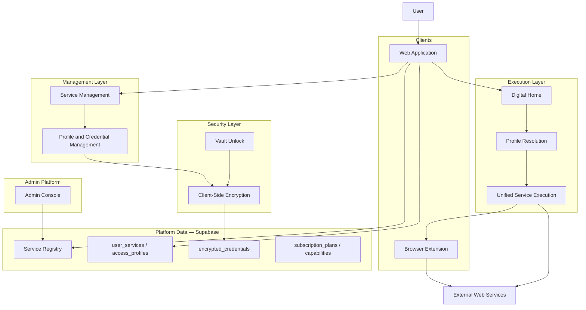
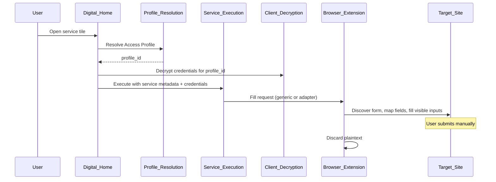
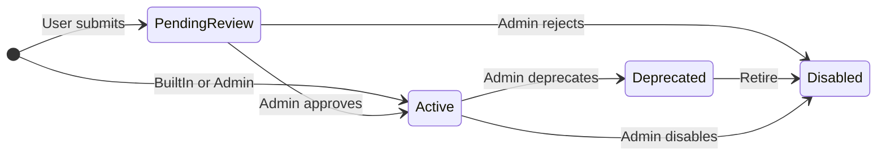
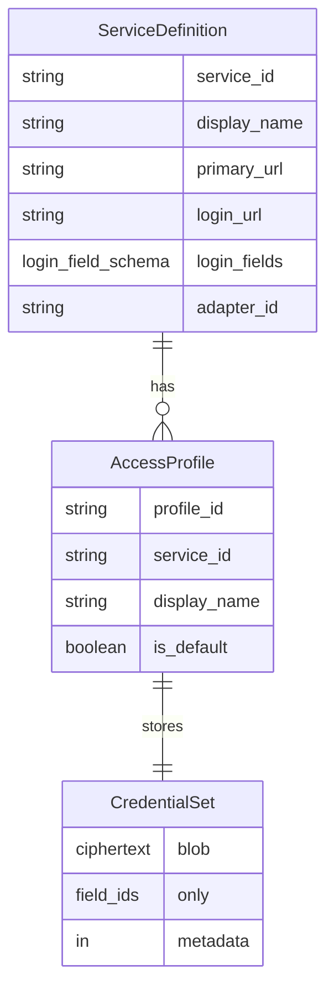
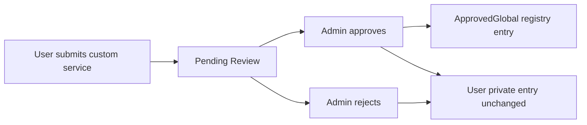
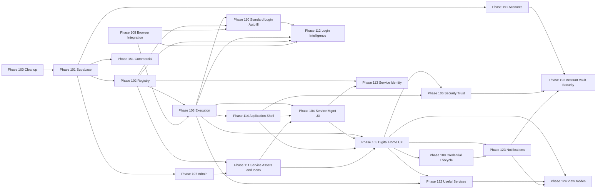

# High-Level Architecture

**Single source of truth** for product vision and production system architecture.

| | |
|---|---|
| **Version** | 4.5 |
| **Status** | Production Ready |
| **Last updated** | 2026-07-09 |

This document describes *what* the product is and *how* it is shaped at a system level. It does not prescribe implementation details, file layouts, or step-by-step build plans.

**Roadmap authority:** Prototype Phases **1–4** are **completed history** (see §3). All active development, planning, and agent work must treat **Phase 100+** as the active roadmap (see §18). Do not extend or reopen prototype phase numbers for new work.

---

## 1. Product Vision

The product is a **Personal Digital Hub for Israeli users** — one trusted place to reach the services, accounts, and workflows that matter in daily life: banking, health, government, shopping, professional tools, and more.

**Secure credential storage and autofill are supporting capabilities**, not the whole product. They enable fast, trusted access. The hub’s core value is **organization and reach** — helping users get to the right place, with the right account, with minimal friction.

### What users experience

| Surface (Hebrew) | Role |
|------------------|------|
| **הבית הדיגיטלי** (Digital Home) | Daily execution — open services, resolve identity, launch login, autofill when available |
| **ניהול שירותים** (Service Management) | Configure which services appear, manage Access Profiles and credentials |

The vault is a **security component** inside the hub, not the product identity (ADR-001).

### Multiple identities per service

A single service in the catalog (e.g. a bank, email provider, tax portal) may represent many real-world uses: personal vs work, family members, professional clients. The production architecture supports this through **Access Profiles** bound to one service — not through duplicating service definitions.

The prototype validated **one tile per service** with **profile selection at execution time** when multiple profiles exist. Production retains this model unless future user research proves otherwise (ADR-006).

### Design philosophy

The product must remain **extremely simple for the default user** — one account per service, no unnecessary steps. Advanced capabilities (multiple profiles, professional workflows, subscriptions) must be **additive**, not intrusive (see [PRODUCT_PRINCIPLES.md](./PRODUCT_PRINCIPLES.md)).

---

## 2. Production Architecture Principles

These principles govern production design. They inherit and refine prototype ADRs ([DECISIONS.md](./DECISIONS.md)).

| # | Principle | Summary |
|---|-----------|---------|
| P1 | **Hub-first** | The web application is the control panel: Digital Home, Service Management, vault unlock. It does not inject into third-party pages. |
| P2 | **User ownership** | The hub organizes access; external sites remain systems of record. |
| P3 | **Zero-knowledge by design** | Secrets are encrypted on the client before persistence. No server holds decryption keys (ADR-002). |
| P4 | **Profile-aware execution** | Open and autofill resolve through a specific **Access Profile**, not merely a service identifier. |
| P5 | **Execution vs management separation** | Digital Home is execution-only. Profiles and credentials are administered in Service Management. |
| P6 | **Unified service execution** | Catalog, custom, and admin-managed services share one execution pipeline differentiated only by metadata. |
| P7 | **Generic before bespoke** | Autofill defaults to the generic discovery-and-fill engine. Adapters are isolated fallbacks (ADR-003, ADR-008). |
| P8 | **User control** | No auto-submit. The user always completes login. Sensitive actions require explicit intent (ADR-004). |
| P9 | **Progressive enhancement** | The hub works without a browser extension (open URL). Autofill is an enhancement when the extension is installed. |
| P10 | **Web-first platform** | The browser application is the primary experience. Extensions and future clients are supporting interfaces (ADR-007). |
| P11 | **Israeli-first** | RTL, Hebrew UX, and a local service catalog as defaults. |
| P12 | **Minimize secret lifetime** | Decrypt late, use briefly, clear on lock. Credentials reach the extension only for the active matched request. |
| P13 | **Capability as data** | Subscription limits and feature gates are data-driven, not hardcoded (production subscription model). |
| P14 | **Validated behavior before permanence** | Presentation may evolve; the three-layer data model (service → profile → credentials) is production canon. |

---

## 3. Prototype History and Lessons Learned

### Status of prototype phases

**Phases 1–4 are completed prototype work.** They validated architecture direction in a local, client-only implementation. They are **not** the active roadmap. Production development **starts at Phase 100**.

| Prototype phase | Focus | Outcome |
|-----------------|--------|---------|
| **Phase 1 — First User Journey** | Hub MVP, first-run flow, one reliable “magic moment” | Users reach services from a unified hub; journey-aligned copy and flow |
| **Phase 2 — First Real Integration** | Vault, extension bridge, generic autofill on real Israeli sites | Encrypted local vault; Shufersal and Clalit via generic engine; HTZone via adapter |
| **Phase 3 — Extensible Service Platform** | Services as data, custom services, login URL discovery | Canonical ServiceDefinition; user-added sites; discovery execution abstraction |
| **Phase 4 — Identity and Profile Management** | Access Profiles, vault migration, management surface, profile resolution | Three-layer model; profile-keyed credentials; execution vs management split; unified tile execution |

Detailed prototype plans remain in `docs/phases/` for historical reference only.

### Lessons carried into production

| Lesson | Production implication |
|--------|------------------------|
| **First failed autofill destroys credibility** | Production must prioritize reliability over catalog breadth; generic path must be proven per integration class. |
| **Generic engine scales; adapters are expensive** | Adapter registry exists; new sites default to generic integration. |
| **Services must be data, not code** | Production **service registry** in Supabase replaces built-in TypeScript catalogs. |
| **One tile per service works** | Digital Home keeps one tile per service; profile chooser attaches to tile open. |
| **Credentials belong to profiles, not services** | `encrypted_credentials` keyed by `access_profile_id`. |
| **Discovery is expensive and fragile** | Login URL discovery runs only when `loginUrl` is missing or invalid; results are cached in the registry. |
| **POC/demo surfaces confuse users** | Phase 100 removes demo controls and POC wording from user-facing UI. |
| **Local IndexedDB is not production persistence** | Phase 101 introduces Supabase with zero-knowledge ciphertext storage. |
| **Account login ≠ vault unlock** | Phase 191 separates account session from vault decryption (see §9, Phase 191). |

### Prototype limitations (explicit)

The prototype intentionally **does not** provide:

- Multi-user accounts, registration, or cloud sync
- Admin platform for catalog curation
- Subscription or billing
- Production-grade browser extension distribution (Chrome Web Store / Edge Add-ons)
- Stale-credential lifecycle or login-failure feedback loops
- Edge browser validation
- Security audit or penetration-test sign-off

These gaps are addressed in Phase 100+.

---

## 4. Production Target Architecture



### Component responsibilities

| Component | Responsibility |
|-----------|----------------|
| **Web application** | Primary UX: Digital Home, Service Management, vault unlock, account session (Phase 191+) |
| **Digital Home** | Category-grouped tiles; one tile per service; execution-only |
| **Profile resolution** | Choose Access Profile before open (auto when one profile; chooser when many) |
| **Unified service execution** | Open URL, load profile credentials, invoke generic autofill or adapter fallback |
| **Service Management** | Select services, search/discover catalog, manage profiles and credentials |
| **Client-side encryption** | Derive keys from vault secret; encrypt before any persistence |
| **Browser extension** | Open tabs, bridge hub to page, DOM fill; not the primary vault |
| **Service registry** | Authoritative catalog metadata: URLs, categories, icons, login field schemas |
| **Admin platform** | Curate registry, approve user-submitted services, refresh login URLs, integration review |
| **Supabase** | Auth (Phase 191+), relational metadata, ciphertext storage — never plaintext secrets |

### Autofill flow (production)



---

## 5. Database and Supabase Architecture

Supabase provides **relational metadata and ciphertext storage**. It does **not** participate in decryption.

### Core tables (production target)

| Table | Purpose |
|-------|---------|
| **users** | Account identity (Phase 191+); no vault secrets |
| **service_registry** | Canonical catalog entries: names, URLs, categories, icons, login field schemas |
| **categories** | Grouping for Digital Home and Service Management |
| **user_services** | User’s selected services (catalog or custom reference) |
| **access_profiles** | User-owned identity contexts bound to one `user_service` / service |
| **encrypted_credentials** | Ciphertext credential sets keyed by `access_profile_id` |
| **subscription_plans** | Plan definitions and capability flags (Phase 151+) |

### Data rules

| Rule | Requirement |
|------|-------------|
| **No plaintext credentials** | `encrypted_credentials` stores ciphertext and non-sensitive metadata only (e.g. schema version, field ids present — never values). |
| **No master password on server** | Vault unlock secret never persisted server-side. |
| **Registry is not user-specific** | `service_registry` is shared catalog data; user selections live in `user_services`. |
| **Custom services** | User-added services reference registry rows or user-scoped registry extensions per admin approval policy (Phase 107). |
| **Row-level security** | User tables (`user_services`, `access_profiles`, `encrypted_credentials`) are scoped to authenticated user; registry is readable per policy. |
| **Audit-friendly metadata** | Timestamps, integration status, and login URL freshness tracked on registry rows for admin operations. |

### Client vs server boundary

| Lives on client | Lives in Supabase |
|-----------------|-------------------|
| Master password / vault unlock secret | User account credentials (Phase 191) |
| Decryption keys (in memory while unlocked) | Encrypted credential blobs |
| Ephemeral fill payloads to extension | Service registry metadata |
| Profile resolution UI state | Access profile display metadata |

---

## 6. Service Registry

The **service registry** is the authoritative source of service definitions for production. Every service — whether built-in, user-created, or admin-curated — exists as a registry entry with a defined **lifecycle**, **origin**, and **metadata ownership** model.

### Registry entry responsibilities

| Field class | Purpose |
|-------------|---------|
| **Identity** | Stable service id, display name, source (built-in, admin-curated, user-submitted) |
| **Navigation** | `primaryUrl` (homepage), `loginUrl` (login entry when known) |
| **Presentation** | Category, icon, RTL display name |
| **Integration** | `loginFields` schema (field ids, labels, types), optional `adapterId` |
| **Operational** | Login URL freshness, discovery status, integration health |

### Registry rules

1. **Independent from credentials** — Registry entries never contain user secrets.
2. **Catalog and custom parity** — Custom services become registry entries (user-scoped or admin-approved global).
3. **Login URL cache** — `loginUrl` is persisted after discovery; rediscovery only when missing or invalid (Phase 102).
4. **Generic-first integration** — Registry supplies metadata to the generic engine; `adapterId` marks adapter fallback only.
5. **Admin curation** — Built-in and approved services are maintained through the admin platform (Phase 107).

### Service lifecycle and origin

Every registry entry progresses through a defined lifecycle. **Origin** (how the entry was created) and **status** (whether it is usable in the platform) are distinct dimensions.



#### sourceType

Describes **who created** the registry entry and under what authority.

| sourceType | Meaning |
|------------|---------|
| **BuiltIn** | Shipped with the product; maintained by the platform team via admin tools |
| **User** | Created by an end user for personal use; private by default |
| **Admin** | Authored or edited directly by an administrator in the admin platform |
| **ApprovedGlobal** | Originated as a user submission but promoted into the shared global catalog after admin review |

`sourceType` is immutable audit context once established; promotion creates a **new global entry** rather than rewriting origin history (see Custom services).

#### serviceStatus

Describes **whether and how** the entry may be used across the platform.

| serviceStatus | Meaning |
|---------------|---------|
| **Active** | Available for selection, execution, and (if global) discovery by all eligible users |
| **Pending Review** | User-submitted; visible only to the submitting user until approved or rejected |
| **Deprecated** | Still resolvable for existing user selections but hidden from new discovery; scheduled for retirement |
| **Disabled** | Not selectable or executable; retained for audit and migration only |

Execution and discovery layers must respect `serviceStatus`: disabled entries never open; deprecated entries warn in management surfaces but may still execute for users who already selected them until migrated.

#### Metadata ownership

| Entry class | Who owns metadata | Who may edit |
|-------------|-------------------|--------------|
| **BuiltIn / Admin / ApprovedGlobal** | Platform (admin-curated) | Administrators only |
| **User (private)** | Submitting user | Submitting user for personal fields; integration fields may be admin-overridden on promotion |
| **User selection (`user_services`)** | User | User controls home placement and profile bindings — not registry canonical URLs |

User-owned metadata (display preferences, sort order on Digital Home) lives in **user-scoped tables**, not in the global registry row. The registry holds **canonical service truth**; users hold **personalization and selection**.

#### Future extensibility

The registry schema is designed to accept additional metadata without breaking execution:

- New optional presentation fields (badges, regional availability, capability requirements)
- New integration hints (MFA expected, multi-step login class)
- New `sourceType` or `serviceStatus` values via versioned enums — clients ignore unknown values safely
- Extension fields bucket for experiments not yet promoted to first-class columns

Execution reads only the fields it understands; unknown metadata must not block open or autofill.

### Service metadata versioning

Registry metadata is **versioned** independently of user credentials and independently of application releases.

| Concept | Role |
|---------|------|
| **metadataVersion** | Monotonic version identifier for the registry row’s integration and navigation metadata |
| **lastVerified** | Timestamp when login URL, field schema, or integration health was last confirmed accurate |
| **discoveryMethod** | How `loginUrl` was obtained (manual admin, automated discovery, user-provided, inherited from promotion) |
| **integrationHealth** | Operational signal: healthy, degraded, unknown, failing — derived from discovery outcomes, fill success rates, and admin review |

#### Why metadata versioning is required

1. **Stale URLs are inevitable** — Sites change login paths; without version and verification timestamps, the platform cannot prioritize refresh work or warn users safely.
2. **Safe rollout** — Admins can publish metadata updates while clients capable of older schema versions continue to function until upgraded.
3. **Conflict detection** — Multi-device and admin-user concurrent edits resolve against `metadataVersion` (see §10 Synchronization Architecture).
4. **Audit and support** — Support and admin teams can trace when a service integration changed and by what method.
5. **Execution correctness** — Unified service execution selects URLs and field schemas from the **latest verified metadata** the client is authorized to read, not from stale caches.

Metadata version increments on any material change to `primaryUrl`, `loginUrl`, `loginFields`, `adapterId`, or `integrationHealth` classification. Cosmetic icon changes may bump a separate presentation revision without invalidating integration contracts.

### Custom services

Custom services follow an explicit **ownership and promotion** model.

| Rule | Requirement |
|------|-------------|
| **Private by default** | User-created services (`sourceType: User`) remain **private to that user** until admin promotion |
| **User execution** | Private user services participate fully in unified execution, profile resolution, and autofill for the owning user |
| **Global promotion** | Administrators may promote a user submission to `ApprovedGlobal`, making it discoverable in the shared catalog |
| **Non-destructive promotion** | Promotion **does not modify** the user’s original private definition or their `user_services` binding — it creates or links to a **new global registry entry** |
| **Continuity** | The user’s existing profiles and credentials remain attached to their original service reference; migration to the global id is optional and user-consented |

Pending submissions use `serviceStatus: Pending Review` until approved or rejected.

### Categories

Categories organize Digital Home and Service Management (banking, health, shopping, government, etc.). Category definitions are data-driven (`categories` table), not hardcoded in the client.

#### Many-to-many readiness

The architecture supports **many-to-many** relationships between services and categories:

- A service may belong to **multiple categories** (e.g. a health insurer also tagged under government services).
- The data model uses a junction association, not a single foreign key, as the canonical truth.

**Current UI constraint:** Early production surfaces may expose **one primary category** per service for simplicity. This is a **presentation choice**, not a data-model limit. Digital Home grouping and Service Management filters must not assume exclusivity in the underlying architecture.

Admin category assignment and future multi-category browse must work without schema migration.

### Icon architecture

Service icons are first-class presentation metadata in the registry. **Phase 111** defines the full icon lifecycle: discovery, normalization, Supabase Storage, caching, admin override, versioning, and consistent rendering across Digital Home and Service Management.

| Concept | Role |
|---------|------|
| **iconUrl** | Resolved URL or asset reference for the tile and service card — points to managed storage, not third-party hotlinks during normal app use |
| **iconSource** | Provenance: built-in asset, admin upload, favicon derivation, user-provided, approved promotion |
| **Fallback icons** | Deterministic fallback when `iconUrl` is missing or fails to load — typically initials or category default glyph; must never block execution |
| **Administrator-managed icons** | Admins may override icons for BuiltIn, Admin, and ApprovedGlobal entries; overrides version with presentation metadata (Phase 111) |

Architecture rules (Phase 111):

- Do not store image binary data directly in `service_registry` rows — store files in object storage (Supabase Storage); registry holds metadata/reference only.
- Execution must never depend on icon availability.
- Icon updates must not require changing credentials or access profiles.

Icons are **presentation only** — they do not affect integration, autofill, or security paths. Execution must succeed with fallback icons when assets are unavailable.

Icon metadata follows the same ownership rules as other registry fields: user-private icons belong to user-scoped entries; global icons are admin-curated. User-created services may receive automatically discovered icons; admin-approved global services may receive curated icons.

---

## 7. Unified Service Execution Flow

**One execution pipeline** serves catalog services, custom services, and admin-managed services. Differentiation is **metadata only** — not separate code paths per brand.

### Execution steps

| Step | Actor | Action |
|------|-------|--------|
| 1 | User | Clicks service tile on Digital Home |
| 2 | Profile resolution | Resolve Access Profile (auto if one; chooser if many; default preselected) |
| 3 | Credential load | Decrypt credential set for resolved `profile_id` |
| 4 | URL selection | Open `loginUrl` if present and valid; otherwise `primaryUrl` |
| 5 | Autofill decision | If `loginFields` and complete credentials exist → generic autofill; else open only |
| 6 | Adapter fallback | If `adapterId` is set and generic path is insufficient for this service class → adapter |
| 7 | User | Completes login manually (no auto-submit) |

### Autofill path priority

```
1. Generic integration engine (default)
2. Site adapter (only when registry marks adapterId and generic is insufficient)
3. Open URL only (no loginFields or incomplete credentials — user-friendly message)
```

### Messages

When autofill is unavailable, the user sees **non-technical Hebrew messaging** — not engine errors or POC terminology.

### Prototype validation

The prototype proved this flow for Shufersal, Clalit, Practice, HTZone (adapter), and custom services. Production generalizes it behind registry metadata and Supabase-backed definitions.

---

## 8. Access Profiles and Credential Model

Production adopts the **three-layer model** validated in prototype Phase 4.



### Layer responsibilities

| Layer | Contains | Must not contain |
|-------|----------|------------------|
| **Service definition** | Site metadata from registry | Credentials, profile labels |
| **Access Profile** | User-owned identity context for one service | Credentials, site URLs, login field schema |
| **Credential set** | Encrypted field values matching service `loginFields` | Service metadata, profile display label |

### Rules

- **One credential set per profile** — keyed by `access_profile_id` in storage.
- **Exactly one default profile per service** when multiple profiles exist.
- **No duplicate service definitions** for family members, clients, or roles.
- **Profile resolution at execution** — Digital Home never administers profiles.
- **Management in Service Management** — create, rename, delete profiles; edit credentials; set default.

### Terminology

**Access Profile** is production canon (replacing provisional “access instance” language from early architecture drafts).

---

## 9. Security and Zero-Knowledge Rules

| # | Rule |
|---|------|
| S1 | **Encrypt before store** — All credential material encrypted client-side before Supabase persistence. |
| S2 | **Never persist plaintext secrets** — Not in database, local storage, extension storage, logs, analytics, or error reports. |
| S3 | **Keys stay on the client** — Vault unlock-derived keys exist in memory only while unlocked. |
| S4 | **Least exposure at fill time** — Decrypt only when needed; pass credentials to extension only for the active request; clear promptly. |
| S5 | **Strict site matching** — Autofill applies only when open URL matches declared domain and login path rules. |
| S6 | **No site-internal invocation** — Do not call page JavaScript login functions; do not fill hidden fields; do not auto-submit. |
| S7 | **Extension least privilege** — Minimal permissions; origin-checked messaging between hub and extension. |
| S8 | **Account session ≠ vault unlock** — Signing into the product does not automatically decrypt the vault (Phase 191). |
| S9 | **Defense in depth** — CSP/XSS hardening, unlock rate limiting, cautious memory lifetime in extension contexts. |
| S10 | **Audit before public launch** — Penetration test, crypto review, extension security review, privacy review as release gates. |

### Non-goals

The product does not: replace external websites; circumvent authentication; bypass MFA automatically; auto-submit login forms; store plaintext credentials; depend on site-internal JavaScript APIs.

---

## 10. Synchronization Architecture

Production must support **multiple authorized devices** per user while preserving zero-knowledge guarantees. Synchronization is architectural — not merely a transport detail.

### Principles

| Principle | Meaning |
|-----------|---------|
| **Ciphertext only** | Only encrypted credential blobs and non-sensitive metadata sync across devices; vault unlock secret never leaves the client voluntarily |
| **Authorized devices** | A device is trusted only after explicit user authorization tied to account session (Phase 191+) |
| **Offline operation** | Digital Home and vault unlock must function offline against locally cached ciphertext and registry snapshots |
| **Eventual consistency** | The platform tolerates temporary divergence between devices; convergence is guaranteed within bounded sync windows |
| **User-visible conflicts** | Credential and profile conflicts surface to the user — silent last-write-wins on secrets is forbidden |

### Synchronization scope

| Data class | Sync strategy |
|------------|---------------|
| **encrypted_credentials** | Sync ciphertext blobs keyed by `access_profile_id`; client decrypts after unlock |
| **access_profiles** | Sync display metadata and defaults |
| **user_services** | Sync selection and home placement |
| **service_registry (global)** | Pull-based refresh; admin publishes versioned metadata |
| **service_registry (user-private)** | Sync only for owning user |
| **Vault lock state** | Never synced — each device maintains independent lock |

### Conflict resolution

| Conflict type | Resolution model |
|---------------|------------------|
| **Profile metadata** (rename, default flag) | Last-write-wins on non-secret fields with `updatedAt` and user notification if concurrent edit detected |
| **Credential ciphertext** | Per-profile version vector; concurrent edits require user to choose which version to keep or re-enter credentials |
| **Registry metadata** | Server-authoritative for global entries; clients refresh on `metadataVersion` mismatch |
| **User service selection** | Union with tombstones for removals; duplicates prevented by stable ids |

### Offline behavior

When offline:

- Digital Home renders from cached registry and user selections
- Execution opens URLs; autofill requires extension and cached credentials after vault unlock
- Changes queue locally and sync on reconnect
- UI indicates offline/sync-pending state without blocking read-only execution where safe

Synchronization architecture aligns with ADR-002: the sync layer is untrusted with respect to plaintext.

---

## 11. Non-Functional Requirements

Production quality is defined by the following non-functional requirements. They apply to all phases unless explicitly deferred.

### Performance

- Digital Home initial render must feel instantaneous on modern hardware and typical Israeli mobile networks
- Vault unlock feedback appears within perceptually immediate bounds; heavy crypto runs off the critical UI path where possible
- Service tile open initiates navigation without blocking on network round-trips beyond profile resolution and credential decrypt
- Registry search and discovery remain responsive at catalog scale growth through indexed queries and client caching

### Scalability

- Registry, user tables, and ciphertext storage scale horizontally via Supabase/Postgres capacity planning
- Client caches bounded registry snapshots; full catalog is not loaded into memory at once
- Autofill and discovery workloads are extension- and client-side — they do not centralize DOM execution
- Capability and subscription evaluation remain O(1) per request via cached plan data

### Availability

- Hub web application targets high availability for read paths (Digital Home, registry browse)
- Sync and write paths degrade gracefully during partial outages — offline mode remains usable
- Extension autofill failure never prevents URL open (progressive enhancement)
- Admin operations may use maintenance windows; user execution paths fail open to cached metadata where safe

### Security

- All requirements in §9 apply as baseline NFRs
- RLS, MFA, rate limiting, and audit logging are mandatory for production — not optional enhancements
- Third-party dependencies reviewed for supply-chain risk before public launch

### Accessibility

- WCAG-oriented contrast, focus order, and screen-reader labels on core flows (unlock, tile grid, profile chooser, credential editor)
- Keyboard-operable alternatives for pointer-only interactions
- Motion and animation respect reduced-motion preferences

### Localization

- **Hebrew primary** — default copy, RTL layout, Israeli date/number conventions
- **RTL architecture** — layout mirroring is structural, not a stylesheet afterthought; LTR exceptions only for URLs and technical values
- **English secondary** — supported for admin and future expansion without breaking RTL-first defaults
- String externalization required for all user-visible text

### Observability

- Client and server emit structured, non-sensitive telemetry: sync health, discovery outcomes, fill success/failure classes (never credential values)
- Admin dashboard for integration health aggregates `integrationHealth` and discovery metrics
- Error budgets defined for core journeys: unlock, tile open, autofill attempt

### Logging

- **Never log plaintext secrets**, master passwords, vault keys, or decrypted field values
- Security events (failed unlock, MFA challenge, device authorization) are auditable
- Log retention and access controls comply with privacy policy

### Backup and recovery

- Supabase backup strategy for relational data and ciphertext with documented RPO/RTO targets
- Client-side export path for user vault backup (encrypted bundle) planned for disaster recovery
- Registry version history enables rollback of bad admin metadata publishes

### Maintainability

- Unified execution, profile resolution, and browser abstraction minimize per-site branching
- Registry-driven integration reduces code deploys for new catalog entries
- Phase boundaries (100+) map to independently testable capabilities
- Architecture documents remain the single source of truth; phase plans reference, not duplicate

---

## 12. Product Governance

Product governance defines **who owns** platform definitions and how changes propagate.

### Ownership matrix

| Domain | Owner | Change authority |
|--------|-------|------------------|
| **Service Registry (global)** | Platform / product operations | Admin platform; change-managed releases |
| **Service Registry (user-private)** | End user | User via Service Management; subject to capability limits |
| **Categories** | Platform / product operations | Admin platform; localization review for Hebrew labels |
| **Adapters** | Engineering + product | New adapters require engineering implementation **and** admin registry binding; generic engine improvements preferred |
| **Integration metadata** | Platform operations | Admins edit `loginUrl`, `loginFields`, `integrationHealth`; discovery system proposes |
| **Approval workflow** | Platform operations | User submissions queue as `Pending Review`; admins approve to `ApprovedGlobal` or reject to `Disabled` |

### Approval workflow (architectural)



Governance ensures **users keep their private definition** while the platform gains a curated global entry when approved. Adapters and integration metadata changes for global services require admin visibility — not silent auto-update without `metadataVersion` bump and `lastVerified` update.

### Escalation

- Degraded `integrationHealth` on BuiltIn services triggers admin review queue
- Security incidents override normal governance — ability to `Disable` registry entries platform-wide

---

## 13. Browser Compatibility

### Supported browsers (production target)

| Browser | Support level |
|---------|---------------|
| **Google Chrome** | **Primary** — full support; extension distributed via Chrome Web Store |
| **Microsoft Edge** | **Supported peer** — full support; extension distributed via Edge Add-ons (Chromium-based) |

### Future browser evaluation

The following browsers are **not** production commitments in Phase 108 but are evaluated for future support through the same abstraction layer:

| Browser | Evaluation notes |
|---------|------------------|
| **Mozilla Firefox** | Requires WebExtensions packaging and API parity assessment; distinct store and manifest considerations |
| **Brave** | Chromium-derived; likely low incremental cost if Chrome path is stable — policy and store review still required |
| **Apple Safari** | WebExtensions on macOS/iOS with platform constraints; lowest priority for Israeli desktop-first launch |

No future browser may bypass the **Browser Integration Abstraction** — browser-specific code lives only in adapter implementations.

### Browser Integration Abstraction (required model)

Production **requires** a **Browser Integration Abstraction** — a stable internal contract between the hub execution layer and browser-specific extension hosts.

| Layer | Responsibility |
|-------|----------------|
| **Execution layer** | Calls abstraction: open URL, request fill, probe extension availability |
| **Abstraction interface** | Uniform messages, capability flags, error taxonomy |
| **Browser host** | Chrome, Edge, or future: maps abstraction to `chrome.*` / `browser.*` APIs |

Production introduces this abstraction so execution logic does not depend on Chrome-specific APIs directly.

| Concern | Abstraction |
|---------|-------------|
| Extension messaging | Uniform message envelope for fill requests |
| Tab open | Browser-neutral open-with-fill orchestration |
| Extension detection | Capability probe with graceful degradation to open-URL-only |
| Packaging | Separate store artifacts from shared extension core (Phase 108) |
| Future browsers | New host adapter implements same interface — execution layer unchanged |

### Degradation

Without a supported extension: Digital Home opens the service URL; user enters credentials manually. No broken or technical error states.

---

## 14. UX Architecture Principles

### Cross-cutting UX concepts

These concepts apply to all user surfaces. They describe **interaction architecture**, not visual design.

| Concept | Meaning |
|---------|---------|
| **Progressive disclosure** | Show only what the current step requires — profile chooser appears only when multiple profiles exist; advanced management hidden from Digital Home |
| **Execution vs management** | Daily use (open, fill) is separated from configuration (profiles, credentials, service selection) — different surfaces, different mental models |
| **Consistency** | Same service card metaphors, category language, and action verbs across discovery, selection, and home; catalog and custom services look like one system |
| **Minimal cognitive load** | One tile per service; default path is one profile and one click; Hebrew copy is short and non-technical |
| **Responsive layouts** | Digital Home and Service Management function across desktop and mobile widths; tile grid and card browse reflow without losing category grouping or RTL correctness |

### Digital Home — **הבית הדיגיטלי**

| Principle | Detail |
|-----------|--------|
| **Daily starting point** | Where users begin their digital day (Product Principle 1). |
| **One tile per service** | Multiple identities handled via profile resolution, not duplicate tiles. |
| **Category grouping** | Services grouped by category for scanability. |
| **Execution only** | No profile CRUD or credential editing on tiles. |
| **Profile chooser on tile** | When multiple profiles exist, chooser appears at open time (attached to tile interaction). |
| **Useful services area** | Surface for pinned, frequent, or recommended services (Phase 105). |
| **Notifications foundation** | Area reserved for future hub notifications (Phase 105); not a full notification product in early production phases. |

### Service Management — **ניהול שירותים**

| Principle | Detail |
|-----------|--------|
| **Configuration surface** | Select services, manage profiles, edit credentials. |
| **Selected services section** | Clear view of what appears on Digital Home. |
| **Discovery and search** | Find catalog services; add to user collection. |
| **One custom-service entry point** | Single “add my site” action — not per-category duplicates. |
| **Category filtering** | Browse and filter registry by category. |
| **Modern service cards** | Card-based selection UX (Phase 104). |

### Execution vs management

| Digital Home | Service Management |
|--------------|-------------------|
| Open services | Add/remove services from home |
| Resolve profile | Create/rename/delete profiles |
| Launch autofill | Edit credentials |
| Read-only credential indicator on tile | Set default profile |

This separation is **architectural** — not merely a layout preference (validated in prototype Phase 4).

### Trust and simplicity

- Default user: one profile per service, no chooser, minimal steps.
- Security state (locked/unlocked) must be visible and reassuring (Product Principles 4, 7).
- Advanced capabilities never complicate the default path (Product Principle 5).

---

## 15. Admin Architecture

The **admin platform** is a separate operational surface (not part of the end-user Digital Home).

### Responsibilities

| Function | Detail |
|----------|--------|
| **Category management** | Create, reorder, and localize categories |
| **Service registry CRUD** | Maintain built-in and curated services |
| **User-submitted service approval** | Review user-added services for promotion to global registry |
| **Login URL refresh** | Trigger rediscovery or manual correction when URLs go stale |
| **Icon management** | Upload, override, or refresh service icons; discovery and asset lifecycle per Phase 111 |
| **Integration status review** | Monitor generic vs adapter health per service |

### Admin vs user boundary

Admins curate **registry metadata** and **integration health**. Admins never access user credential plaintext. User vault data remains zero-knowledge.

---

## 16. Subscription and Capability Model

Production commercialization (Phase 151+) uses a **data-driven capability engine**.

### Concepts

| Concept | Role |
|---------|------|
| **subscription_plans** | Plan tiers (e.g. free, premium) defined as data |
| **Capabilities** | Feature flags and limits per plan (profile count, custom services, sync, etc.) |
| **Capability engine** | Evaluates user plan at runtime; UI and API gates read capabilities — not hardcoded `if (premium)` |
| **Billing** | Integrated later; plans exist before payment provider |
| **Trial and pricing** | Product decisions deferred; architecture accommodates them |

### Rules

- Plan limits are **configuration**, not scattered conditionals.
- Free tier must support the core Digital Home experience (ADR-001 hub-first).
- Zero-knowledge rules apply regardless of plan tier.

---

## 17. Future Considerations

Items explicitly **out of scope** for the early production roadmap (Phases 100–113, with Digital Home extensions through Phases 122–124) but architecturally anticipated:

| Topic | Notes |
|-------|-------|
| **Family / household vaults** | Shared visibility rules; separate namespaces |
| **Professional client workflows** | Rich client labeling, export, compliance constraints |
| **Multi-device sync** | Ciphertext sync with zero-knowledge model (ADR-002); see §10 Synchronization Architecture |
| **Mobile / PWA clients** | Reuse web platform and encryption model (ADR-007) |
| **Remembered profile per service** | UX optimization after baseline chooser ships |
| **AI-assisted discovery or fill** | Not planned; automation requires explicit user trust model |
| **Enterprise administration** | Org-managed profiles, SSO — separate product line |
| **Government identity integration** | National ID flows — policy-dependent |
| **Auto-submit** | Remains non-goal (ADR-004) unless product principles change via new ADR |

Open questions from the prototype era (multiple tiles vs chooser, family patterns) are **partially resolved**: production ships **one tile + chooser**. Further UX models require user validation before architecture changes (ADR-006).

---

## 18. Production Roadmap — Phase 100+

**This section is the active roadmap.** Development agents must plan and implement against these phases only. Prototype Phases 1–4 are complete and must not be extended.

Phases are ordered by dependency. Acceptance criteria define done.

---

### Phase 100 — Production Baseline Cleanup

**Goal:** Remove prototype artifacts from the user-facing product and isolate developer tooling.

| Acceptance criteria | |
|---------------------|---|
| AC-100-1 | No demo or test autofill buttons visible in production builds |
| AC-100-2 | No “POC”, “demo”, or developer jargon in user-facing Hebrew or English UI |
| AC-100-3 | Developer tools (discovery harness, POC controls) accessible only in explicit dev builds or admin/dev modes |
| AC-100-4 | Prototype limitations documented for support and engineering onboarding |
| AC-100-5 | Digital Home and Service Management use production naming conventions (interim names allowed until Phases 104–105) |

---

### Phase 101 — Supabase and Persistence Foundation

**Goal:** Establish production data layer with zero-knowledge credential storage.

| Acceptance criteria | |
|---------------------|---|
| AC-101-1 | Supabase project schema includes: `users`, `service_registry`, `categories`, `user_services`, `access_profiles`, `encrypted_credentials`, `subscription_plans` |
| AC-101-2 | No plaintext credential values in any table |
| AC-101-3 | Client encrypts credential sets before write; server cannot decrypt |
| AC-101-4 | Row-level security enforces user isolation on user-owned tables |
| AC-101-5 | Migration path from prototype local vault documented (one-time import or fresh start policy stated) |

---

### Phase 102 — Service Registry and Login URL Cache

**Goal:** Catalog as platform data with cached login URLs and discovery on demand.

**Ownership:** Phase 102 owns **Service Registry metadata** and the **login URL cache**. Tile execution may open `loginUrl` only when `service_registry.loginUrl` exists. If `loginUrl` is missing, opening `primaryUrl` is compliant for Phase 102.

| Acceptance criteria | |
|---------------------|---|
| AC-102-1 | Registry entries include `primaryUrl`, `loginUrl`, category, icon metadata |
| AC-102-2 | Built-in Israeli catalog loaded from registry, not application source code |
| AC-102-3 | Custom services create user-scoped registry references |
| AC-102-4 | Login discovery runs only when `loginUrl` is missing or marked invalid |
| AC-102-5 | Discovered `loginUrl` persisted to registry cache |
| AC-102-6 | `loginFields` schema stored on registry entry when known |

---

### Phase 103 — Unified Service Execution Flow

**Goal:** One execution pipeline for catalog, custom, and admin-managed services.

> **Prerequisite:** Phase 103 begins only after the prototype satisfies the unified execution architecture for every supported service type.

**Ownership:** Phase 103 owns **Unified Service Execution** and **autofill orchestration**. Phase 103 must **not** be interpreted as “discover `loginUrl` for every site”. Phase 103 assumes registry metadata exists when available and must:

- Resolve Access Profile for all service types
- Load credentials by `profileId`
- Open `loginUrl` if present, otherwise `primaryUrl`
- Invoke generic autofill when `loginFields` and credentials exist
- Use adapters only through `adapterId`
- Preserve validated Shufersal and Clalit autofill behavior; Practice and HTZone continue through approved adapters

**Unified execution pipeline:**

```text
Service Tile
↓
Resolve Service
↓
Resolve Access Profile
↓
Load Credentials by profileId
↓
Resolve Open URL
(loginUrl if present, otherwise primaryUrl)
↓
Open Browser Tab
↓
Generic Autofill if metadata and credentials allow
↓
Adapter only when required by adapterId
↓
Execution Complete
```

Phase 103 does **not** own `loginUrl` discovery or `loginUrl` refresh.

If `loginUrl` is missing, execution falls back to `primaryUrl`. If `loginUrl` appears stale or invalid during execution, Phase 103 may emit a non-blocking metadata health signal, but must not block user navigation and must not perform full discovery inline.

Updating stale `loginUrl` values belongs to Service Registry / Admin metadata flows:

- **Phase 102** for `loginUrl` cache model
- **Phase 107** for admin refresh and registry maintenance
- **Phase 109** for lifecycle signals and user-facing hints when login/open/fill fails

**Acceptance clarification:** Execution failure or stale metadata must never prevent opening a usable URL. The site must remain open whenever possible.

| Acceptance criteria | |
|---------------------|---|
| AC-103-1 | Every service tile uses the same execution entry point |
| AC-103-2 | Profile resolution runs for all service types before open |
| AC-103-3 | Credentials loaded by `profile_id` for all service types |
| AC-103-4 | Open target is `loginUrl` when present, else `primaryUrl` |
| AC-103-5 | Generic autofill used when `loginFields` and complete credentials exist |
| AC-103-6 | Adapters invoked only when registry `adapterId` requires fallback |
| AC-103-7 | Preserve validated Shufersal and Clalit autofill behavior. Practice and HTZone continue through approved adapters |
| AC-103-8 | Custom services with discovery metadata participate identically to catalog services |
| AC-103-9 | Every execution request must produce a deterministic outcome:<br>— Open `loginUrl` when available.<br>— Otherwise open `primaryUrl`.<br>— Execute generic autofill only when metadata and credentials allow.<br>— If autofill cannot execute, the website must remain open.<br>— Execution failure must never prevent the website from opening. |
| AC-103-10 | Execution must be independent of service origin. Built-in services, admin-managed services, and user-created services must all traverse the same execution pipeline and follow identical execution orchestration rules |

---

### Phase 104 — Service Management Experience

**Goal:** Complete production-grade Service Management UX (**ניהול שירותים**) — regression protection, state consistency, and baseline UX requirements for managing selected services and discovery.

**Architectural principles:**

- Service Management is the single source of truth for the user's selected services.
- Any change made in Service Management must be immediately reflected in Digital Home.
- Service Management consumes Service Registry metadata but does not own it.

**Scope:**

- **My Services** section
- **Discover Services** section
- Service state representation (Added, Not Added, Missing Credentials, Multiple Profiles)
- Search by service name
- Search by domain
- Empty state behavior
- Offline/error state behavior
- Service card actions (Open, Manage Profiles, Edit Credentials, Remove)
- Exactly one “add custom service” entry point globally
- Category filtering in discovery
- Modern service card UX for browse and select
- Profile and credential management from selected service context
- Dependencies: **Phase 102** (Service Registry metadata), **Phase 103** (execution entry points), **Phase 111** (service icons), **Phase 113** (canonical identity and duplicate prevention)
- Idempotent add/remove service operations
- Duplicate-click prevention during pending operations
- No partial UI success on failed persistence
- Digital Home derives selected services only from persisted `user_services` state
- Clear loading and disabled states for service actions
- Regression protection for existing execution, profile, and credential flows
- Basic production-ready layout structure
- Unified execution entry point shared with Digital Home
- Consistent loading, empty, offline and error states across all Service Management sections

| Acceptance criteria | |
|---------------------|---|
| AC-104-1 | Screen titled **ניהול שירותים** |
| AC-104-2 | **Selected services** section shows what appears on Digital Home |
| AC-104-3 | **Discovery/search** section for finding catalog services |
| AC-104-4 | Exactly **one** “add custom service” entry point globally |
| AC-104-5 | Category filtering available in discovery |
| AC-104-6 | Service cards used for browse and select (modern card UX) |
| AC-104-7 | Profile and credential management reachable from selected service context |
| AC-104-8 | Every service card displays its current management state |
| AC-104-9 | Changes made in Service Management are immediately reflected in Digital Home |
| AC-104-10 | Service Management remains usable when discovery/search is temporarily unavailable: existing selected services can still be viewed and managed, while unavailable discovery/search actions show a friendly error or empty state |
| AC-104-11 | Service Management uses Service Registry as metadata source but never modifies registry identity directly |
| AC-104-12 | Add/remove service operations are idempotent. Repeated clicks or repeated submit events must not create duplicate `user_services` rows or duplicate Digital Home tiles |
| AC-104-13 | While a service add/remove/update operation is pending, relevant action controls are disabled or ignored to prevent duplicate writes |
| AC-104-14 | If persistence fails, Service Management must show a friendly error and must not leave a phantom service card or Digital Home tile |
| AC-104-15 | Digital Home must reflect only persisted selected services, not optimistic local-only state that failed to sync |
| AC-104-16 | Removing a service updates Service Management and Digital Home consistently without orphaning Access Profiles or encrypted credentials |
| AC-104-17 | Opening a service from Service Management must use exactly the same execution entry point as Digital Home. No separate execution path may exist |
| AC-104-18 | The Service Management layout must provide a production-ready baseline UX:<br>— Clear separation between "My Services" and "Discover Services"<br>— Consistent service card layout<br>— Visible service status<br>— Loading indicators<br>— Empty states<br>— Error states<br>— Offline states<br>— Responsive layout consistent with the rest of the application |
| AC-104-19 | Phase 104 must not regress existing profile or credential management. Adding, removing or updating services must preserve: Access Profiles, Default Profile selection, Encrypted Credentials, and Service associations |
| AC-104-20 | Removing a service must affect only the user's association with that service. It must never delete or modify the global Service Registry entry |
| AC-104-21 | Service Management must remain resilient during concurrent updates. Refreshing data, synchronization, or background updates must not duplicate cards, lose selection state, or overwrite newer persisted data |
| AC-104-22 | Every user-visible operation must produce a deterministic UI outcome: success confirmation, friendly validation message, or friendly error message. No silent failures are permitted |
| AC-104-23 | Navigation away from Service Management during a pending operation must not leave partial UI state or inconsistent persisted data |

---

### Phase 105 — Digital Home Experience

**Goal:** Production Digital Home UX (**הבית הדיגיטלי**) as the user’s daily execution surface.

**Architectural principles:**

- Digital Home is an execution surface, not a management surface.
- Digital Home consumes Service Registry, user_services, Access Profiles and encrypted credentials, but does not own or modify them.
- Service execution must use the Phase 103 unified execution pipeline.
- One tile represents one service. Multiple identities are resolved through profile selection, not duplicated tiles.
- Digital Home must remain simple for single-profile users and progressively reveal complexity only when needed.

**Scope:**

- Screen title: **הבית הדיגיטלי**
- Category-grouped service tiles
- One tile per selected service
- Profile chooser on tile open when multiple profiles exist
- Useful Services area foundation
- Notifications area foundation
- Empty state when no services exist
- Loading state while services are loading
- Offline/error state behavior
- Stable layout that does not jump during loading or filtering
- Execution-only tile behavior
- No credential/profile management controls on tiles
- Responsive RTL layout
- Regression protection for Phase 103 execution
- Dependency on Phase 102, Phase 103, Phase 104, Phase 111 and Phase 113

**Layout architecture:**

The Digital Home page should contain:

1. Header
   - Page title
   - Optional short reassurance/security message
   - Clear navigation to Service Management

2. Useful Services area
   - Architecturally reserved in Phase 105; user-visible functionality deferred to Phase 122
   - Layout containers, component boundaries, and data contracts may exist without rendering
   - Future ranking must be user-specific and data-driven

3. Notifications area
   - Architecturally reserved in Phase 105; user-visible functionality deferred to Phase 123
   - Layout containers, component boundaries, and data contracts may exist without rendering
   - Reserved for system notifications related to services, credentials, sync, security, or required user actions

4. Category sections
   - Show only categories that contain selected user services
   - Categories without services must not appear
   - Each category contains service tiles

5. Service tiles
   - Show service icon and service name
   - Optional minimal state indicator only when useful
   - Tile click initiates execution
   - No edit/remove/manage buttons on tile

**Execution rules:**

- Clicking a tile must call the same execution entry point defined in Phase 103.
- Digital Home must not implement its own service-specific execution logic.
- If a service has multiple Access Profiles, show profile chooser attached to the tile/open action.
- If a service has one profile, execute directly without forcing the user to understand profiles.
- If credentials are missing, the service should still open when possible and show friendly guidance.
- Execution failure must never silently do nothing.
- Autofill failure must never prevent opening the website.
- No tab opened from Digital Home may auto-close as part of normal execution.

**UX rules:**

- Digital Home is visually calmer and more execution-oriented than Service Management.
- Tiles may be larger and more visual than Service Management rows.
- Tile layout must support categories, icons, and readable Hebrew names.
- Hover/focus states should make tiles feel interactive.
- The page must avoid management clutter.
- Empty, loading, offline and error states must be friendly and non-technical.
- Responsive behavior must preserve RTL correctness.

**Non-goals:**

- No credential editing in Digital Home
- No profile CRUD in Digital Home
- No service removal in Digital Home
- No Service Registry editing in Digital Home
- No admin actions in Digital Home
- No new login discovery implementation in Phase 105
- Useful Services infrastructure only. User-visible functionality is deferred to Phase 122.
- Notifications infrastructure only. User-visible functionality is deferred to Phase 123.

#### Feature visibility

The following Digital Home areas are architecturally reserved during Phase 105 but remain hidden from the user until their corresponding functionality is implemented and explicitly enabled by later phases.

**Reserved areas:**

- Useful Services
- Notifications

**Requirements:**

- The required layout containers, routing, component boundaries and data contracts may exist.
- The UI must not render these sections while they contain no meaningful content.
- Hidden sections must not reserve screen space or affect page layout.
- Digital Home should begin directly with the service categories whenever these sections are hidden.

**Future enablement:**

- Useful Services becomes visible only in **Phase 122**.
- Notifications becomes visible only in **Phase 123**.

Future phases own the business logic, ranking algorithms, notification engine and user-facing presentation of these areas.

| Acceptance criteria | |
|---------------------|---|
| AC-105-1 | Screen titled **הבית הדיגיטלי** |
| AC-105-2 | Services are grouped by category; empty categories are hidden |
| AC-105-3 | Exactly one tile per selected service |
| AC-105-4 | Tile click uses the Phase 103 unified execution entry point |
| AC-105-5 | Profile chooser appears only when multiple profiles exist for the selected service |
| AC-105-6 | Single-profile services open without profile-management friction |
| AC-105-7 | Missing credentials do not prevent opening the service when a URL is available |
| AC-105-8 | Autofill failure does not prevent website opening and does not close the tab |
| AC-105-9 | No profile, credential, remove, or management controls appear on tiles |
| AC-105-10 | Useful Services infrastructure exists but remains hidden until Phase 122 unless meaningful approved content is available |
| AC-105-11 | Notifications infrastructure exists but remains hidden until Phase 123 unless meaningful approved content is available |
| AC-105-12 | Empty state guides the user to Service Management when no services are selected |
| AC-105-13 | Loading state is stable and does not cause major layout jumps |
| AC-105-14 | Offline/error states are friendly and do not expose technical errors |
| AC-105-15 | Category and tile layout is responsive and RTL-correct |
| AC-105-16 | Digital Home does not mutate Service Registry, Access Profiles, credentials, or user_services except through approved execution telemetry/future signals |
| AC-105-17 | Shufersal and Clalit validated autofill behavior remains preserved |
| AC-105-18 | Custom and admin-managed services appear and execute identically to catalog services when selected |
| AC-105-19 | No Digital Home tile opens a temporary discovery tab or closes a user-visible execution tab automatically |
| AC-105-20 | Build passes |

| Reserved Digital Home Area | Visible In |
|----------------------------|------------|
| Useful Services | Phase 122 |
| Notifications | Phase 123 |

---

### Phase 106 — Security and Trust Experience

**Goal:** Build user trust by making security understandable, visible and consistent, while preserving the Zero-Knowledge architecture.

**Architectural principles:**

- Security must be understandable without technical knowledge.
- The product must explain what happens to sensitive data without exposing implementation details.
- Trust is created through consistent UX, not marketing claims.
- All security messaging must accurately reflect the Zero-Knowledge architecture.
- Security indicators must never contradict actual system behavior.

**Scope:**

- Security messaging
- Vault state indicators
- **Global vault chrome** — application-wide lock/unlock state and controls on every primary screen
- Credential editor UX
- Browser password manager suppression
- Sensitive operation feedback
- Session security indicators
- Error messaging for security-related failures
- First-time security onboarding
- Consistent trust language across the product
- Responsive RTL design
- Security settings screen foundation
- Privacy messaging
- Security terminology consistency

**Security UX:**

- Clearly explain where credentials are stored.
- Clearly explain that credentials are encrypted before leaving the device.
- Explain that STRAIX cannot read user credentials.
- Clearly explain that STRAIX cannot read, access, or sell user credentials.
- Clearly distinguish between account information and encrypted Vault data.
- Avoid technical jargon whenever possible.
- Avoid security fatigue.
- Do not display warnings or alerts when no user action is required.
- Security language should reassure without creating false expectations.
- Security messaging should reassure users without creating unnecessary fear.
- Security messaging must explain user benefits rather than implementation details.
- Prefer reassuring, user-oriented language over technical security terminology.
- Users should understand what they can trust, not how encryption is implemented.
- Terms such as "client-side encryption", "before storage", "device encryption" or similar implementation-specific wording should not appear in primary user flows unless required for advanced documentation.

**Security terminology consistency:**

The following terms must remain consistent throughout the application:

- Vault
- Master Password
- Encrypted
- Zero-Knowledge
- Client-side Encryption

The same concept must never appear under multiple names.

**Vault behavior:**

- Vault lock/unlock state and controls must be available from **every primary application screen** through a **consistent global UI element** (application shell — not per-screen duplicates).
- Primary screens include at minimum: **הבית הדיגיטלי** (Digital Home), **ניהול שירותים** (Service Management), and any other top-level Hub route shown after unlock.
- The global element must show current vault state (locked / unlocked) and expose **lock** while unlocked; **unlock** returns the user to the existing unlock flow when locked.
- Vault lock/unlock state must always be visible during sensitive operations (credential management, save/update).
- Lock state changes must be immediately reflected in the global UI without navigation.
- Sensitive actions must not continue silently while the vault is locked.
- Friendly guidance must be shown when user action is required.

**Credential editor:**

- Browser assistance must be **field-specific** (AC-106-20).
- **Username and email fields** may leverage browser autocomplete where appropriate (`username`, `email`, or field-appropriate tokens).
- **Password fields** must suppress password-manager **save**, **generation**, and **save/update** prompts (Chrome and Edge).
- Prevent accidental browser password replacement on **password** inputs.
- Preserve accessibility and keyboard navigation.

**Sensitive operations:**

Provide clear feedback for:

- credential save
- credential update
- encryption in progress
- encryption completed
- vault unlock required
- security-related errors

Messages must be human-readable.

**Trust indicators:**

Security indicators may include:

- Encrypted
- Client-side encryption
- Zero-Knowledge
- Secure vault

Indicators must remain visually consistent throughout the application.

**Error handling:**

Security-related errors must:

- never expose technical details
- never expose encryption state
- never expose internal exceptions
- provide friendly recovery guidance

**First-use experience:**

For new users:

- Explain how credentials are protected.
- Explain what the Master Password protects.
- Explain that losing the Master Password may prevent credential recovery (according to the final architecture).
- Avoid overwhelming the user with security information.

**Security Settings Foundation:**

Phase 106 establishes the architectural foundation for future security settings.

The initial implementation may be minimal, but the UX and navigation must anticipate future capabilities such as:

- Auto Lock
- Trusted Devices
- Biometric Unlock
- Multi-Factor Authentication
- Recovery Options

These capabilities are implemented in later phases and are not part of Phase 106 functionality.

**UX principles:**

Security actions must:

- explain consequences before execution
- avoid technical language
- clearly distinguish warnings from errors
- never create unnecessary fear
- always provide recovery guidance

Security messaging should communicate outcomes ("your information is protected") rather than implementation mechanisms.

**Regression protection:**

Phase 106 must not:

- change encryption algorithms
- change vault architecture
- change authentication architecture
- change execution pipeline
- change Access Profile behavior

It defines only the user experience around security.

| Acceptance criteria | |
|---------------------|---|
| AC-106-1 | Zero-Knowledge is explained in clear, non-technical Hebrew where credentials are managed |
| AC-106-2 | Vault lock/unlock state is always visible during sensitive operations |
| AC-106-19 | Primary security messaging uses clear, non-technical language focused on user trust rather than implementation details |
| AC-106-3 | Internal credential editor **password fields** prevent Chrome and Edge password-manager save, generation, and update prompts |
| AC-106-4 | Username and email fields in the internal credential editor may use appropriate browser autocomplete; password fields must not trigger password-manager interference |
| AC-106-20 | Browser assistance in the internal credential editor is field-specific — username/email autocomplete allowed; password fields suppress password-manager prompts |
| AC-106-21 | Vault state and lock/unlock controls are available from every primary application screen through a consistent global UI element |
| AC-106-5 | Trust indicators consistently communicate encrypted client-side storage |
| AC-106-6 | Credential save/update operations provide clear success feedback |
| AC-106-7 | Security-related errors are friendly and never expose technical implementation details |
| AC-106-8 | Security messaging is consistent throughout the application |
| AC-106-9 | First-time users receive a short explanation of how credentials are protected |
| AC-106-10 | Vault state changes immediately update the UI |
| AC-106-11 | No security claim contradicts the Zero-Knowledge architecture |
| AC-106-12 | Phase 106 does not modify encryption, authentication, execution, or vault architecture |
| AC-106-13 | Build passes |
| AC-106-14 | Security terminology remains consistent across all application screens |
| AC-106-15 | Security UX clearly distinguishes account information from encrypted Vault data |
| AC-106-16 | Security messaging avoids unnecessary warnings and presents only actionable security information |
| AC-106-17 | Security UX behaves consistently for catalog services, custom services, and future service types |
| AC-106-18 | Security Settings foundation exists and can be extended in future phases without redesigning the user experience |

---

### Phase 107 — Admin Management Platform

**Goal:** Operational console for catalog and integration health.

| Acceptance criteria | |
|---------------------|---|
| AC-107-1 | Admin can manage categories |
| AC-107-2 | Admin can CRUD service registry entries |
| AC-107-3 | Admin can approve user-submitted services for global registry |
| AC-107-4 | Admin can trigger login URL refresh / rediscovery |
| AC-107-5 | Admin can manage service icons |
| AC-107-6 | Admin can view integration status (generic vs adapter, last discovery outcome) |
| AC-107-7 | Admin cannot view user credential plaintext |

---

### Phase 108 — Browser Integration and Login Discovery

**Goal:** Provide Chrome and Edge browser support and establish the browser-based login page discovery mechanism used to enrich `service_registry` with `loginUrl` metadata.

**Scope:**

#### 1. Browser Compatibility

- Chrome support
- Microsoft Edge support
- Browser integration abstraction layer
- Extension messaging abstraction
- Tab API abstraction
- Store packaging strategy for Chrome Web Store and Edge Add-ons
- Graceful Hub behavior when extension is missing

#### 2. Login Page Discovery

When a user adds a new service, the system should attempt to discover the service login page and store it in `service_registry`.

Discovery must:

- start from the user-provided URL or `primaryUrl`
- detect common login/sign-in links
- follow safe redirects
- identify candidate `loginUrl`
- validate that the candidate looks like a login page
- store `loginUrl` in `service_registry` when confidence is sufficient
- store `primaryUrl` even when `loginUrl` is not found
- never block service creation solely because `loginUrl` discovery failed
- never perform autofill during discovery
- never submit forms during discovery
- never use user credentials during discovery

#### 3. `service_registry` metadata

`service_registry` should support login discovery metadata such as:

- `primaryUrl`
- `loginUrl`
- `loginUrlSource`: auto | admin | user | unknown
- `loginUrlConfidence`
- `loginUrlStatus`: valid | missing | stale | failed | needs_review
- `loginUrlLastDiscoveredAt`
- `loginUrlLastCheckedAt`
- `loginUrlDiscoveryError`

Exact column names may follow existing schema conventions.

#### 4. Custom Service Creation Flow

When a user adds a custom service:

- normalize/validate the provided URL according to Phase 113 rules where available
- create or reuse `service_registry` entry
- attempt login discovery
- save `loginUrl` if found
- if not found, save service with `primaryUrl` and mark `loginUrlStatus` appropriately
- link `user_services` to the registry entry
- avoid phantom tiles and partial local-only success

#### 5. Admin Login URL Management

Admin Management must support:

- viewing current `loginUrl` per service
- editing `loginUrl` manually
- marking `loginUrl` as verified
- marking `loginUrl` as stale/needs review
- triggering rediscovery for a single service
- triggering bulk refresh for all services
- seeing last discovery/check date
- seeing discovery failure reason
- preserving manual admin override unless explicitly refreshed

#### 6. Bulk Refresh Rules

Bulk `loginUrl` refresh must:

- be rate-limited
- avoid blocking the application
- support partial success
- report failures clearly
- not overwrite verified manual admin `loginUrl` values without explicit approval
- not affect credentials, access profiles, or `user_services`
- update only service metadata

#### 7. Discovery UX Rules

- Discovery should be non-intrusive.
- Avoid visible temporary tabs where possible.
- If a temporary tab is technically required, it must be isolated in a DiscoveryExecutor and must close reliably on success, failure, timeout, or cancellation.
- Normal Digital Home execution tabs must never reuse discovery close behavior.
- User should receive friendly messages when discovery fails.

#### 8. Relationship to Other Phases

- Phase 102 owns Service Registry persistence.
- Phase 108 owns browser integration and `loginUrl` discovery.
- Phase 110 uses discovered `loginUrl` for standard autofill.
- Phase 112 handles complex authentication flows once a valid login entry point is available, whether through a discovered `loginUrl`, an admin-managed `loginUrl`, or approved Service Registry metadata.
- Phase 113 owns service identity and URL canonicalization.
- Phase 107 owns admin registry management UI.

**Discovery boundary**

Phase 108 is responsible only for discovering and maintaining the service login entry point.

Phase 108 must not:

- perform credential autofill
- interact with authentication flows
- execute login sequences
- solve CAPTCHA
- handle OTP
- execute service-specific adapters
- interpret complex authentication logic

Its responsibility ends once a valid login entry point has been identified (or discovery has failed gracefully and the service has been created with the appropriate metadata status).

Phase 110 consumes the discovered login entry point for generic autofill.

Phase 112 extends the same execution architecture to complex authentication scenarios that cannot be handled safely by generic autofill.

**Non-goals:**

- No credential autofill
- No auto-submit
- No password handling
- No complex multi-step login intelligence
- No iframe/modal/OTP/CAPTCHA handling
- No service-specific adapters
- No canonical identity redesign

| Acceptance criteria | |
|---------------------|---|
| AC-108-1 | Extension functions on current Chrome stable |
| AC-108-2 | Extension functions on current Edge stable |
| AC-108-3 | Browser integration abstraction layer isolates messaging and tab APIs |
| AC-108-4 | Packaging strategy documented for Chrome Web Store and Edge Add-ons |
| AC-108-5 | Hub degrades gracefully when extension is not installed |
| AC-108-6 | Adding a custom service attempts `loginUrl` discovery |
| AC-108-7 | `service_registry` stores `loginUrl` when discovery succeeds |
| AC-108-8 | `service_registry` stores `primaryUrl` and a clear `loginUrl` status when discovery fails |
| AC-108-9 | Discovery failure does not prevent service creation |
| AC-108-10 | Discovery never uses credentials, never autofills, and never submits forms |
| AC-108-11 | Admin can manually edit `loginUrl` for a service |
| AC-108-12 | Admin can trigger rediscovery for a single service |
| AC-108-13 | Admin can trigger bulk `loginUrl` refresh |
| AC-108-14 | Bulk refresh is rate-limited and reports partial failures |
| AC-108-15 | Manual admin `loginUrl` overrides are not overwritten without explicit approval |
| AC-108-16 | Temporary discovery tabs, if used, close reliably and are never confused with user-opened execution tabs |
| AC-108-17 | Build passes |

---

### Phase 109 — Credential Lifecycle

**Goal:** Help users maintain accurate credentials without automatic changes.

| Acceptance criteria | |
|---------------------|---|
| AC-109-1 | Stale password detection heuristics defined and surfaced non-technically |
| AC-109-2 | Login failure hints suggest credential review (not auto-update) |
| AC-109-3 | Explicit “update credentials” flow in Service Management |
| AC-109-4 | Credential updates require user confirmation — no silent overwrite |
| AC-109-5 | Lifecycle events do not weaken zero-knowledge rules |

---

### Phase 110 — Standard Login Autofill Coverage

**Goal:** Expand autofill support from validated examples only to all standard login forms across catalog, custom, and admin-managed services.

**Architectural purpose:**

Phase 103 established one execution pipeline.
Phase 110 makes that pipeline useful for normal websites.
Phase 112 remains responsible for complex login intelligence and advanced cases.

**Scope:**

- Standard single-page login forms
- Username/email/user-id fields
- Password fields
- Basic login button detection
- Catalog services
- Custom services with `loginUrl`
- Admin-managed services
- Services with simple `loginFields`
- Services where standard login fields can be detected using conservative, safe heuristics
- Generic autofill coverage beyond Shufersal and Clalit

The heuristics must be deterministic and limited to common HTML login forms.

Phase 110 must not introduce AI-based detection, advanced DOM analysis, visual recognition or adaptive learning.

**Standard login definition:**

A standard login form is:

- one visible login page
- one username/email/id field
- one password field
- optional visible login button
- no iframe requirement
- no multi-step login
- no CAPTCHA dependency
- no heavy dynamic authentication flow
- no special adapter requirement

A standard login page may contain:

- username
- email
- user ID
- customer number
- password
- visible login button

provided that all fields exist on the same page and follow a conventional HTML login structure.

**Execution rules:**

- All services must use the Phase 103 unified execution pipeline.
- Autofill must not depend on Shufersal/Clalit allowlists.
- Generic autofill must be attempted when:
  - `loginUrl` exists
  - credentials exist
  - standard login fields are known or safely detectable
- If field detection fails, the site must still open.
- Autofill failure must never close the tab.
- Autofill failure must never block user navigation.
- No auto-submit.
- No hidden-field filling.
- No filling into unrelated fields.

Generic autofill must remain deterministic.

It must never:

- guess credentials
- guess field meaning when confidence is low
- interact with hidden elements
- bypass browser security
- execute custom JavaScript specific to a service
- rely on timing-sensitive hacks

**Metadata rules:**

- Prefer explicit `loginFields` from Service Registry.
- If safe field detection succeeds, discovered metadata may be proposed for registry enrichment.
- Metadata enrichment must follow governance rules and must not bypass admin review where required.
- Phase 110 must not redefine canonical service identity; URL normalization remains Phase 113.

**Out of scope:**

- Multi-step login
- OTP flows
- CAPTCHA
- iframe login forms
- popup/modal login forms
- bank-specific complex adapters
- automatic password rotation
- loginUrl discovery for missing login pages
- canonical URL normalization
- duplicate service detection

These belong to Phase 112 or Phase 113.

**Relationship to Phase 112:**

Phase 110 provides broad coverage for conventional login forms.

Phase 112 extends the same execution architecture to advanced authentication scenarios that cannot be handled safely by generic autofill.

Phase 112 includes, but is not limited to:

- multi-step login flows
- iframe-based login
- modal login dialogs
- dynamically generated forms
- CAPTCHA-aware orchestration
- OTP orchestration
- service-specific adapters
- complex JavaScript-driven authentication
- bank-specific authentication flows
- advanced field detection strategies

Phase 112 builds on Phase 110 and must not replace or duplicate its generic capabilities.

**Regression protection:**

Phase 110 must not:

- change the unified execution pipeline defined in Phase 103
- change Service Registry ownership
- introduce service-specific branching outside approved adapters
- modify URL canonicalization rules (Phase 113)
- introduce advanced login intelligence reserved for Phase 112

| Acceptance criteria | |
|---------------------|---|
| AC-110-1 | Generic autofill is no longer limited to Shufersal and Clalit |
| AC-110-2 | Standard login forms can be autofilled for catalog services when metadata and credentials exist |
| AC-110-3 | Standard login forms can be autofilled for custom services when metadata and credentials exist |
| AC-110-4 | Standard login forms can be autofilled for admin-managed services when metadata and credentials exist |
| AC-110-5 | Username/email/id and password fields are handled through the same generic autofill engine |
| AC-110-6 | Autofill never auto-submits the login form |
| AC-110-7 | Autofill never writes into hidden or unrelated fields |
| AC-110-8 | If autofill cannot run safely, the website remains open |
| AC-110-9 | Autofill failure produces a friendly non-blocking indication or integration health signal |
| AC-110-10 | Shufersal and Clalit validated autofill behavior remains preserved |
| AC-110-11 | No service-specific branching is introduced outside approved adapters |
| AC-110-12 | Phase 110 does not modify Service Identity or URL canonicalization rules |
| AC-110-13 | Build passes |
| AC-110-14 | Generic autofill uses deterministic matching rules and never relies on AI, probabilistic guessing or service-specific heuristics |
| AC-110-15 | Phase 110 remains fully compatible with the advanced authentication architecture introduced by Phase 112 |

---

### Phase 111 — Service Assets and Icon Management

**Goal:** Provide reliable, centralized, and performant management of service visual assets, especially icons, for Digital Home, Service Management, and Admin surfaces.

**Scope:**

- Service icon discovery
- Favicon and apple-touch-icon detection
- OpenGraph/logo fallback discovery where appropriate
- Icon normalization and validation
- Icon caching
- Supabase Storage usage for icon files
- Registry metadata for icon references
- Admin-managed icon override
- Fallback icon rules
- Asset versioning
- Consistent icon rendering across Digital Home and Service Management

**Architecture rules:**

- Do not store image binary data directly in `service_registry` rows.
- Store icon files in object storage, such as Supabase Storage.
- Store only icon metadata/reference in `service_registry`.
- Execution must never depend on icon availability.
- Missing or broken icons must fall back to deterministic safe icons.
- User-created services may receive automatically discovered icons.
- Admin-approved global services may receive curated icons.
- Icon updates must not require changing credentials or access profiles.

| Acceptance criteria | |
|---------------------|---|
| AC-111-1 | Service registry supports icon metadata/reference for every service |
| AC-111-2 | Icons are loaded from a managed asset location, not directly from third-party sites during normal app use |
| AC-111-3 | The system can discover candidate icons from a service URL |
| AC-111-4 | The system stores approved/discovered icons in Supabase Storage or equivalent |
| AC-111-5 | Digital Home and Service Management render icons consistently |
| AC-111-6 | Missing or failed icons use fallback icons |
| AC-111-7 | Admin can override or refresh service icons |
| AC-111-8 | Icon changes are versioned or timestamped |
| AC-111-9 | Icon handling works for built-in, admin-managed, and user-created services |

---

### Phase 112 — Login Intelligence & Advanced Autofill

**Goal:** Improve the platform’s ability to discover, classify, and autofill login experiences beyond simple login forms.

**Scope:**

- Login field detection
- Username/email/id/user-code field classification
- Password field detection
- Multi-step login flows
- Modal/popup login flows
- iframe evaluation
- `loginUrl` quality signals
- Metadata enrichment for Service Registry
- Adapter recommendation rules
- Autofill success/failure classification

**Rules:**

- Generic engine remains first priority.
- Adapters are used only when generic intelligence is insufficient.
- No auto-submit.
- No hidden-field filling.
- User navigation must not be blocked by detection failure.
- Discovered metadata must update registry/admin flows, not bypass governance.

| Acceptance criteria | |
|---------------------|---|
| AC-112-1 | The system can classify common login form patterns |
| AC-112-2 | The system can enrich registry metadata when safe |
| AC-112-3 | Failed generic autofill produces actionable integration health signals |
| AC-112-4 | Complex sites can be marked as adapter-needed |
| AC-112-5 | Existing Phase 103 execution flow remains unchanged |

---

### Phase 113 — Service Identity and URL Canonicalization

**Goal:** Establish a canonical identity for every service by normalizing user-provided URLs before creating or reusing Service Registry entries. Prevent duplicate services while preserving correct execution behavior.

**Scope:**

- Canonical service identity
- URL normalization
- Canonical `primaryUrl` resolution
- Existing Service Registry lookup
- Duplicate prevention
- HTTP/HTTPS normalization
- WWW / non-WWW normalization
- Trailing slash normalization
- URL case normalization
- Deep-link normalization
- Query-string removal for identity comparison
- Fragment (`#`) removal for identity comparison
- Canonical domain extraction
- Safe handling of subdomains (do not automatically collapse all subdomains into the root domain)
- Linking `user_services` to existing registry entries when appropriate
- Preserve private vs global ownership rules
- Canonical identity is used only for service identification, never for execution target selection

**Execution boundary:** Canonicalization must never determine which page is opened. Execution continues to use `loginUrl` when available, otherwise `primaryUrl` (Phase 103).

| Acceptance criteria | |
|---------------------|---|
| AC-113-1 | Adding an existing service URL does not create a duplicate registry row |
| AC-113-2 | Adding www/non-www/http/https variants resolves to the same canonical service when appropriate |
| AC-113-3 | Adding a deep link attempts to resolve the service homepage before registry insert |
| AC-113-4 | User receives clear feedback when an existing service is reused |
| AC-113-5 | Custom private services remain private unless approved by admin |
| AC-113-6 | Canonicalization must never change the execution target. It is used only for service identity, matching and duplicate detection |
| AC-113-7 | Equivalent URL variants (HTTP/HTTPS, WWW/non-WWW, trailing slash, letter case, query parameters and fragments) resolve to the same canonical service identity when appropriate |
| AC-113-8 | Subdomains must not automatically be merged into the root domain. Canonical identity must preserve service boundaries unless explicitly defined by Service Registry metadata |
| AC-113-9 | When an existing Service Registry entry matches the canonical identity, no duplicate registry row is created. The user's `user_services` record references the existing registry entry |
| AC-113-10 | Canonical Service Identity is stable. It may be recomputed only through the approved normalization process. User edits or execution behavior must never implicitly change canonical identity |

---

### Phase 114 — Application Shell and Shared Layout

**Goal:** Establish a single Application Shell that provides a consistent layout, navigation and global user experience across all primary application screens.

**Architectural principles:**

- The application behaves as one cohesive product rather than independent pages.
- Every primary screen renders inside the same Application Shell.
- Global navigation and global controls belong to the Application Shell.
- Individual screens own only their page-specific content.
- Layout consistency takes precedence over individual page optimizations.

**Scope:**

- Shared Application Shell
- Shared page layout
- Shared content container
- Global header
- Shared responsive behavior
- Shared spacing system
- Shared typography hierarchy
- Shared alignment rules
- Shared page margins
- Stable layout behavior
- Global Vault state indicator
- Global Vault Lock / Unlock control
- Future account menu foundation
- Future notification center foundation
- Future synchronization indicator foundation
- Future global search foundation

**Application Shell responsibilities:**

The Application Shell owns:

- Global Header
- Shared content container
- Global navigation
- Vault state indicator
- Vault Lock / Unlock control
- Global loading indicator
- Future account menu
- Future synchronization status
- Future notification center
- Future global search

Primary screens must never implement their own global header or duplicate global controls.

**Shared Content Container:**

- Define a shared maximum content width for primary application screens.
- Global controls must align with the active content container rather than the browser viewport.
- Exceptions require explicit architectural approval.

**Layout consistency:**

The Application Shell defines:

- shared spacing
- shared typography
- shared component alignment
- shared responsive breakpoints
- shared margins
- shared elevation rules
- shared page rhythm

All primary screens inherit these rules.

**Stable layouts:**

The layout should remain visually stable during:

- loading
- filtering
- searching
- asynchronous operations
- empty states
- state transitions

Large layout jumps should be avoided.

**Navigation ownership:**

Application navigation belongs to the Application Shell.

Business navigation belongs to individual screens.

**Global state ownership:**

The Application Shell owns application-wide state presentation for:

- Vault state
- Authentication state
- Future synchronization state
- Future notification state

Screens consume these states but must not duplicate them.

**Screen ownership:**

Digital Home owns:

- categories
- service tiles

Service Management owns:

- selected services
- discovery
- service actions

Credential Management owns:

- credential editor
- access profiles

Screens own only business functionality.

**Design consistency:**

Primary screens must use the same:

- spacing
- typography
- color hierarchy
- button hierarchy
- icon sizing
- elevation
- interaction patterns

The user should experience the application as a single product regardless of which screen is currently displayed.

**Regression protection:**

Phase 114 must not:

- modify execution logic
- modify Service Registry
- modify Access Profiles
- modify Vault architecture
- modify authentication
- modify credential storage

Only presentation architecture and shared application layout are introduced.

| Acceptance criteria | |
|---------------------|---|
| AC-114-1 | Every primary screen renders inside the shared Application Shell |
| AC-114-2 | A single global header is shared across all primary screens |
| AC-114-3 | Global controls are rendered by the Application Shell rather than individual screens |
| AC-114-4 | Vault state and Lock/Unlock control are available from every primary screen |
| AC-114-5 | Global controls align with the shared content container rather than the browser viewport |
| AC-114-6 | Primary screens follow a consistent spacing, typography and alignment system |
| AC-114-7 | Layout remains visually stable during loading, filtering, searching and asynchronous operations |
| AC-114-8 | Individual screens no longer implement their own application header |
| AC-114-9 | Future screens integrate into the shared Application Shell without redesigning global navigation |
| AC-114-10 | Build passes |

---

### Phase 122 — Useful Services Intelligence

**Goal:** Introduce a personalized **Useful Services** area that intelligently surfaces the services most relevant to the current user.

**Architectural name:** Useful Services

The user-facing title may use a localized UX label (for example "גישה מהירה") without changing the underlying architecture or data model.

**Architectural principles:**

- Useful Services is a personalization layer, not a replacement for category navigation.
- Recommendations are user-specific and data-driven.
- The feature never changes Service Registry metadata.
- Users always retain access to the complete categorized Digital Home.
- Ranking logic must be deterministic and explainable.

**Scope:**

- Enable the previously hidden Useful Services section.
- Personalized service ranking.
- Frequently used services.
- Recently used services.
- User-pinned favorite services.
- Time-aware suggestions (future extension).
- Context-aware suggestions (future extension).
- Empty state behavior.
- Loading state.
- Offline behavior.
- Responsive RTL layout.

**Ranking sources (initial implementation):**

Priority order:

1. User pinned favorites.
2. Recently used services.
3. Frequently used services.
4. Administrator recommendations (future extension).
5. Context-aware recommendations (future extension).

**Eligibility rules:**

A service may appear in Useful Services only when at least one of the following conditions is true:

- The user explicitly pinned the service.
- The service was recently used.
- The service exceeds the minimum usage threshold.
- A future recommendation engine explicitly promotes the service.

Services that satisfy none of these conditions must not appear.

**Duplicate prevention:**

Each service may appear at most once in the Useful Services area, regardless of how many ranking signals selected it.

Ranking sources influence ordering only.
They must never create duplicate tiles.

**Relationship to category navigation:**

Useful Services is an additional personalization layer.

It must never replace category navigation.

Every service shown in Useful Services must also continue to exist in its original category.

Showing a service in Useful Services must never remove, move or duplicate it inside category sections.

**Service lifecycle:**

Removing a service from the user's selected services automatically removes it from:

- Useful Services
- Favorites
- Usage history used for personalization

Personalization data must never reference services that are no longer selected by the user.

**User interactions:**

- Pin service to Useful Services.
- Unpin service.
- Open service.
- Reorder pinned services (optional if implemented).
- All execution continues through the Phase 103 execution pipeline.

**Regression protection:**

Phase 122 must not modify or replace the Phase 103 unified execution pipeline.

Opening a service from Useful Services must execute exactly the same execution flow as opening the same service from its category.

**Layout stability:**

Showing or hiding the Useful Services section must not introduce disruptive layout shifts.

When the section is hidden, the Digital Home layout should remain visually stable.

**UX rules:**

- Display only meaningful services.
- Hide the section when there are no useful services.
- Maximum visible tiles should remain limited (for example 4–8).
- Remaining services continue to appear in their categories.
- Useful Services never replaces category browsing.
- Large visual tiles are acceptable.
- Preserve Digital Home visual language.

**Data rules:**

- Usage statistics belong to the user only.
- Statistics never modify Service Registry.
- Recommendations must not expose private information.
- Clearing user data also clears personalization.

**Data ownership:**

Useful Services owns only personalization metadata.

It does not own service metadata, execution metadata, Access Profiles, encrypted credentials or Service Registry records.

Ownership remains:

- Service Registry → service metadata
- Access Profiles → profile definitions
- Credentials → encrypted user credentials
- Useful Services → personalization metadata only

Useful Services must consume these data sources without duplicating ownership.

**Presentation metadata:**

Useful Services must always render the current Service Registry presentation metadata.

This includes:

- service name
- service icon
- category
- future presentation attributes

Useful Services must never maintain duplicated presentation metadata.

Changes in Service Registry presentation should automatically be reflected in Useful Services.

**First-use experience:**

New users should not be presented with an empty Useful Services area.

Until meaningful personalization data exists, Digital Home should rely entirely on normal category navigation.

Useful Services becomes visible only after its eligibility rules are satisfied.

**Performance and resiliency:**

Useful Services must not noticeably increase Digital Home loading time.

Personalization loading should execute independently from category loading.

If personalization data cannot be loaded:

- Digital Home must continue rendering normally.
- Category navigation must remain fully usable.
- Useful Services should simply remain hidden until personalization becomes available.

Failure of personalization must never block Digital Home.

**Future extensibility:**

Reserved for future phases:

- AI recommendations.
- Calendar-aware suggestions.
- Location-aware suggestions.
- Reminder-driven suggestions.
- Seasonal recommendations.

**Non-goals:**

- No AI ranking in Phase 122.
- No machine learning.
- No advertisement or sponsored services.
- No cross-user recommendation sharing.
- No automatic removal of services from Useful Services based solely on temporary inactivity.
- No modification of category organization.
- No replacement of Digital Home category navigation.

| Acceptance criteria | |
|---------------------|---|
| AC-122-1 | Useful Services section becomes visible |
| AC-122-2 | Only meaningful services are displayed |
| AC-122-3 | User may pin and unpin favorite services |
| AC-122-4 | Frequently used services are ranked correctly |
| AC-122-5 | Recently used services are ranked correctly |
| AC-122-6 | Opening a service uses the Phase 103 execution pipeline |
| AC-122-7 | Hiding or showing the section does not affect category layout |
| AC-122-8 | Empty state hides the section completely |
| AC-122-9 | Personalization is user-specific |
| AC-122-10 | Responsive RTL layout preserved |
| AC-122-11 | Build passes |
| AC-122-12 | Each service appears at most once in Useful Services regardless of how many ranking signals selected it |
| AC-122-13 | Removing a selected service immediately removes it from Useful Services and all personalization collections |
| AC-122-14 | Useful Services never replaces or removes category sections. Category navigation remains complete and unchanged |
| AC-122-15 | Showing or hiding the Useful Services section does not introduce disruptive layout shifts |
| AC-122-16 | Useful Services executes services through the exact same Phase 103 execution pipeline used by category tiles |
| AC-122-17 | Useful Services always renders the current Service Registry presentation metadata without maintaining duplicated presentation data |
| AC-122-18 | Failure to load personalization data does not prevent Digital Home from rendering category navigation or executing services normally |

---

### Phase 123 — Notifications Center

**Goal:** Introduce a personalized **Notifications Center** that surfaces only meaningful, actionable events related to the user's Digital Home.

**Architectural name:** Notifications

The user-facing title may use a localized UX label without changing the underlying architecture.

User-facing title may use localized labels such as:

- עדכונים
- לתשומת לבך

without changing the underlying architecture or data model.

**Architectural principles:**

- Notifications provide awareness, never interrupt normal Digital Home usage.
- Every notification must represent an actionable event or meaningful information.
- Notifications are user-specific.
- Notifications never modify Service Registry, credentials or execution behavior.
- Notification generation is deterministic and rule-based.
- Users must never be overwhelmed by unnecessary notifications.

**Scope:**

- Enable the previously hidden Notifications area.
- Notification generation engine.
- Notification lifecycle management.
- Read / unread state.
- Notification dismissal.
- Notification prioritization.
- Notification categorization.
- Empty state.
- Loading state.
- Offline behavior.
- Responsive RTL layout.

**Notification categories:**

Initial supported categories:

- Missing credentials
- Service requires attention
- Login URL changed
- Synchronization failed
- Service unavailable
- Security recommendation
- Future administrative announcements

Future categories may be added without redesign.

**Notification priorities:**

Notifications shall support priority levels:

- Critical
- Warning
- Information

Priority determines visual emphasis only.

It must never block Digital Home usage.

**Notification lifecycle:**

Each notification progresses through:

```text
Generated
↓
Visible
↓
Read
↓
Dismissed
↓
Archived (optional future phase)
```

Notifications must never remain permanently visible once dismissed unless regenerated by a new event.

**Notification retention:**

Notifications may expire according to their notification type.

Expired notifications must automatically disappear from the active notification list.

Historical retention and archival policies belong to future phases.

**Notification ownership:**

Notifications own only notification metadata.

Source systems remain owners of their respective data:

- Service Registry
- Access Profiles
- Credentials
- Execution Pipeline
- Synchronization Engine

Notifications consume events but never own them.

**Notification identity:**

Each notification must have a stable unique identifier.

The identifier must remain stable while the notification represents the same active condition.

Notification identifiers are implementation details and must never be exposed to the user.

Notification identity must support:

- read/unread state
- dismissal
- deduplication
- future synchronization
- future notification history

**Notification navigation:**

Every notification type must define a deterministic navigation destination.

Examples:

- Missing credentials → Service Management → Manage Service
- Service requires attention → Service Management
- Login URL changed → Service Management
- Synchronization failed → Synchronization status screen (future)
- Security recommendation → Security details (future)

Notifications must never leave the user without a clear next action.

Notifications may navigate the user but must never automatically execute services.

**User interactions:**

Users may:

- Open related service
- Mark notification as read
- Dismiss notification
- View notification details (future)

Notifications must never automatically execute services.

**UX rules:**

- Display only actionable notifications.
- Maximum visible notifications should remain limited.
- Collapse older informational notifications when appropriate.
- Empty notification area remains hidden.
- Loading state should not block Digital Home.
- Friendly wording only.
- Never expose technical error messages.

**Notification ordering:**

Notifications must always be displayed in a deterministic order.

Ordering priority:

1. Notification priority (Critical → Warning → Information)
2. Creation time (newest first)
3. Service name (deterministic tie-breaker)

Refreshing the page must not randomly reorder notifications representing the same state.

**Presentation limits:**

To preserve a clean Digital Home experience:

- Display up to five active notifications by default.
- Additional notifications remain hidden until a future notification expansion mechanism is introduced.
- Hidden notifications must not be discarded.
- Future phases may introduce "View all", grouping or pagination without changing the underlying notification model.

**Duplicate prevention:**

Equivalent notifications generated by the same event must be merged.

Repeated failures should update the existing notification rather than creating duplicates.

**Duplicate identification:**

Equivalent notifications are identified by:

- Notification type
- Affected service
- Active notification state

Only one active notification may exist for the same notification condition.

Repeated events should update the existing notification rather than creating duplicates.

**Performance and resiliency:**

Failure of the notification engine must never prevent Digital Home from loading.

Notifications load independently.

If notification data cannot be retrieved:

- Digital Home renders normally.
- Notification area remains hidden.

**Regression protection:**

Phase 123 must not modify:

- Phase 103 Unified Execution Pipeline
- Phase 104 Service Management
- Phase 122 Useful Services ranking

Notifications observe system state.

They never modify execution behavior, Service Registry, Access Profiles or credentials.

**Future extensibility:**

Reserved for future phases:

- Push notifications
- Mobile notifications
- Email notifications
- SMS notifications
- AI-generated recommendations
- Scheduled reminders
- User notification preferences
- Quiet Hours
- Per-category notification preferences
- Notification grouping
- Notification history

These capabilities are reserved for future dedicated phases.

**Non-goals:**

- No push notifications
- No email delivery
- No SMS delivery
- No AI-generated notifications
- No marketing messages
- No advertisements
- No mandatory popups
- No notification-driven execution

| Acceptance criteria | |
|---------------------|---|
| AC-123-1 | Notifications section becomes visible |
| AC-123-2 | Only actionable notifications are displayed |
| AC-123-3 | Notifications are user-specific |
| AC-123-4 | Users can mark notifications as read |
| AC-123-5 | Users can dismiss notifications |
| AC-123-6 | Dismissed notifications disappear from the active list |
| AC-123-7 | Duplicate notifications are merged |
| AC-123-8 | Notification priority affects presentation only |
| AC-123-9 | Notifications never execute services automatically |
| AC-123-10 | Clicking a notification opens the relevant service or management screen when appropriate |
| AC-123-11 | Empty notification state hides the Notifications section |
| AC-123-12 | Notification engine failure does not affect Digital Home availability |
| AC-123-13 | Notifications do not expose technical implementation details |
| AC-123-14 | Responsive RTL layout preserved |
| AC-123-15 | Build passes |
| AC-123-16 | Every notification type has a deterministic navigation destination |
| AC-123-17 | Expired notifications are automatically removed from the active notification list according to their retention policy |
| AC-123-18 | At most one active notification exists for the same notification condition |
| AC-123-19 | Notifications observe system state but never modify execution behavior, Service Registry, Access Profiles or credentials |
| AC-123-20 | Each notification has a stable unique identifier throughout its active lifecycle |
| AC-123-21 | Notifications are presented in a deterministic order based on priority, creation time and service name |
| AC-123-22 | The Notifications area initially displays a maximum of five active notifications while preserving additional notifications for future presentation mechanisms |

---

### Phase 124 — Digital Home View Modes

**Goal:** Allow users to choose how services are visually organized in Digital Home without changing execution behavior or service data.

**Architectural principles:**

- Digital Home remains an execution surface.
- View mode affects presentation only.
- View mode must never change Service Registry, user_services, Access Profiles, credentials, or execution logic.
- Every selected service appears exactly once in the active view.
- The default view remains the simple app-launcher grid.

**Scope:**

- Add Digital Home view mode preference.
- Supported view modes:
  - Grid view — app-launcher style, all services together.
  - Category view — services grouped by category.
- Persist user view preference.
- Allow switching between views from Digital Home.
- Preserve RTL responsive layout.
- Preserve Phase 103 execution behavior.
- Preserve Phase 122 Useful Services and Phase 123 Notifications integration.

**View rules:**

- Grid view is the default for new users.
- Category view is optional.
- Category view shows only categories that contain selected services.
- Empty categories are hidden.
- Switching view mode must not duplicate services.
- Switching view mode must not change service order, profiles, credentials, or metadata.
- View preference is user-specific.

**Presentation boundary:**

Changing the view mode affects presentation only.

The following must remain identical across all view modes:

- Available services
- Service execution
- Profile selection
- Credentials
- Useful Services
- Notifications
- Service ordering rules, unless the view explicitly defines visual grouping

View modes are different visual representations of the same Digital Home data.

**Relationship to Useful Services and Notifications:**

Useful Services and Notifications are not view modes.

When enabled:

- Useful Services remains a separate personalization area above the main services layout.
- Notifications remains a separate awareness area above or near the main services layout.
- View mode selection affects only the main services area below these sections.

Phase 122 owns Useful Services.
Phase 123 owns Notifications.
Phase 124 owns only how the main selected services are visually organized.

**State preservation:**

Switching view modes must preserve user context whenever reasonably possible, including:

- Scroll position
- Active dialogs
- Selected service context
- Future filters or search state

Changing the view mode must not reload the entire Digital Home unnecessarily.

**Performance:**

Switching between view modes should reuse already loaded data.

Changing the view mode must not trigger unnecessary network requests or reload Service Registry data.

**Layout preference:**

Digital Home stores a single user-specific layout preference.

Requirements:

- The preference determines presentation only.
- The preference must persist across sessions and devices (when user data is synchronized).
- Changing the preference takes effect immediately.
- No page reload is required.
- No service reload is required.

**Migration strategy:**

Existing users must be migrated safely to the default Grid layout when no Digital Home layout preference already exists.

If a valid layout preference already exists, it must be preserved.

Migration must never modify:

- Service Registry
- user_services
- Access Profiles
- Credentials
- Personalization data
- Notification data

Migration affects layout preference only.

**UX rules:**

- View switch should be simple and non-intrusive.
- Suggested labels:
  - רשת
  - קטגוריות
- The selected view should be visually clear.
- The switch must not look like service management.
- The layout must remain stable when switching views.

**UX responsiveness:**

Changing layout mode should feel immediate.

Requirements:

- No visible flicker.
- No loading spinner unless absolutely required.
- Existing tiles should transition smoothly whenever possible.
- Switching layouts must preserve user orientation.
- The active layout must always be visually obvious.

**Future extensibility:**

The architecture shall allow future view modes without redesign.

Examples:

- Compact list
- Large tiles
- Favorites-first
- Accessibility mode

Possible future layouts include:

- Compact list
- Large tiles
- Accessibility layout
- Favorites-first layout
- Adaptive layout based on device size

Future layouts must integrate without changing the underlying Digital Home data model.

**Regression protection:**

Phase 124 must not modify:

- Phase 103 execution pipeline
- Phase 104 Service Management
- Phase 122 Useful Services
- Phase 123 Notifications

View modes affect presentation only.

**Accessibility:**

View mode switching must remain fully keyboard accessible.

Both view modes must preserve readability and RTL correctness.

Touch targets must remain accessible on mobile devices.

**Non-goals:**

- No service management in Digital Home.
- No editing categories.
- No drag-and-drop organization.
- No custom folders.
- No changes to execution logic.
- No changes to Service Registry.

| Acceptance criteria | |
|---------------------|---|
| AC-124-1 | Digital Home supports Grid view and Category view |
| AC-124-2 | Grid view is the default for new users |
| AC-124-3 | User can switch between views |
| AC-124-4 | User view preference is persisted |
| AC-124-5 | Each selected service appears exactly once in the active view |
| AC-124-6 | Category view hides empty categories |
| AC-124-7 | Switching views does not affect execution behavior |
| AC-124-8 | Switching views does not modify Service Registry, profiles, credentials, or user_services |
| AC-124-9 | Useful Services and Notifications remain compatible with both views |
| AC-124-10 | Responsive RTL layout is preserved |
| AC-124-11 | Build passes |
| AC-124-12 | Switching view modes does not reload Service Registry or execution metadata unnecessarily |
| AC-124-13 | View mode changes preserve user context whenever reasonably possible |
| AC-124-14 | Additional future view modes can be introduced without changing the underlying Digital Home data model |
| AC-124-15 | Accessibility and RTL behavior remain consistent across all supported view modes |
| AC-124-16 | View mode affects presentation only and never changes service execution, Useful Services, Notifications, profile selection, credentials, or personalization behavior |
| AC-124-17 | Existing users are automatically migrated to the default Grid layout when no layout preference exists |
| AC-124-18 | A user's selected layout preference persists across sessions and synchronized devices |
| AC-124-19 | Changing layout mode takes effect immediately without page reload or unnecessary service reload |
| AC-124-20 | Switching layouts does not introduce visible flicker or unnecessary loading indicators |
| AC-124-21 | The currently active layout is always visually distinguishable |
| AC-124-22 | Future layout modes can be added without changing the Digital Home data model or execution pipeline |

---

### Phase 151 — Commercial Platform

**Goal:** Subscription and capability foundation without mandatory billing integration.

| Acceptance criteria | |
|---------------------|---|
| AC-151-1 | `subscription_plans` populated with at least free and one paid-capable tier |
| AC-151-2 | Capability engine evaluates plan features at runtime |
| AC-151-3 | Plan limits (profiles, custom services, etc.) read from data — not hardcoded |
| AC-151-4 | Billing provider integration deferred with documented extension points |
| AC-151-5 | Trial and pricing UX deferred; architecture supports both |

---

### Phase 191 — Account, Registration and Secure Sign-In

**Goal:** Real user accounts separate from vault unlock.

| Acceptance criteria | |
|---------------------|---|
| AC-191-1 | User registration and secure login implemented |
| AC-191-2 | MFA supported for account sign-in |
| AC-191-3 | Account session management (sign out, session expiry) |
| AC-191-4 | Vault unlock remains a **separate** step from account login |
| AC-191-5 | Account compromise does not expose vault plaintext without vault secret |
| AC-191-6 | Supabase Auth (or equivalent) integrated without storing vault master secret server-side |

---

### Phase 192 — Account and Vault Security

**Goal:** Provide production-grade account, vault and device security while preserving the Zero-Knowledge architecture.

> **Prerequisite:** All credential storage, execution and Trust UX phases (100–191) are complete and stable.

**Architectural principles:**

- Security features must never weaken the Zero-Knowledge model.
- STRAIX must never gain access to plaintext credentials.
- Security must be configurable without overwhelming typical users.
- Safe defaults are mandatory.
- Advanced security remains optional but easily accessible.

Phase 192 is limited to **account, vault, authentication, session, device and security capabilities** only.

**Scope:**

Phase 192 is responsible only for:

- Vault Security
- Session Security
- Authentication Security
- Device Management
- Security Monitoring
- Security Notifications
- Recovery
- Security Health
- Security Settings

#### Vault Security

- Manual vault lock
- Automatic vault lock after configurable inactivity
- Lock on browser close
- Lock on operating system lock/sleep
- Lock after restart
- Lock after configurable idle timeout
- Vault unlock confirmation
- Secure memory cleanup after lock

#### Session Security

The account session and the Vault are independent security concepts.

Session Security includes:

- Session timeout
- Session validation
- Re-authentication for sensitive operations
- Session invalidation
- Session state visibility

The application may keep the user authenticated while the Vault remains locked.

#### Authentication Security

- Master Password verification
- Multi-Factor Authentication (future-ready)
- Passkey support (future-ready)
- Biometric unlock integration
  - Windows Hello
  - Touch ID
  - Face ID (where supported)

#### Device Management

- Trusted devices
- Device approval
- Device naming
- Device rename
- Device expiration
- Device revocation
- Current device identification
- Last active timestamp
- Session expiration
- Logout from all devices

Trusted devices must support their complete lifecycle, not only revocation.

#### Security Monitoring

- Login history
- Vault unlock history
- Failed unlock attempts
- New device detection
- Suspicious activity detection
- Security event timeline

#### Security Notifications

Notify users when:

- Master Password changes
- New trusted device added
- Device removed
- Multiple failed unlock attempts
- Security-sensitive settings changed
- Vault exported
- Recovery configuration changed

#### Recovery

Support future recovery architecture:

- Recovery Kit
- Recovery Key
- Emergency recovery flow
- Account recovery policies

Recovery must never violate the approved Zero-Knowledge architecture.

#### Security Health

Provide an overall Security Health dashboard **framework** for account, vault, device and session security posture.

The initial implementation focuses on account, vault, device and session security posture.

- Missing MFA
- Missing recovery configuration
- Vault inactivity
- Trusted device review
- Unreviewed security events

Password content intelligence (strength, reuse, breach exposure) belongs to the **Future Architecture Roadmap**, not Phase 192.

#### Security Settings

Centralized security settings page including:

- Auto-lock timeout
- Biometric unlock
- Trusted devices
- Session management
- Notification preferences
- Security history
- Recovery options

**UX principles:**

Security actions must:

- explain consequences before execution
- avoid technical language
- clearly distinguish warnings from errors
- never create unnecessary fear
- always provide recovery guidance

**Non-goals:**

Phase 192 must **not** expand into unrelated future product capabilities, including:

- Secure Notes
- Payment Cards
- Identity Documents
- File Attachments
- Password Sharing
- Family Vault
- Organization Vault
- Software Licenses
- Password Generator
- Password History
- Breach Monitoring

These belong to the **Future Architecture Roadmap** (see §19), not Account and Vault Security.

**Regression protection:**

Phase 192 must not:

- modify credential encryption
- modify Service Registry
- modify execution pipeline
- modify Access Profiles
- modify autofill behavior

Only account, vault and security capabilities are introduced.

| Acceptance criteria | |
|---------------------|---|
| AC-192-1 | Manual vault lock is available from the application UI |
| AC-192-2 | Automatic vault locking is configurable and reliable |
| AC-192-3 | Vault locks after browser close or configured inactivity |
| AC-192-4 | Trusted devices can be viewed and revoked |
| AC-192-5 | Session history is available |
| AC-192-6 | Security-sensitive events generate appropriate notifications |
| AC-192-7 | Security Health dashboard framework exists |
| AC-192-8 | Future MFA, Passkeys and Biometrics integrate without architectural changes |
| AC-192-9 | Recovery architecture preserves Zero-Knowledge guarantees |
| AC-192-10 | No security feature exposes plaintext credentials |
| AC-192-11 | Security settings are centralized in one location |
| AC-192-12 | Build passes |
| AC-192-13 | Vault security and account session security remain independent. Locking or unlocking the Vault must never implicitly authenticate, invalidate or modify the user's account session unless explicitly configured by future security settings |

---

## 19. Future Architecture Roadmap

The capabilities listed below are intentionally outside the current implementation roadmap.

They are documented to guide long-term architectural decisions and to ensure today's implementation remains extensible.

Their presence here does **not** represent a commitment or implementation schedule.

Implementation order is intentionally undefined.

### Password Intelligence

- Password Health
- Password Strength Analysis
- Password History
- Password Reuse Detection
- Breach Monitoring

### Authentication

- TOTP Authenticator
- Passkeys
- Advanced Multi-Factor Authentication
- Hardware Security Keys

### Vault Content

- Secure Notes
- Payment Cards
- Identity Documents
- File Attachments
- Software Licenses

### Collaboration

- Password Sharing
- Family Vault
- Organization Vault
- Shared Collections

### Recovery

- Emergency Access
- Recovery Kit
- Account Recovery

### Automation

- Password Generator
- Automatic Password Rotation
- Credential Expiration Policies

### Security Intelligence

- Security Score
- Device Risk Analysis
- Login Risk Detection
- Behavioral Anomaly Detection

---

### Phase dependency overview



---

## Document History

| Version | Date | Summary |
|---------|------|---------|
| **0.1** | Early prototype | Password-vault-oriented draft |
| **0.2** | 2026-06-25 | Personal Digital Hub vision; generic autofill; open user-model questions |
| **1.0** | 2026-06-21 | **Production architecture.** Prototype Phases 1–4 marked complete. Phase 100+ active roadmap. Access Profile canon. Unified execution. Supabase target. UX surfaces named. Admin and subscription architecture. |
| **1.1** | 2026-06-21 | **Production Ready.** Service registry lifecycle, metadata versioning, custom service ownership, category many-to-many, icon architecture, synchronization architecture, NFRs, product governance, strengthened UX principles, future browser evaluation. |
| **1.2** | 2026-07-03 | **Phase 111 — Service Assets and Icon Management.** Dedicated production phase for icon discovery, Supabase Storage, caching, admin override, and consistent rendering. Service Registry and Admin Architecture cross-references updated; dependency diagram extended. |
| **1.3** | 2026-07-06 | **Phase 102 / 103 boundary clarification.** Phase 102 owns registry metadata and login URL cache; Phase 103 owns execution and autofill orchestration — not per-site login URL discovery. |
| **1.4** | 2026-07-06 | **Phase 103 acceptance criteria refined.** AC-103-7 updated; AC-103-9 and AC-103-10 added for deterministic outcomes and origin-independent execution. |
| **1.5** | 2026-07-06 | **Phase 103 execution pipeline.** Unified pipeline diagram, loginUrl discovery boundary, stale-metadata health signals, and Phase 102/107/109 ownership split documented. |
| **1.6** | 2026-07-06 | **Phase 112 — Login Intelligence & Advanced Autofill.** Advanced login detection, registry metadata enrichment, integration health signals, and adapter recommendation — without changing Phase 103 execution contract. |
| **1.7** | 2026-07-07 | **Phase 113 — Service URL Normalization and Duplicate Prevention.** Canonical URL resolution, duplicate detection, deep-link homepage resolution, and reuse feedback for custom service creation. |
| **1.8** | 2026-07-07 | **Phase 113 refined — Service Identity and URL Canonicalization.** Canonical identity scope, execution boundary, subdomain rules, and AC-113-6 through AC-113-9. |
| **1.9** | 2026-07-07 | **Phase 113 — AC-113-10.** Canonical Service Identity stability; recomputation only via approved normalization process. |
| **2.0** | 2026-07-07 | **Phase 104 refined — Service Management Experience.** Architectural principles, extended scope, management state, and AC-104-8 through AC-104-11. |
| **2.1** | 2026-07-07 | **Phase 104 bug-prevention.** Idempotent operations, pending-state guards, persistence failure handling, and AC-104-12 through AC-104-16. |
| **2.2** | 2026-07-07 | **Phase 104 — AC-104-10 refined.** Usability when discovery/search unavailable; selected services remain manageable. |
| **2.3** | 2026-07-07 | **Phase 104 completion criteria.** Production-grade layout, unified execution, regression protection, concurrent-update resilience, and AC-104-17 through AC-104-23. |
| **2.4** | 2026-07-08 | **Phase 105 rewritten — Digital Home Experience.** Execution-surface principles, layout architecture, execution/UX rules, non-goals, and AC-105-1 through AC-105-20. |
| **2.5** | 2026-07-08 | **Phase 105 feature visibility.** Useful Services and Notifications are reserved infrastructure (hidden UI) until Phases 121 and 122; AC-105-10/11 and roadmap note updated. |
| **2.6** | 2026-07-08 | **Phase 122 — Useful Services Intelligence.** Personalized ranking, pin/unpin, usage-based ranking, and visible Useful Services section enabled from Phase 105 reserved area. |
| **2.7** | 2026-07-08 | **Phase 122 refined.** Eligibility, duplicate prevention, category relationship, lifecycle, regression protection, layout stability, and AC-122-12 through AC-122-16. |
| **2.8** | 2026-07-08 | **Phase 122 ownership and resiliency.** Data ownership, first-use, presentation metadata sourcing, performance isolation, and AC-122-17/18. |
| **2.9** | 2026-07-08 | **Phase 123 — Notifications Center.** Actionable notifications, lifecycle, ownership, duplicate merge, priority presentation-only, and Digital Home fail-open resiliency. |
| **3.0** | 2026-07-08 | **Phase 123 refined.** Deterministic navigation, retention, duplicate identification, regression protection, extended future extensibility, and AC-123-16 through AC-123-19. |
| **3.1** | 2026-07-08 | **Phase 123 identity and presentation.** Stable notification identifiers, deterministic ordering, five-item presentation limit, and AC-123-20 through AC-123-22. |
| **3.2** | 2026-07-08 | **Phase 124 — Digital Home View Modes.** Grid and Category presentation-only views with persisted preference; execution and data ownership unchanged. |
| **3.3** | 2026-07-08 | **Phase 124 refined.** Presentation boundary, Useful Services/Notifications relationship, state preservation, performance, future extensibility, regression protection, accessibility, and AC-124-12 through AC-124-16. |
| **3.4** | 2026-07-08 | **Phase 124 layout preference complete.** Migration strategy, layout preference persistence, UX responsiveness, extended future layouts, and AC-124-17 through AC-124-22. |
| **3.5** | 2026-07-08 | **Phase 106 rewritten — Security and Trust Experience.** Trust UX, vault indicators, credential editor browser-PM suppression, sensitive operation feedback, and AC-106-1 through AC-106-13. |
| **3.6** | 2026-07-08 | **Phase 192 — Account and Vault Security.** Vault lock policies, trusted devices, security monitoring, notifications, recovery readiness, Security Health framework, and AC-192-1 through AC-192-12. |
| **3.9** | 2026-07-08 | **Phase 106 refined — field-specific browser assistance.** Username/email may use autocomplete; password fields suppress PM save/generation/update; AC-106-3/4 amended; AC-106-20 added. |
| **3.8** | 2026-07-08 | **Phase 106 refined — global vault chrome.** Vault state and lock/unlock controls must be application-wide on every primary screen via a consistent global UI element; AC-106-19 added. |
| **3.8** | 2026-07-08 | **Phase 192 scope boundary and Future Architecture Roadmap (§19).** Account/vault security focus clarified; long-term capabilities documented outside implementation roadmap. |
| **3.9** | 2026-07-08 | **Phase 192 refined.** Session Security subsection, device lifecycle, Security Health wording, and AC-192-13 vault/session independence. |
| **4.0** | 2026-07-08 | **Phase 114 — Application Shell and Shared Layout.** New phase after 113; renumbered 121→122, 122→123, 123→124, 150→151, 190→191, 191→192. |
| **4.1** | 2026-07-08 | **Phase 106 — user-trust messaging.** Benefit-oriented Security UX guidance, UX principles section, AC-106-19; global vault chrome AC renumbered to AC-106-21. |
| **4.2** | 2026-07-09 | **Phase 110 — Standard Login Autofill Coverage.** Generic autofill for standard login forms across all service types; Phase 112 remains advanced intelligence. |
| **4.3** | 2026-07-09 | **Phase 110 refined.** Conservative field detection, deterministic autofill constraints, Phase 112 boundary, regression protection, and AC-110-14/15. |
| **4.4** | 2026-07-09 | **Phase 108 rewritten — Browser Integration and Login Discovery.** Chrome/Edge abstraction plus loginUrl discovery, registry metadata, admin refresh, and DiscoveryExecutor tab isolation. |
| **4.5** | 2026-07-09 | **Phase 108 discovery boundary.** Clarified Phase 112 entry-point sources and explicit Phase 108 vs 110 vs 112 responsibility split. |

Implementation plans for individual production phases may be authored separately; they must align with this document and must not duplicate it as a second architecture source.
